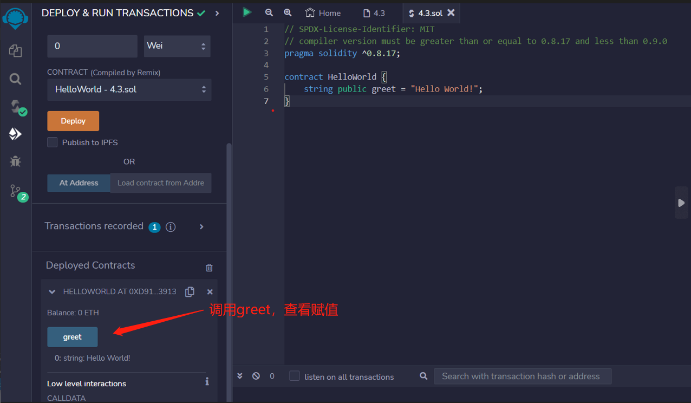

# 1.Hello World
pragma指定了Solidity编译器的版本。

```solidity

// SPDX-License-Identifier: MIT
// 编译器版本必须大于等于0.8.17且小于0.9.0。
pragma solidity ^0.8.17;

contract HelloWorld {
    string public greet = "Hello World!";
}
```

## remix验证
1. 编译并部署代码
