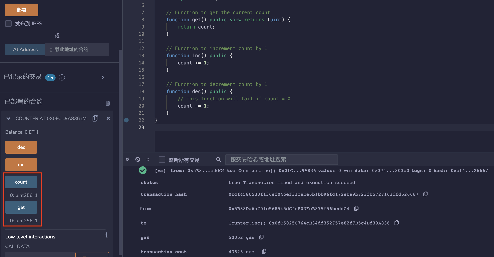

# 2.第一个应用程序 
下面是一个简单的合约，可以在这个合约中获取、增加和减少存储的计数。

* 获取当前计数的函数。
```solidity
function get() public view returns (uint) {
    return count;
}
```

* 计数增加1的函数。
```solidity
function inc() public {
    count += 1;
}
```

* 计数减少1的函数。
```solidity
function dec() public {
    // 如果计数为0，这个函数将会失败。
    count -= 1;
}
```

## remix验证
1. 部署合约Counter，调用count()和get()函数，结果显示为0。

2. 调用inc()函数，结果加1，显示为1。

3. 调用dec()函数，结果减1，显示为0。

4. 计数为0时，直接调用dec（）函数会调用失败。


