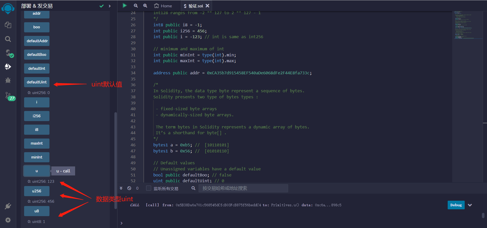

# 3.Primitive Data Types


在这里，我们介绍 Solidity 中一些可用的原始数据类型。

## boolean //布尔型
```solidity
bool public boo = true;
```

## uint256 //256位正整数
uint 代表无符号整数，表示非负整数
有不同的大小可用
uint8   范围从 0 到 2 ** 8 - 1
uint16  范围从 0 到 2 ** 16 - 1
uint256 范围从 0 到 2 ** 256 - 1
```solidity
uint8 public u8 = 1;
uint public u256 = 456;
uint public u = 123;// uint是uint256的别名。
```

## int256 //256位整数(包括负数)
int 类型允许负数。
和 uint 类型一样，可以有不同范围，从 int8 到 int256
    
int256 范围从 -2 ** 255 到 2 ** 255 - 1
int128 范围从 -2 ** 127 到 2 ** 127 - 1
```solidity
int8 public i8 = -1;
int public i256 = 456;
int public i = -123; 
//  int 和 int256 相同

// int 的最小值和最大值
int public minInt = type(int).min;
int public maxInt = type(int).max;
```

## address//地址类型
```solidity
address public addr = 0xCA35b7d915458EF540aDe6068dFe2F44E8fa733c;
```

## byte //字节类型
在 Solidity 中，数据类型 byte 表示一系列字节。 
Solidity 提供了两种字节类型：

 - 固定大小的字节数组
 - 动态大小的字节数组。
     
在 Solidity 中，bytes这个词表示字节的 动态数据。 
它是 byte[] 的缩写。
```solidity
bytes1 a = 0xb5; //  [10110101]
bytes1 b = 0x56; //  [01010110]
```

## 枚举 enum
举（enum）是solidity中用户定义的数据类型。它主要用于为uint分配名称，使程序易于阅读和维护。它与C语言中的enum类似，使用名称来代替从0开始的uint：
```solidity
// 用enum将uint 0， 1， 2表示为Buy, Hold, Sell
enum ActionSet { Buy, Hold, Sell }
// 创建enum变量 action
ActionSet action = ActionSet.Buy;
```

## 默认值
未分配的变量有一个默认值
```solidity
bool public defaultBoo; // false错误
uint public defaultUint; // 0
int public defaultInt; // 0
address public defaultAddr; // 0x0000000000000000000000000000000000000000
```

## remix验证
1. 编译并部署代码查看数据类型bool

2. 查看数据类型uint

3. 查看数据类型int

4. 查看数据类型addresss
