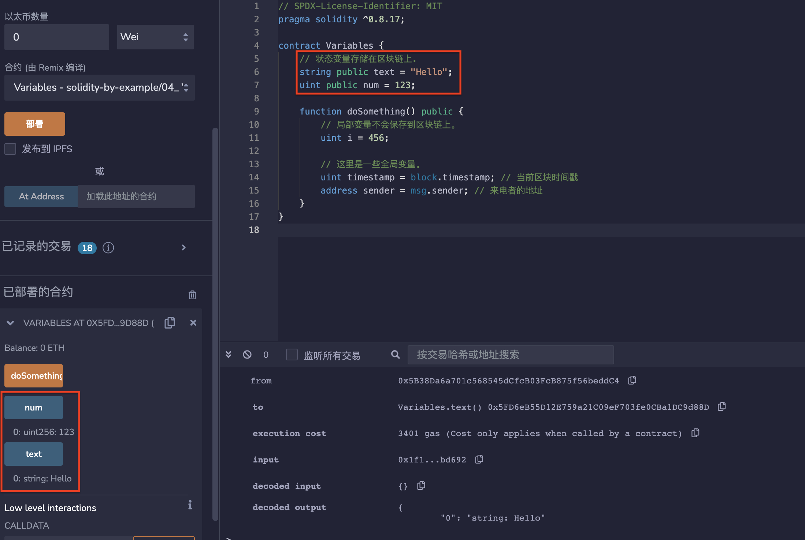

# 4.变量
## Solidity 中有 3 种类型的变量：

* 局部变量：在函数内部声明，不存储在区块链上。
* 状态变量：在函数外部声明，存储在区块链上。
* 全局变量（提供有关区块链的信息）。

### 1.局部变量
局部变量是仅在函数执行过程中有效的变量，函数退出后，变量无效。局部变量的数据存储在内存里，不上链，gas低。局部变量在函数内声明：
```solidity
function doSomething() public {
// 局部变量不会保存到区块链上。
uint i = 456;
}
```

### 2.状态变量
状态变量是数据存储在链上的变量，所有合约内函数都可以访问 ，gas消耗高。状态变量在合约内、函数外声明：
```solidity
// 状态变量存储在区块链上.
string public text = "Hello";
uint public num = 123;
```

### 3.全局变量
全局变量是全局范围工作的变量，都是solidity预留关键字。可以在函数内不声明直接使用：
```solidity
// 这里是一些全局变量。
uint timestamp = block.timestamp; // 当前区块时间戳
address sender = msg.sender; // 来电者的地址
```

## remix验证
部署合约Variables，调用显示为存储的状态变量

