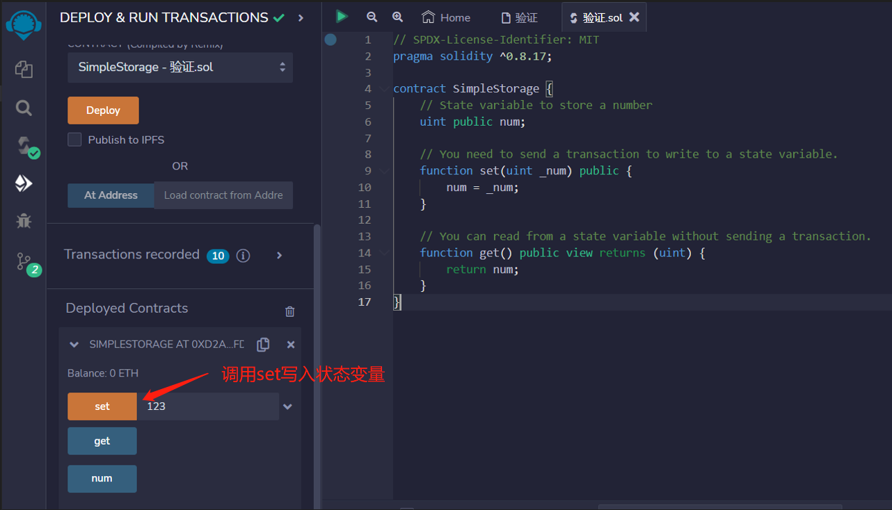
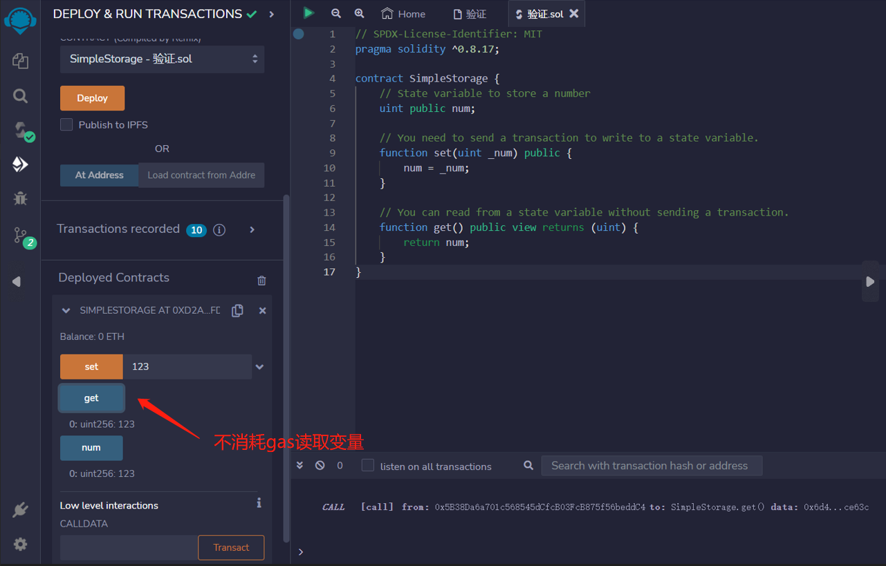

# 7.Reading and Writing to a State Variable

要写入或更新状态变量，你需要发送交易。
```solidity
// 存储数字的状态变量
uint public num;

// 你需要发送交易才能写入状态变量
function set(uint _num) public {
    num = _num;
}
```
另一方面，你可以免费读取状态变量，无需任何交易费用。
```solidity
// 你可以在不发送交易的情况下从状态变量中读取。
function get() public view returns (uint) {
    return num;
}
```

## remix验证
1. 部署合约 调用set写入状态变量

2. 调用get可以不消耗gas读取变量

