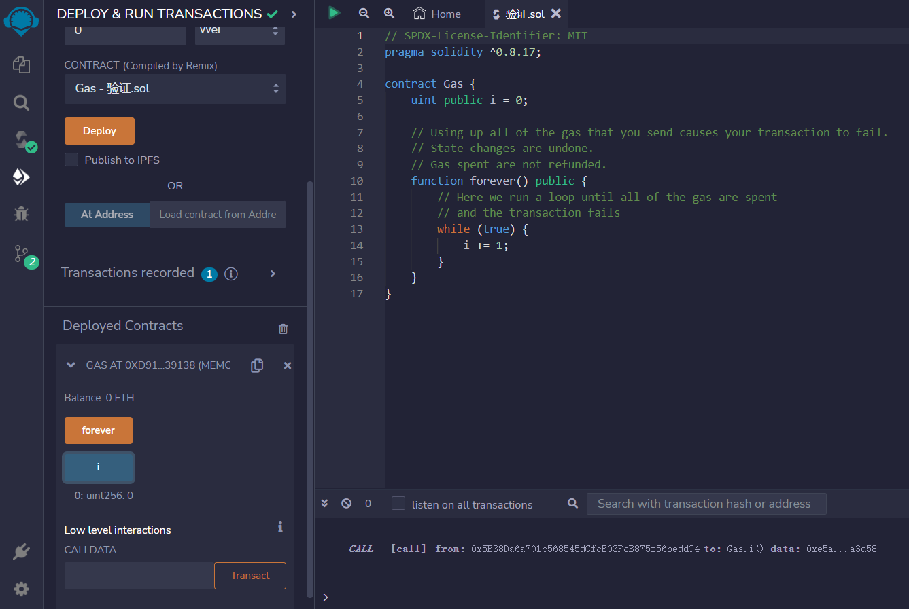
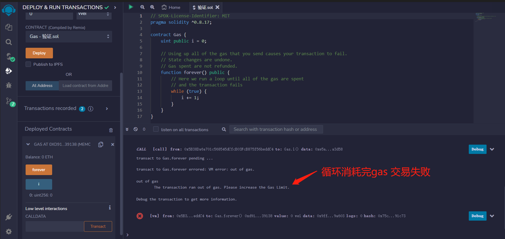

# 9.Gas
一笔交易需要支付多少以太?
一经创建，每笔交易都会被收取一定数量的 gas， 这些 gas 必须由交易的发起人 （ tx.origin）支付。 在 EVM 执行交易时，gas 根据特定规则逐渐耗尽。 如果 gas 在某一点被用完（即它会为负）， 将触发一个 gas 耗尽异常， 这将结束执行并撤销当前调用栈中对状态所做的所有修改。

此机制激励了对 EVM 执行时间的经济利用， 并为 EVM 执行器（即矿工/持币者）的工作提供补偿。 由于每个区块都有最大 gas 量，因此还限制了验证块所需的工作量。

由于 EVM 执行器可以选择包含一笔交易， 因此交易发送者无法通过设置低 gas 价格滥用系统。

你支付的是gas使用量*gas价格的以太数量，其中

* gas是计算单位
* gas spent是交易中使用的总gas量
* gas price是指你愿意支付多少gas

gas价格越高的交易，优先级越高。

未使用的gas将被退还.

## Gas Limit
可以使用的gas量有两个限制

* Gas Limit (你愿意为你的交易使用的最大gas量，由您设定)
* block gas limit (一个区块允许的最大gas量，由网络设定)

```solidity
contract Gas {
    uint public i = 0;

    // 使用完所有gas会使交易失败.
    // 状态更改被撤消.
    // 消耗的gas不会退回.
    function forever() public {
        // 这里是个while循环，直到所有gas消耗完
        // 并导致交易失败
        while (true) {
            i += 1;
        }
    }
}
```

## remix验证
1. 部署合约

1. 调用forever()进入循环消耗gas 交易失败
