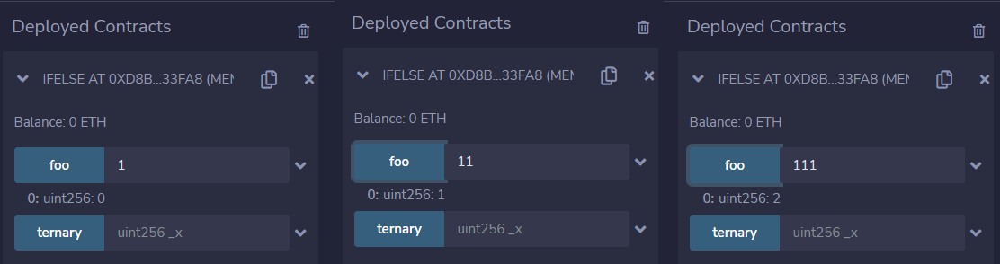
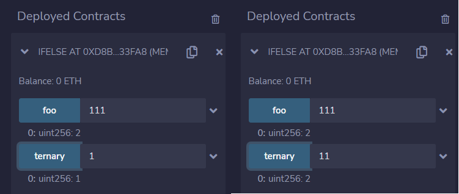

# 10.if/else
Solidity支持条件语句if、else if和else。
### 1.if/else
Solidity中的if-else语句与其他编程语言类似，用于根据条件执行不同的代码块。
```solidity
function foo(uint x) public pure returns (uint) {
    if (x < 10) {
        return 0;
    } else if (x < 20) {
        return 1;
    } else {
        return 2;
    }
}
```
### 2.三元运算符 
三元运算符是solidity中唯一一个接受三个操作数的运算符，规则条件? 条件为真的表达式:条件为假的表达式。 此运算符经常用作 if 语句的快捷方式。
```solidity
function ternary(uint _x) public pure returns (uint) {
    // if (_x < 10) {
    //     return 1;
    // }
    // return 2;

    // if/else语句的速记写法
    // "?" 运算符被称为三元运算符。
    return _x < 10 ? 1 : 2;
}
```

## remix验证
1. 部署合约IfElse，函数foo（）中，使用 if/else 语句进行条件判断，如果 x 小于 10，则返回 0，如果 x 小于 20，则返回 1，否则返回 2。

2. 函数 ternary 中，使用三元运算符进行条件判断，如果 _x 小于 10，则返回 1，否则返回 2。
