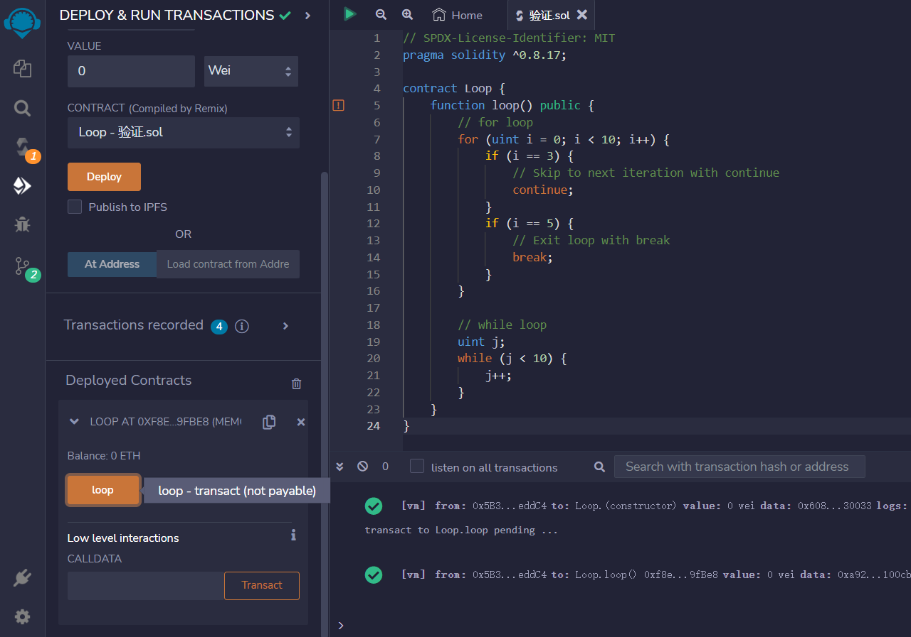

# For and While Loop

Solidity支持for、while和do while循环.

不要编写无限循环，因为这会达到gas limit，导致您的交易失败.

由于上述原因，while和do while循环很少使用.
###for循环示例
```solidity
contract Loop {
    function loop() public {
        // for循环
        for (uint i = 0; i < 10; i++) {
            if (i == 3) {
                // 使用continue跳到下一次迭代
                continue;
            }
            if (i == 5) {
                //  使用break退出循环
                break;
            }
        }

        // 循环结构
        uint j;
        while (j < 10) {
            j++;
        }
    }
}
```

## remix验证
1. 部署合约，调用loop函数进行循环验证测试
