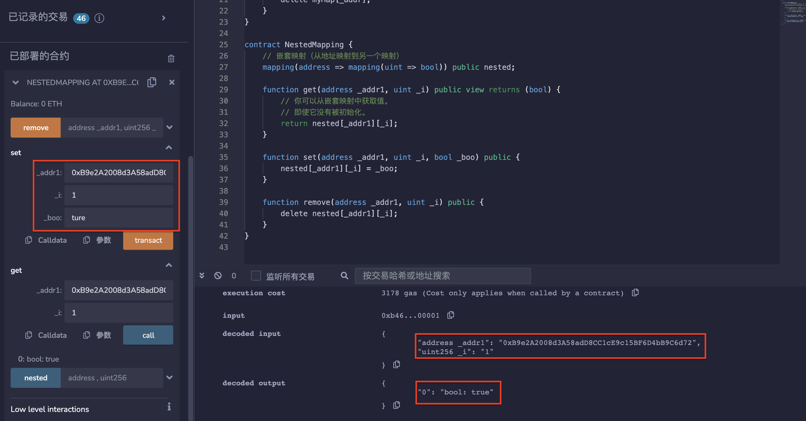

# 12.Mapping
使用语法mapping(keyType => valueType)创建映射。
keyType 可以是任何内置值类型、字节、字符串或任何合约。
valueType 可以是任何类型，包括另一个映射或数组。
映射不可迭代。
## Mapping映射
* 从地址到无符号整数uint的映射。
```solidity
mapping(address => uint) public myMap;
```

* 映射始终返回一个数值，如果从未设置该数值，则会返回默认数值。
```solidity
function get(address _addr) public view returns (uint) {
    return myMap[_addr];
}
```

* 更新此地址的数值。
```solidity
function set(address _addr, uint _i) public {
    myMap[_addr] = _i;
}
```

* 将数值重置为默认数值。
```solidity
function remove(address _addr) public {
    delete myMap[_addr];
}
```

## 嵌套映射NestedMapping
* 嵌套映射（从地址映射到另一个映射）
```solidity
mapping(address => mapping(uint => bool)) public nested;
```

* 可以从嵌套映射中获取值，即使它没有被初始化。
```solidity
function get(address _addr1, uint _i) public view returns (bool) {
    return nested[_addr1][_i];
}
```

* 更新此地址的数值。
```solidity
function set(address _addr1, uint _i, bool _boo) public {
    nested[_addr1][_i] = _boo;
}
```

* 将数值重置为默认数值。
```solidity
function remove(address _addr1, uint _i) public {
    delete nested[_addr1][_i];
}
```
## remix验证
1. 部署合约Mapping，调用set（）函数输入address、uint，调用get（）函数输入address查看uint。

2. 调用remove（）函数输入address，再次查看get（）函数，数值已被重置为0。

3. 部署合约NestedMapping，调用set（）函数输入address、uint和bool值，调用get（）函数输入address和uint查看bool值。

4. 调用remove（）函数输入address和uint，再次查看get（）函数，数值已被重置。

