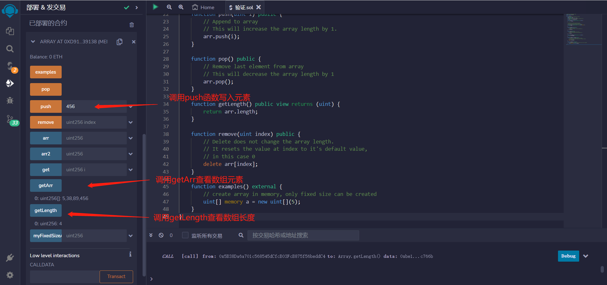
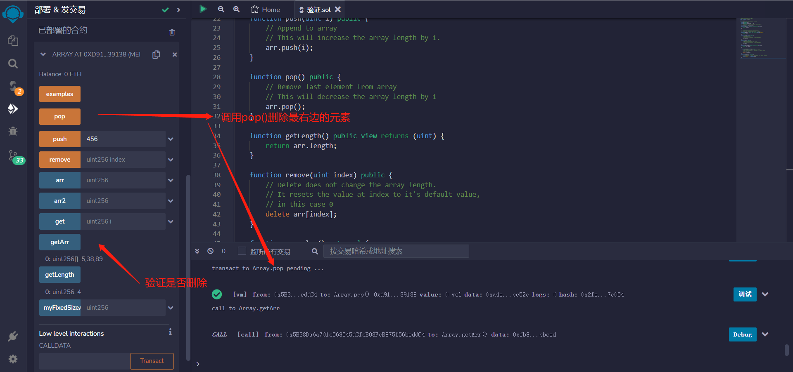
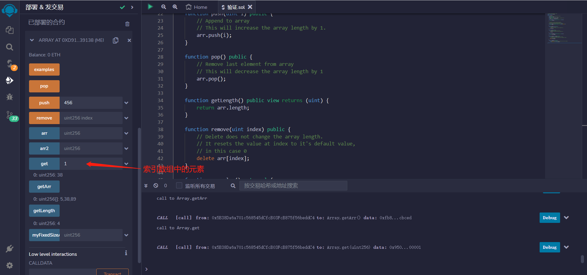
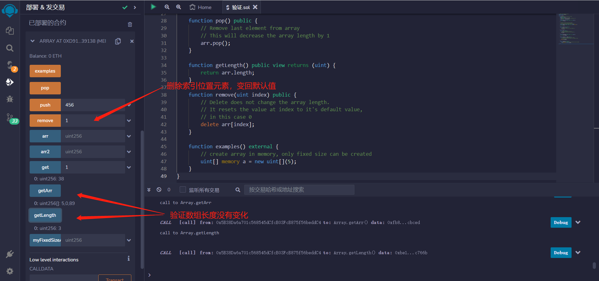

# Array
数组可以在编译时具有固定长度，也可以具有动态长度。
一个元素类型为 T，固定长度为 k 的数组可以声明为 T[k]， 而动态数组声明为 T[]。
数组元素可以是任何类型，包括映射或结构体。 并适用于类型的一般限制，映射只能存储在 storage 数据位置， 公开可见的函数需要参数是 ABI类型。
可以将状态变量数组标记为 public， 并让Solidity创建一个 getter 函数。数字索引成为该函数的一个必要参数。

初始化数组的几种方式
```solidity
uint[] public arr;
uint[] public arr2 = [1, 2, 3];
// 固定长度的数组，所有元素都初始化为0
uint[10] public myFixedSizeArr;
```
获取数组arr中索引为i的元素的值，并将其作为无符号整数返回
```solidity
function get(uint i) public view returns (uint) {
    return arr[i];
}
```
Solidity 可以返回整个数组.
但是对于长度可以无限增长的数组，应该避免使用此类函数.
获取数组arr的值，返回一个包含所有元素的uint类型数组。
```solidity
//由于函数声明了view关键字，因此不会修改合约状态，任何人都可以调用此函数来获取数组的当前状态。
function getArr() public view returns (uint[] memory) {
    return arr;
}
```

在数组末尾添加元素
这将使数组长度增加1.
```solidity
function push(uint i) public {
    arr.push(i);
}
```

删除数组中的最后一个元素
这将使数组长度减少1
```solidity
function pop() public {
    arr.pop();
}
```

读取数组arr长度
```solidity
function getLength() public view returns (uint) {
    return arr.length;
}
```

删除操作不会改变数组的长度。
它将索引处的值重置为其默认值，在这种情况下为0。
```solidity
function remove(uint index) public {
    delete arr[index];
}
```
在内存中创建数组，只能创建固定大小的数组
```solidity
function examples() external {
    uint[] memory a = new uint[](5);
}
```


## 删除数组元素的示例
通过将元素从右到左移动来删除数组元素

```solidity
// SPDX-License-Identifier: MIT
pragma solidity ^0.8.17;

contract ArrayRemoveByShifting {
    // [1, 2, 3] -- remove(1) --> [1, 3, 3] --> [1, 3]
    // [1, 2, 3, 4, 5, 6] -- remove(2) --> [1, 2, 4, 5, 6, 6] --> [1, 2, 4, 5, 6]
    // [1, 2, 3, 4, 5, 6] -- remove(0) --> [2, 3, 4, 5, 6, 6] --> [2, 3, 4, 5, 6]
    // [1] -- remove(0) --> [1] --> []

    uint[] public arr;

    function remove(uint _index) public {
        require(_index < arr.length, "index out of bound");

        for (uint i = _index; i < arr.length - 1; i++) {
            arr[i] = arr[i + 1];
        }
        arr.pop();
    }

    function test() external {
        arr = [1, 2, 3, 4, 5];
        remove(2);
        // [1, 2, 4, 5]
        assert(arr[0] == 1);
        assert(arr[1] == 2);
        assert(arr[2] == 4);
        assert(arr[3] == 5);
        assert(arr.length == 4);

        arr = [1];
        remove(0);
        // []
        assert(arr.length == 0);
    }
}
```
通过将最后一个元素复制到要删除的位置来删除数组元素
```solidity
// SPDX-License-Identifier: MIT
pragma solidity ^0.8.17;

contract ArrayReplaceFromEnd {
    uint[] public arr;

    // 删除一个元素会在数组中创建一个间隙.
    // 保持数组紧凑的一个技巧是将最后一个元素移动到要删除的位置.
    function remove(uint index) public {
        // 将最后一个元素移动到要删除的位置。
        arr[index] = arr[arr.length - 1];
        // 移除最后一个元素
        arr.pop();
    }

    function test() public {
        arr = [1, 2, 3, 4];

        remove(1);
        // [1, 4, 3]
        assert(arr.length == 3);
        assert(arr[0] == 1);
        assert(arr[1] == 4);
        assert(arr[2] == 3);

        remove(2);
        // [1, 4]
        assert(arr.length == 2);
        assert(arr[0] == 1);
        assert(arr[1] == 4);
    }
}
```

## remix验证
1. 部署Array合约，调用push函数写入元素，调用getArr查看数组元素，调用getLength查看数组长度

2. 调用pop函数 删除从右往左第一个元素，验证

3. 调用get函数，索引数组中的元素。

4. 调用remove函数，删除索引位置元素，不会改变数组的长度，将删除元素重置为默认值。

