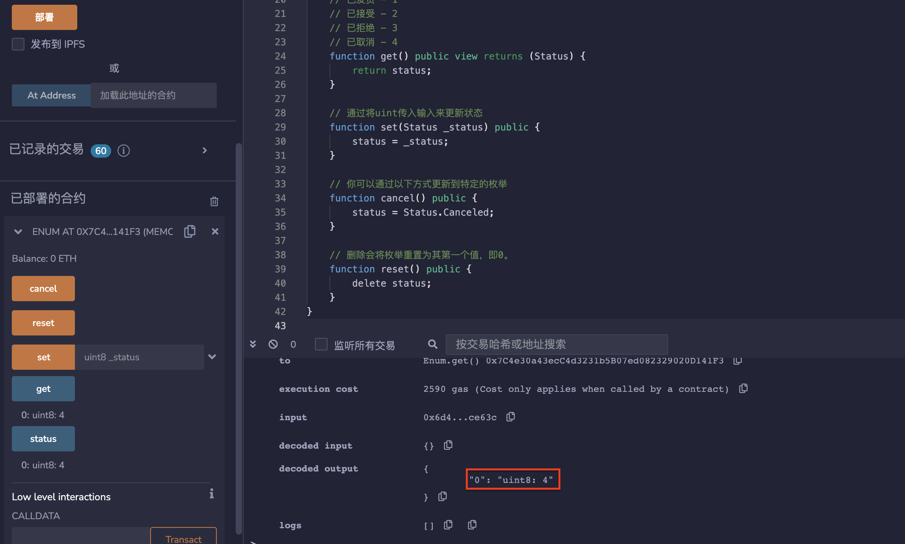
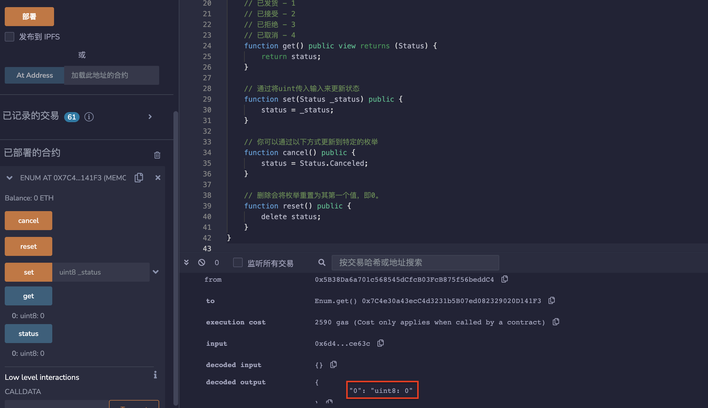
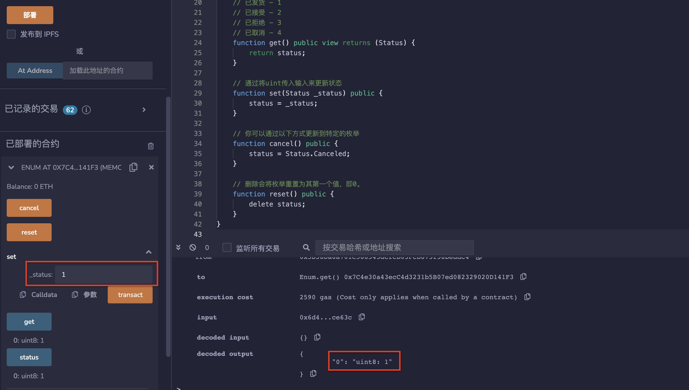

# 14.Enum
Solidity支持枚举类型，非常有用，可以模拟选择并跟踪状态。
枚举类型可以在合约外声明。
## 枚举 enum
枚举（enum）是solidity中用户定义的数据类型。可以显式地转换为所有整数类型，和从整数类型来转换，但不允许隐式转换。 从整数的显式转换在运行时检查该值是否在枚举的范围内，否则会导致异常。
枚举要求至少有一个成员，其声明时的默认值是第一个成员。 枚举不能有超过256个成员。
enum主要用于为uint分配名称，使程序易于阅读和维护。与C语言中的enum类似，使用名称来代替从0开始的uint。
* 枚举表示运输状态。
```solidity
enum Status {
    Pending,
    Shipped,
    Accepted,
    Rejected,
    Canceled
}
```

* 默认数值是列出的第一个元素,在这种情况下，“Pending”的定义是“待处理的”。
```solidity
Status public status;

// 返回值为无符号整数uint。
// 待处理 - 0
// 已发货 - 1
// 已接受 - 2
// 已拒绝 - 3
// 已取消 - 4
function get() public view returns (Status) {
    return status;
}
```

* 通过将uint传入输入来更新状态。
```solidity
function set(Status _status) public {
    status = _status;
}
```

* 可以通过以下方式更新到特定的枚举。
```solidity
function cancel() public {
    status = Status.Canceled;
}
```

* 删除会将枚举重置为其第一个值，即0。
```solidity
function reset() public {
    delete status;
}
```
## remix验证
1. 部署合约Enum，调用cancel（）函数，get（）函数显示为4.

2. 调用reset（）函数，get（）函数显示为0.

3. 调用set（）函数，输入1，get（）函数显示为1.

