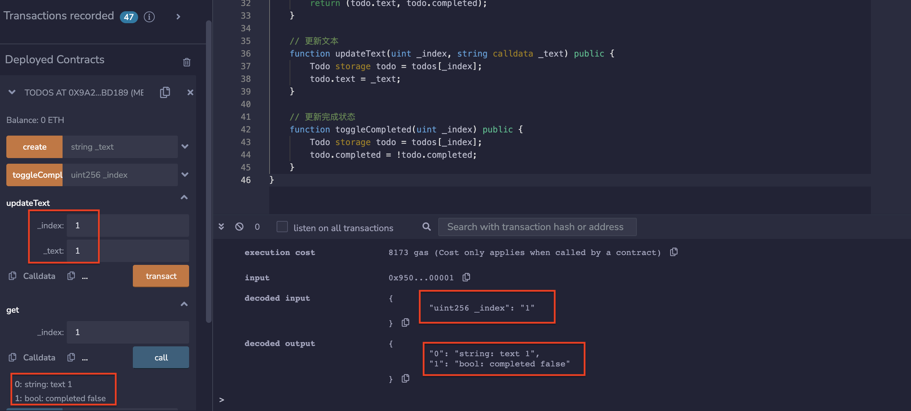

# Structs
你可以通过创建结构体来定义自己的类型。

结构体非常有用，可以将相关的数据进行分组。

结构体可以在合约之外声明，并在另一个合约中进行导入。


* Solidity支持通过构造结构体的形式定义新的类型。创建结构体的方法：
```solidity
struct Todo {
    string text;
    bool completed;
}
// 一个 'Todo' 结构体的数组
Todo[] public todos;
```

* 有三种初始化结构体的方法
```solidity
function create(string calldata _text) public {
    // - 像调用函数一样调用它
    todos.push(Todo(_text, false));

    // 键值映射
    todos.push(Todo({text: _text, completed: false}));

    // 初始化一个空的结构体，然后更新它
    Todo memory todo;
    todo.text = _text;
    //todo.completed 初始化为 false

    todos.push(todo);
}
```
* 更新文本
```solidity
function updateText(uint _index, string calldata _text) public {
    Todo storage todo = todos[_index];
    todo.text = _text;
}
```
* 更新完成状态
```solidity
function toggleCompleted(uint _index) public {
    Todo storage todo = todos[_index];
    todo.completed = !todo.completed;
}
```

## 声明和导入结构体
声明结构体的文件

```solidity
// SPDX-License-Identifier: MIT
pragma solidity ^0.8.17;
// 这个文件保存为 'StructDeclaration.sol'

struct Todo {
    string text;
    bool completed;
}
```

导入上面声明的结构体的文件

```solidity
// SPDX-License-Identifier: MIT
pragma solidity ^0.8.17;

import "./StructDeclaration.sol";

contract Todos {
    // 一个 'Todo' 结构体的数组
    Todo[] public todos;
}
```

## remix验证
1. 部署 Todos合约，调用create函数，创建结构体,调用get函数，验证是否创建成功

2. 调用updateText（）函数修改文本为1，调用get（）函数查看结果修改为1，状态为false。

3. 调用toggleCompleted（）函数修改完成状态，调用get（）函数查看状态修改为true。

