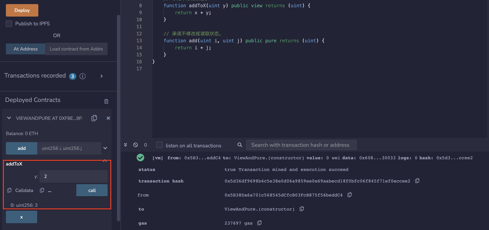

# 18.View and Pure Functions
Getter函数可以声明为view或pure。
* View函数声明不会改变状态。
* Pure函数声明不会改变或读取状态变量。

不写pure也不写view，函数既可以读取也可以写入状态变量。

1. view

包含view关键字的函数，能读取但也不能写入状态变量。
```solidity
function addToX(uint y) public view returns (uint) {
    return x + y;
}
```

2. pure

包含pure关键字的函数，不能读取也不能写入存储在链上的状态变量。
```solidity
function add(uint i, uint j) public pure returns (uint) {
    return i + j;
}
```
## remix验证
部署合约ViewAndPure，调用addToX（）函数，输入y值2，显示为3.

