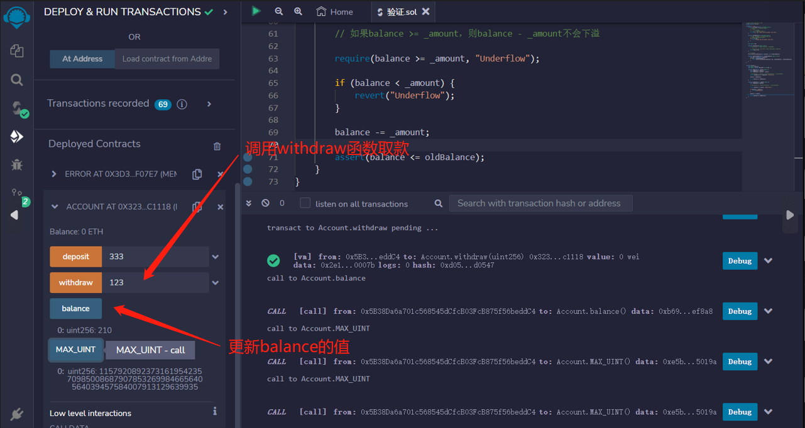

# 19.Error
出现错误将会撤销合约编译期间对状态所做的所有更改。
您可以通过调用require、revert或assert来引发错误。
error是solidity 0.8版本新加的内容，方便且高效（省gas）地向用户解释操作失败的原因。人们可以在contract之外定义异常。

* require用于在执行之前验证输入和条件
* revert与require类似。有关详细信息，请参见下面的代码。
* assert用于检查永远不应为false的代码。失败可能意味着存在错误。

使用自定义错误以节省gas。
## Require
require 函数要么创造一个没有任何数据的错误， 要么创造一个 Error(string) 类型的错误。 它应该被用来确保在执行之前无法检测到的有效条件。 这包括对输入的条件或调用外部合约的返回值。

```solidity
// SPDX-License-Identifier: MIT
pragma solidity ^0.8.17;

contract Error {
    function testRequire(uint _i) public pure {
        // Require应用于验证条件，例如：
        // - 输入
        // - 执行前的条件
        // - 对其他函数的调用的返回值
        require(_i > 10, "Input must be greater than 10");
    }

    function testRevert(uint _i) public pure {
        // 当要检查的条件复杂时，Revert很有用。
        // 此代码与上面的示例完全相同
        if (_i <= 10) {
            revert("Input must be greater than 10");
        }
    }
    uint public num;
```
* Assert
Assert应该只用于测试内部错误，以及检查不变量。
```solidity
function testAssert() public view {
    // Assert仅应用于测试内部错误，并检查不变量。

    // 我们在这里声明，由于不可能更新num的值，因此num始终等于0。

    assert(num == 0);
}
```
* Revert
定义了一个自定义错误函数InsufficientBalance，当账户余额小于提取金额时，会触发该错误。在testCustomError函数中，如果当前合约账户余额小于提取金额，则会抛出该自定义错误。这样可以让调用者更清楚地知道为什么会出现错误，而不是只看到一个普通的revert异常。
```solidity
error InsufficientBalance(uint balance, uint withdrawAmount);

function testCustomError(uint _withdrawAmount) public view {
    uint bal = address(this).balance;
    if (bal < _withdrawAmount) {
        revert InsufficientBalance({balance: bal, withdrawAmount: _withdrawAmount});
    }
}
```
## 这是另一个示例
这个函数用于向合约账户存款.
函数接受一个参数 _amount，表示存款金额。
函数首先将当前的账户余额存储在变量 oldBalance 中，然后计算新的账户余额 newBalance，即当前余额加上存款金额。
接下来，函数使用 require 语句确保新的余额不会导致溢出。
如果新余额小于旧余额，则会触发 require 语句中的错误信息 "Overflow"。
最后，函数将新余额存储在 balance 变量中，并使用 assert 语句确保新余额大于等于旧余额。
这个函数的目的是确保存款操作不会导致溢出，并且在存款完成后，账户余额正确更新。
```solidity
// SPDX-License-Identifier: MIT
pragma solidity ^0.8.17;

contract Account {
    uint public balance;
    uint public constant MAX_UINT = 2 ** 256 - 1;
  
    function deposit(uint _amount) public {
        uint oldBalance = balance;
        uint newBalance = balance + _amount;

        // 如果balance + _amount >= balance，则balance + _amount不会溢出
        require(newBalance >= oldBalance, "Overflow");

        balance = newBalance;

        assert(balance >= oldBalance);
    }
}
```

该函数用于从合约中提取资金并将其转移到调用方的帐户中。
函数的第一行创建了一个名为oldBalance的局部变量，以保存提取资金之前的合约余额。
接下来的两个条件语句用于确保提取的金额不会导致合约余额下溢（小于零）。第一个条件使用require语句，如果条件不满足，则函数将停止并抛出一个错误消息“Underflow”。第二个条件使用revert语句，如果条件不满足，则函数将停止并回滚所有状态更改。
如果余额足够，则函数将执行余额减去提取金额的操作。
最后，assert语句用于确保余额减少了提取金额。如果assert失败，则意味着代码存在错误，并且将停止并回滚所有状态更改。

```solidity
function withdraw(uint _amount) public {
    uint oldBalance = balance;

    // 如果balance >= _amount，则balance - _amount不会下溢

    require(balance >= _amount, "Underflow");

    if (balance < _amount) {
        revert("Underflow");
    }

    balance -= _amount;

    assert(balance <= oldBalance);
}

```

## remix验证
1. 部署 Error合约,testRequire()须大于10否则抛出错误信息；testRevert()如果小于或等于10则抛出错误信息

2. 调用testCustomError函数，输入一个 uint 类型的参数 _withdrawAmount，它使用自定义错误 InsufficientBalance，如果合约余额小于 _withdrawAmount，则会使用 revert 抛出一个带有自定义错误消息的异常，消息中包含合约余额和要提取的金额。

3. 部署另一个例子Account合约，调用deposit函数表示要存储的金额，首先将原有的balance保存在oldBalance中，然后计算新的余额newBalance。调用balance查看。

4. 调用withdraw函数取款，在取款之前，使用require函数检查balance是否大于等于_amount，如果不是，则抛出异常Underflow。如果balance小于_amount，则使用revert函数抛出异常Underflow。如果balance不小于_amount，则更新balance的值，并使用assert函数再次检查balance是否小于等于oldBalance。

