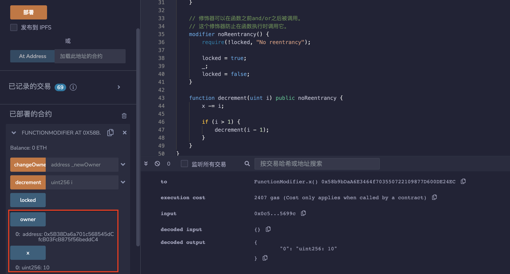
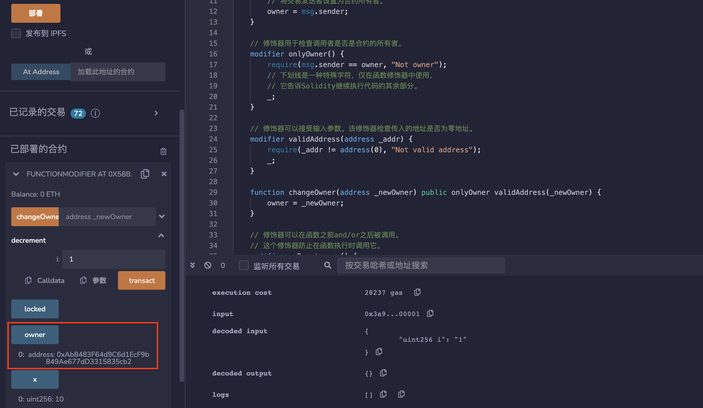
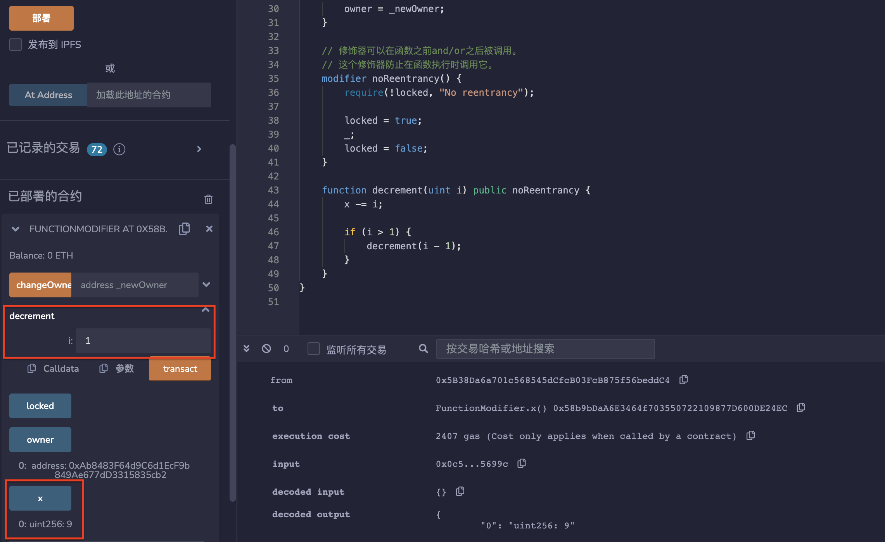

# 20.Function Modifier

修饰器是可以在函数调用之前和/或者之后运行的代码。
修饰器可以用于：
1. 限制访问权限
2. 验证输入
3. 防止重入攻击

修饰器（modifier）是solidity特有的语法，类似于面向对象编程中的decorator，声明函数拥有的特性，并减少代码冗余。
修饰器可用于检查调用者是否是合约的所有者。
使用修饰器modifier 可以轻松改变函数的行为。 
例如，修饰器可以在执行函数之前自动检查某个条件，如地址，变量，余额等。 
修饰器modifier 是合约的可继承属性， 并可能被派生合约覆盖。

## 1. 限制访问权限
该修饰器作用是确保只有合约的拥有者才有权调用被修饰的函数。如果调用者不是合约的拥有者，则会抛出一个异常，提示"Not owner"。
```solidity
modifier onlyOwner() {
    require(msg.sender == owner, "Not owner");
    // 下划线是一种特殊字符，仅在函数修饰器中使用，
    // 它告诉Solidity继续执行代码的其余部分。
    _;
}
```
## 2. 验证输入
修饰器可以接受输入参数。
该修饰器检查传入的地址是否有效。如果地址无效（即地址为 0x0），则会抛出异常"Not valid address"并中止函数执行。如果地址有效，则继续执行函数。

```solidity
modifier validAddress(address _addr) {
    require(_addr != address(0), "Not valid address");
    _;
}

function changeOwner(address _newOwner) public onlyOwner validAddress(_newOwner) {
    owner = _newOwner;
}
```

## 3. 防止重入攻击
修饰器可以在函数之前和/或者之后被调用。
该修饰符用于防止重入攻击。在函数执行前，首先检查“locked”变量是否为false，如果为true，则说明函数正在执行中，防止再次进入以避免重入攻击。如果“locked”为false，则将其设置为true，执行函数，并在函数执行完成后将其设置为false，以便下次调用函数。
```solidity
modifier noReentrancy() {
    require(!locked, "No reentrancy");

    locked = true;
    _;
    locked = false;
}

function decrement(uint i) public noReentrancy {
    x -= i;

    if (i > 1) {
        decrement(i - 1);
    }
}
```
## remix测试
1. 部署合约FunctionModifier，可以看到owner为msg.sender，x = 10。

2. 调用changeOwner（）函数，非msg.sender会调用失败，调用成功修改owner。

3. modifier可以防止重入攻击，调用decrement（）函数输入1，x显示为9。

