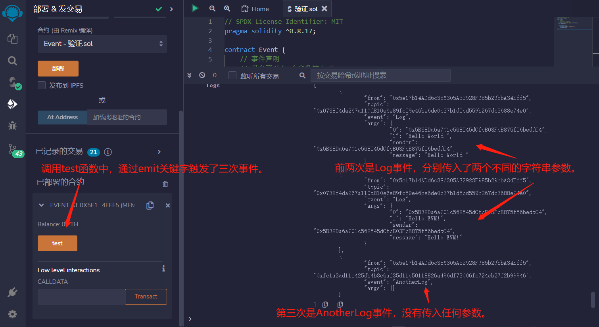

# 21.Events
事件是能方便地调用以太坊虚拟机日志功能的接口。
事件允许在以太坊区块链上进行日志记录。一些事件的使用案例包括：
* 监听事件并更新用户界面
* 一种廉价的存储形式

Solidity中的事件（event）是EVM上日志的抽象，它具有两个特点：

* 响应：应用程序（ether.js）可以通过RPC接口订阅和监听这些事件，并在前端做响应。
* 经济：事件是EVM上比较经济的存储数据的方式，每个大概消耗2,000 gas；相比之下，链上存储一个新变量至少需要20,000 gas。

```solidity
// SPDX-License-Identifier: MIT
pragma solidity ^0.8.17;

contract Event {
    // 事件声明
    // 最多可以有3个参数被索引。
    // 索引的参数可以帮助你通过索引参数过滤日志
    event Log(address indexed sender, string message);
    event AnotherLog();

    function test() public {
        emit Log(msg.sender, "Hello World!");
        emit Log(msg.sender, "Hello EVM!");
        emit AnotherLog();
    }
}
```

## remix验证
1. 部署 Error合约,调用test函数中，通过emit关键字触发了三次事件。前两次是Log事件，分别传入了两个不同的字符串参数。第三次是AnotherLog事件，没有传入任何参数。
