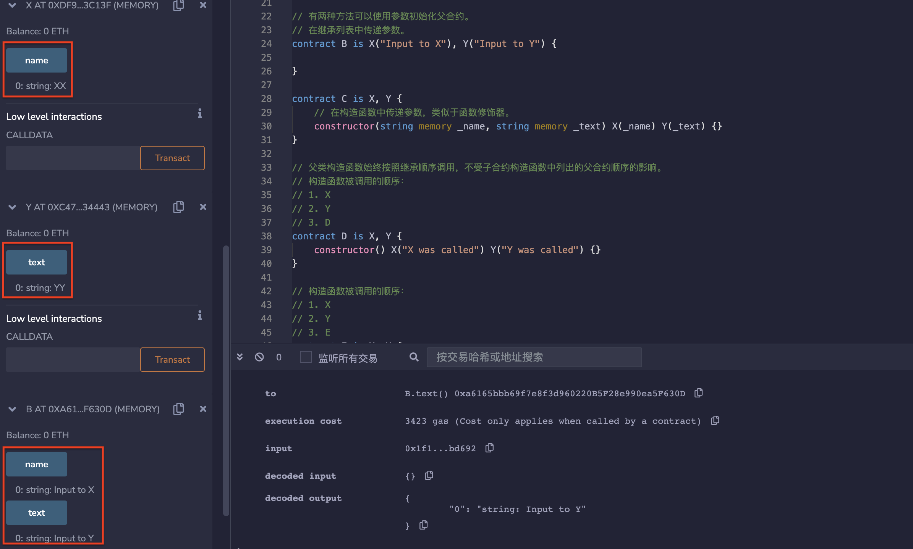
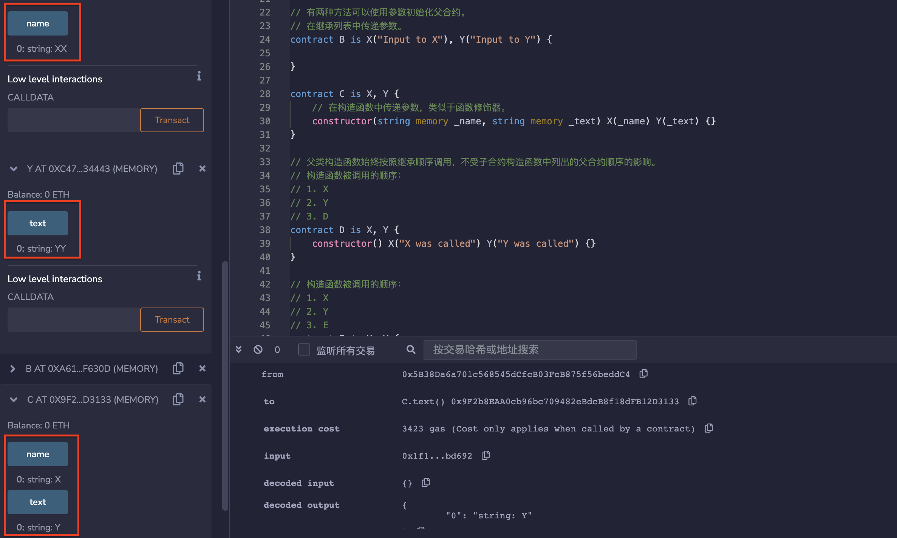

# 22.Constructor

构造函数是在合约创建时可选执行的函数，每个合约可以定义一个，并在部署合约的时候自动运行一次。它可以用来初始化合约的一些参数。
以下是如何向构造函数传递参数的示例。

* 先创建父合约 X，Y

```solidity
contract X {
    string public name;

    constructor(string memory _name) {
        name = _name;
    }
}

contract Y {
    string public text;

    constructor(string memory _text) {
        text = _text;
    }
}
```

有两种方法可以使用参数初始化父合约。 
1. 在继承列表中传递参数。

```solidity
contract B is X("Input to X"), Y("Input to Y") {

}
```

2. 在构造函数中传递参数，类似于函数修饰器。

```solidity
contract C is X, Y {。
    constructor(string memory _name, string memory _text) X(_name) Y(_text) {}
}
```

* 父类构造函数始终按照继承顺序调用，不受子合约构造函数中列出的父合约顺序的影响。

```solidity
// 构造函数被调用的顺序：
// 1. X
// 2. Y
// 3. D
contract D is X, Y {
    constructor() X("X was called") Y("Y was called") {}
}

// 构造函数被调用的顺序：
// 1. X
// 2. Y
// 3. E
contract E is X, Y {
    constructor() Y("Y was called") X("X was called") {}
}
```
## remix验证
1. 在继承列表中传递参数。部署父合约X/Y与子合约B，显示修改为B的参数

2. 在构造函数中传递参数，类似于函数修饰器。部署子合约C，显示为C的参数。

