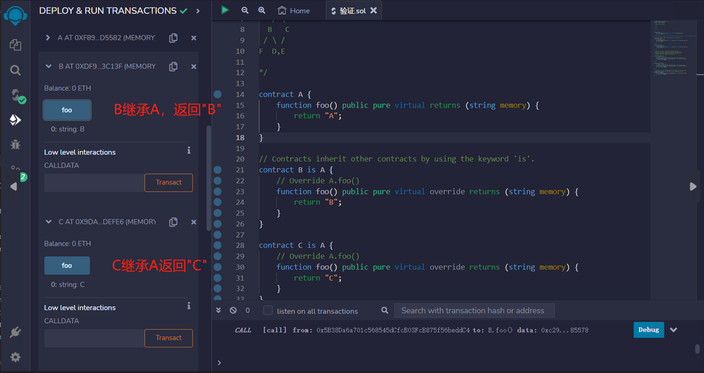
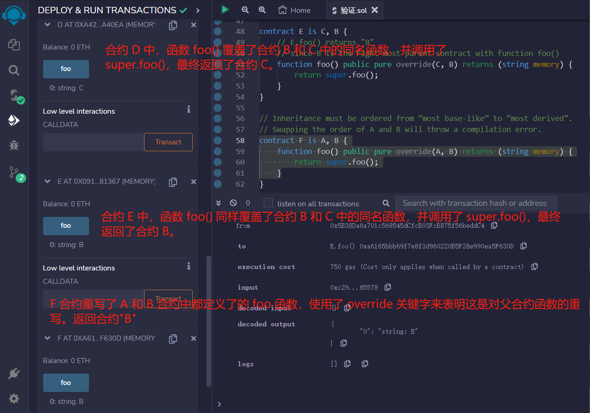

# 23.Inheritance
Solidity 支持多重继承。合约可以使用 is 关键字继承其他合约.

规则:

* virtual: 父合约中的函数，如果希望子合约重写，需要加上virtual关键字。
* override：子合约重写了父合约中的函数，需要加上override关键字。

继承的顺序很重要。

必须按照从“most base-like” 的到 “most derived”的顺序列出父合约。    

```solidity
/* 继承关系图
    A
   / \
  B   C
 / \ /
F  D,E

*/

contract A {
    function foo() public pure virtual returns (string memory) {
        return "A";
    }
}
```
合约通过使用关键字 'is' 继承其他合约
```solidity
contract B is A {
    // 覆盖 A.foo()
    function foo() public pure virtual override returns (string memory) {
        return "B";
    }
}

contract C is A {
    // 覆盖 A.foo()
    function foo() public pure virtual override returns (string memory) {
        return "C";
    }
}
```
solidity的合约可以继承多个合约。
继承时要按辈分最高到最低的顺序排。
当调用在不同合约中多次定义的函数时，父契约将从右向左搜索，并以深度优先的方式进行搜索。
```solidity
contract D is B, C {
    // D.foo() 返回 "C"
    // 因为 C 是带有函数 foo() 的最右侧的父合约
    function foo() public pure override(B, C) returns (string memory) {
        return super.foo();
    }
}

contract E is C, B {
    // E.foo() 返回 "B"
    // 因为 B 是带有函数 foo() 的最右侧的父合约
    function foo() public pure override(C, B) returns (string memory) {
        return super.foo();
    }
}
```
继承必须按照从“most base-like” 的到 “most derived”的顺序进行排序。
交换 A 和 B 的顺序将会导致编译错误。
```solidity
contract F is A, B {
    function foo() public pure override(A, B) returns (string memory) {
        return super.foo();
    }
}
```

## remix验证
1. 部署A,B,C合约，B继承A，返回"B";C继承A返回"C",验证

2. 部署D,E,F合约，合约 D 和 E 都继承了合约 B 和 C。
在合约 D 中，函数 foo() 覆盖了合约 B 和 C 中的同名函数，并调用了 super.foo()，最终返回了合约 C。
在合约 E 中，函数 foo() 同样覆盖了合约 B 和 C 中的同名函数，并调用了 super.foo()，最终返回了合约 B。
F 合约重写了 A 和 B 合约中都定义了的 foo 函数，使用了 override 关键字来表明这是对父合约函数的重写。
