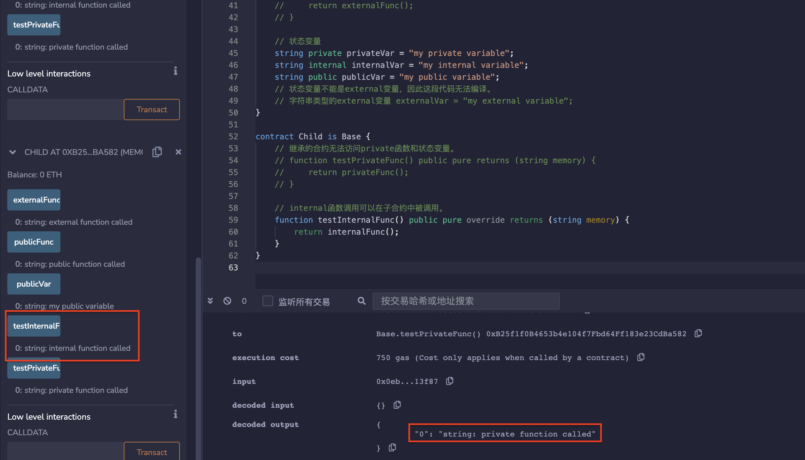

# 26.Visibility
函数和状态变量必须声明它们是否可以被其他合约访问。
函数可以声明为：
* private - 仅限于定义该函数的合约内部访问，继承的合约也不能用（也可用于修饰状态变量）。
* internal- 仅限于继承内部函数的合约内部访问，继承的合约可以用（也可用于修饰状态变量）。
* public - 任何合约和账户都可以调用。(也可用于修饰状态变量，public变量会自动生成 getter函数，用于查询数值).
* external - 只能从合约外部访问（但是可以用this.f()来调用，f是函数名）。
* 
状态变量可以声明为public、private或internal，但不能声明为external。
## 1.private
private函数只能在此合约内被调用,继承此合约的合约不能调用此函数。
```solidity
function privateFunc() private pure returns (string memory) {
    return "private function called";
}

function testPrivateFunc() public pure returns (string memory) {
    return privateFunc();
}
```

## 2.internal
internal函数可以被以下情况调用：
* 在该合约内部；
* 在继承该合约的合约内部。
```solidity
function internalFunc() internal pure returns (string memory) {
    return "internal function called";
}

function testInternalFunc() public pure virtual returns (string memory) {
    return internalFunc();
}
```

## 3. public
public函数可以被调用：
* 在本合约内部；
* 在继承本合约的合约内部；
* 被其他合约和账户调用。
```solidity
function publicFunc() public pure returns (string memory) {
    return "public function called";
}
```
## 4.external
external函数只能被其他合约和账户调用。
```solidity
function externalFunc() external pure returns (string memory) {
    return "external function called";
}
```
* 这个函数无法编译，因为我们试图在这里调用一个external函数。
```solidity
function testExternalFunc() public pure returns (string memory) {
    return externalFunc();
}
```
## 5.状态变量
```solidity
string private privateVar = "my private variable";
string internal internalVar = "my internal variable";
string public publicVar = "my public variable";
// 状态变量不能是external变量，因此这段代码无法编译。
// 字符串类型的external变量 externalVar = "my external variable";
```

* 继承的合约无法访问private函数和状态变量。
```solidity

function testPrivateFunc() public pure returns (string memory) {
    return privateFunc();
}
```
* internal函数调用可以在子合约中被调用。
```solidity
function testInternalFunc() public pure override returns (string memory) {
    return internalFunc();
}
```
## remix验证
1. 部署合约base和Child，在Child合约中调用testInternalFunc（）函数，显示调用成功，返回base合约中internalFunc（）函数的内容。

