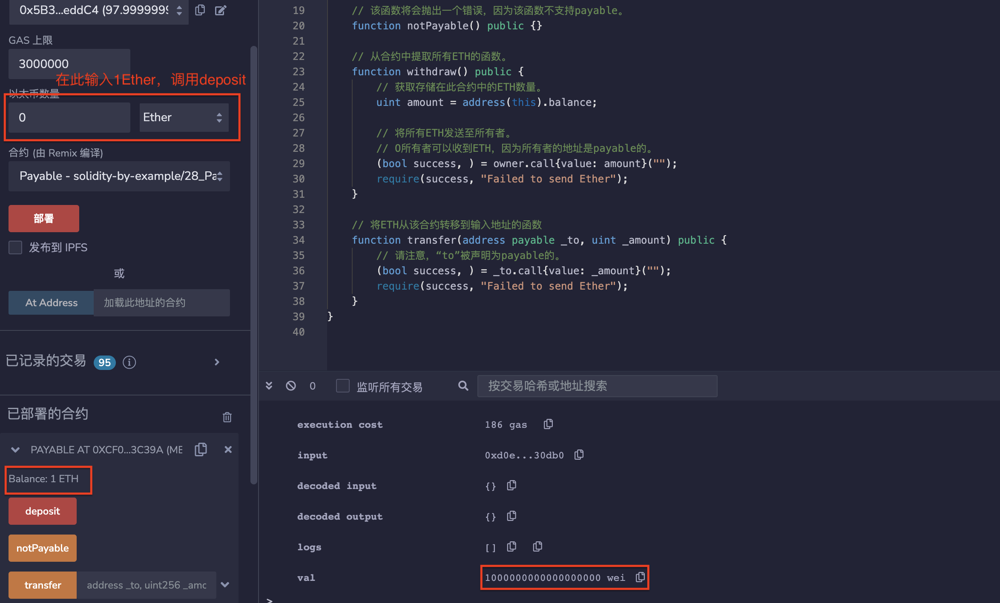
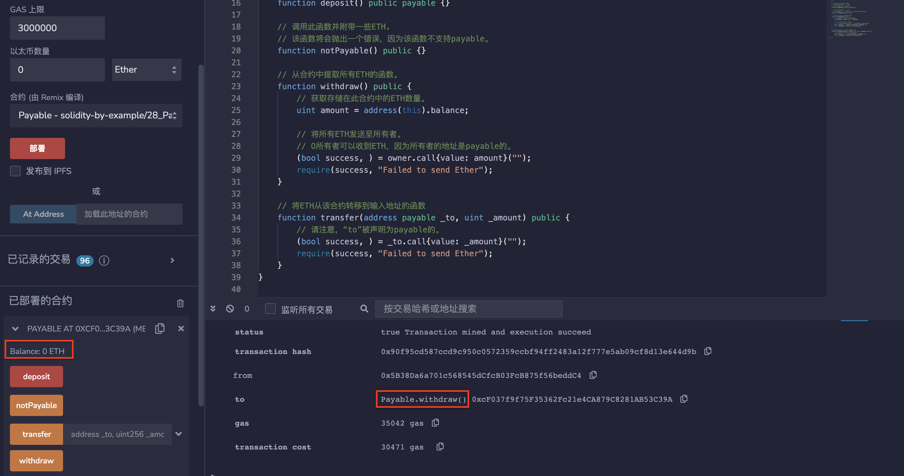
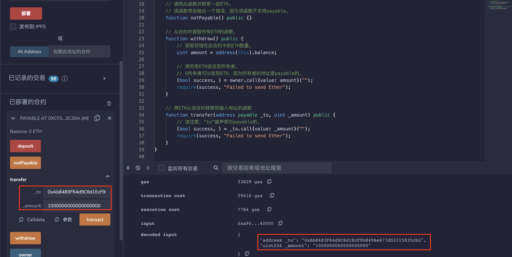

# 28.Payable
声明为“Payable”的函数和地址可以接收ETH进入合约。
* Payable地址可以接收ETH。
```solidity
address payable public owner;
```

* Payable构造函数可以接收ETH。
```solidity
constructor() payable {
    owner = payable(msg.sender);
}
```

* 将ETH存入此合约的函数，调用此函数并附带一些ETH，此合约的余额将自动更新。
```solidity
function deposit() public payable {}
```

* 调用此函数并附带一些ETH，该函数将会抛出一个错误，因为该函数不支持payable。
```solidity
function notPayable() public {}
```

* 从合约中提取所有ETH的函数。
```solidity
function withdraw() public {
    // 获取存储在此合约中的ETH数量。
    uint amount = address(this).balance;

    // 将所有ETH发送至所有者。
    // O所有者可以收到ETH，因为所有者的地址是payable的。
    (bool success, ) = owner.call{value: amount}("");
    require(success, "Failed to send Ether");
}
```

* 将ETH从该合约转移到输入地址的函数
```solidity
function transfer(address payable _to, uint _amount) public {
    // 请注意，“to”被声明为payable的。
    (bool success, ) = _to.call{value: _amount}("");
    require(success, "Failed to send Ether");
}
```
## remix验证
1. 部署合约Payable，调用deposit（）函数，存入1ETH，账户余额为1ETH。

2. 调用withdraw（）函数，提取出1ETH，账户余额为0。

3. 调用transfer（）函数，转账1ETH，目标地址增加1ETH，当前地址减少1ETH。



