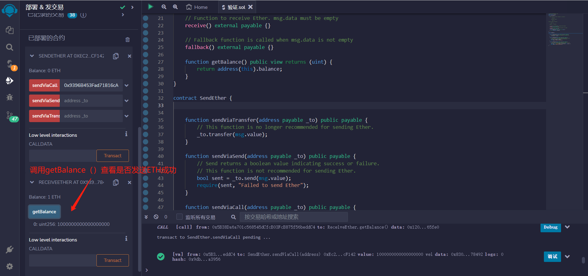

# 29.Sending Ether (transfer, send, call)
## 如何发送以太？
Solidity有三种方法向其他合约发送ETH，他们是：transfer()，send()和call()，其中call()是被鼓励的用法。

* transfer()（2300 gas，抛出错误）
* send()（2300 gas，返回布尔值）
* call()（转发所有gas或设置gas，返回布尔值）

### transfer
* 用法是接收方地址.transfer(发送ETH数额)。
* transfer()的gas限制是2300，足够用于转账，但对方合约的fallback()或receive()函数不能实现太复杂的逻辑。
* transfer()如果转账失败，会自动revert（回滚交易）。
```solidity
function sendViaTransfer(address payable _to) public payable {
    // 这个函数不再推荐用于发送以太。
    _to.transfer(msg.value);
}
```

### send
* 用法是接收方地址.send(发送ETH数额)。
* send()的gas限制是2300，足够用于转账，但对方合约的fallback()或receive()函数不能实现太复杂的逻辑。
* send()如果转账失败，不会revert。
* send()的返回值是bool，代表着转账成功或失败，需要额外代码处理一下。
```solidity
function sendViaSend(address payable _to) public payable {
    // 发送返回一个布尔值，表示成功或失败。
    // 这个函数不推荐用于发送以太。
    bool sent = _to.send(msg.value);
    require(sent, "Failed to send Ether");
}
```
### call
* 用法是接收方地址.call{value: 发送ETH数额}("")。
* call()没有gas限制，可以支持对方合约fallback()或receive()函数实现复杂逻辑。
* call()如果转账失败，不会revert。
* call()的返回值是(bool, data)，其中bool代表着转账成功或失败，需要额外代码处理一下。
```solidity
function sendViaCall(address payable _to) public payable {
    // 调用返回一个布尔值，表示成功或失败。
    // 这是目前推荐使用的方法。
    (bool sent, bytes memory data) = _to.call{value: msg.value}("");
    require(sent, "Failed to send Ether");
}
```

## 如何接收以太？
接收以太的合同必须至少有以下一个函数：

* receive() external payable
* fallback() external payable

如果msg.data为空，则调用receive()，否则调用fallback()。

## 应该使用哪种方法？
在2019年12月之后，结合重入保护的调用是推荐使用的方法。

通过以下方式防止重入：

* 在调用其他合同之前进行所有状态更改
* 使用重入保护修饰器

```solidity
// SPDX-License-Identifier: MIT
pragma solidity ^0.8.17;

contract ReceiveEther {
    /*
    哪个函数被调用，fallback()还是receive()？

           发送以太

               |
         msg.data 是否为空？
              / \
            yes  no
            /     \
receive()是否存在？  fallback()
         /   \
        yes   no
        /      \
    receive()   fallback()
    */

    // 接收以太的函数。msg.data必须为空
    receive() external payable {}

    // 当msg.data不为空时调用这个回退函数
    fallback() external payable {}

    function getBalance() public view returns (uint) {
        return address(this).balance;
    }
}
```


## remix验证
1. 部署ReceiveEther、SendEther合约 推荐使用sendViaCall发送以太。
复制ReceiveEther合约地址用作参数输入到sendViaCall()

2. ETH数量设置为1ETH调用sendViaCall()

3. 调用getBalance()查看是否接受ETH成功
