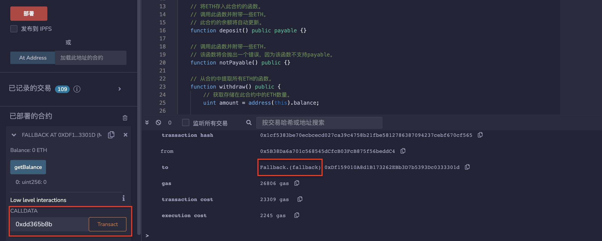
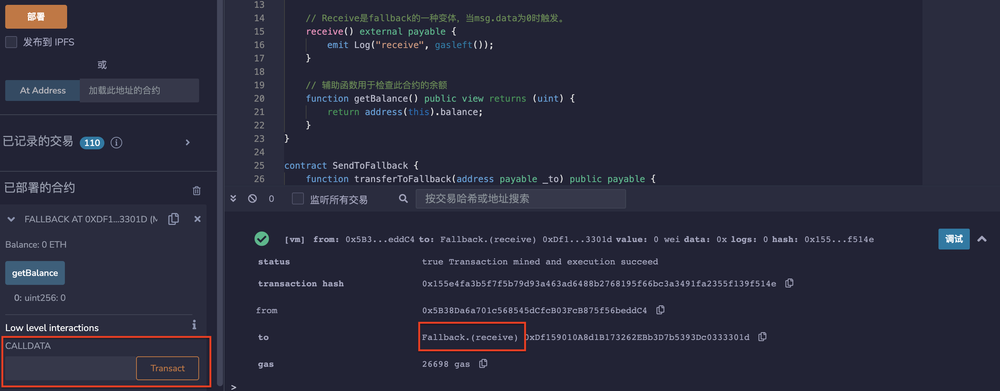

# 30.Fallback
fallback是一种特殊的函数，当以下情况发生时执行：
1. 调用不存在的函数时；
2. 将以太直接发送到合约但receive( )不存在或msg.data不为空时。

当通过transfer或send调用时，fallback的gas限制为2300。
* Fallback函数必须声明为external，并且不能带任何参数。Fallback函数还必须设置为payable，这样它才能接收以太。
需要注意的是，每个合约只能有一个Fallback函数。如果合约中定义了多个Fallback函数，则编译器会报错。
```solidity
fallback() external payable {
    // 发送/转移（将2300个gas转发到此回退函数）
    // call (转发所有gas)
    emit Log("fallback", gasleft());
}
```

* Receive是fallback的一种变体，当msg.data为0时触发。
```solidity
receive() external payable {
    emit Log("receive", gasleft());
}
```

* 辅助函数用于检查此合约的余额。
```solidity
function getBalance() public view returns (uint) {
    return address(this).balance;
}
```

* fallback可以选择使用字节作为输入和输出。
TestFallbackInputOutput -> FallbackInputOutput -> Counter
FallbackInputOutput 合约中定义了一个 fallback 函数，当该合约接收到以太时，
    会将传入的数据 data 转发给目标合约，并返回目标合约的执行结果 res。
```solidity
contract FallbackInputOutput {
    address immutable target;

    constructor(address _target) {
        target = _target;
    }

    fallback(bytes calldata data) external payable returns (bytes memory) {
        (bool ok, bytes memory res) = target.call{value: msg.value}(data);
        require(ok, "call failed");
        return res;
    }
}
```
* 一个简单的计数器合约
包含一个公共变量 count，初始值为 0，以及两个函数，分别是查询函数 get() 和增加计数器值的函数 inc().
```solidity
contract Counter {
    uint public count;

    function get() external view returns (uint) {
        return count;
    }

    function inc() external returns (uint) {
        count += 1;
        return count;
    }
}
```

* 测试合约
包含一个测试函数 test()，该函数需要传入一个 fallback 合约地址 _fallback 和一个数据 data，它会将数据 data 转发给 _fallback 合约，并打印执行结果。
另外，该合约还定义了一个辅助函数 getTestData()，
用于返回两个测试数据，分别是查询计数器值和增加计数器值的函数调用数据。
```solidity
contract TestFallbackInputOutput {
    event Log(bytes res);

    function test(address _fallback, bytes calldata data) external {
        (bool ok, bytes memory res) = _fallback.call(data);
        require(ok, "call failed");
        emit Log(res);
    }

    function getTestData() external pure returns (bytes memory, bytes memory) {
        return (abi.encodeCall(Counter.get, ()), abi.encodeCall(Counter.inc, ()));
    }
}
```
## remix验证
1. 使用calldata低级别调用不存在的函数，显示调用成功，执行fallback（）函数。

2. msg.data为0时，触发receive（）函数。

