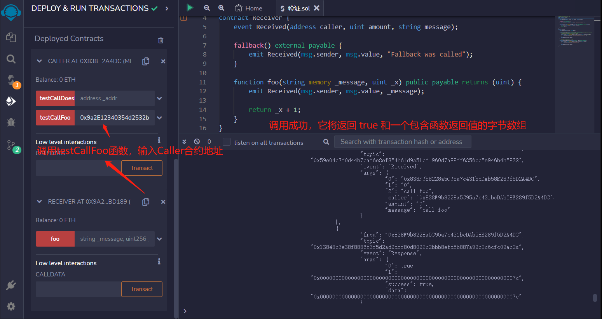
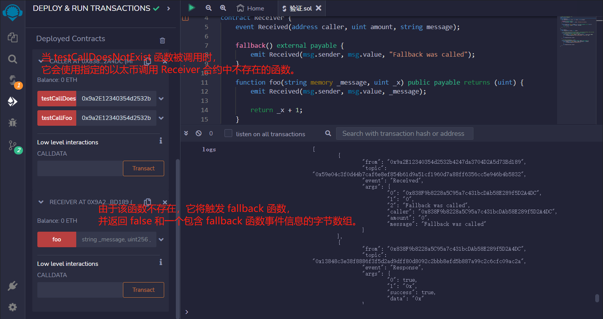

# 31.Call
call 是address类型的低级成员函数，它用来与其他合约交互。它的返回值为(bool, data)，分别对应call是否成功以及目标函数的返回值。
* call是solidity官方推荐的通过触发fallback或receive函数发送ETH的方法。
* 不推荐用call来调用另一个合约，因为当你调用不安全合约的函数时，你就把主动权交给了它。推荐的方法仍是声明合约变量后调用函数.
* 当我们不知道对方合约的源代码或ABI，就没法生成合约变量；这时，我们仍可以通过call调用对方合约的函数。

## 低级别函数的调用不推荐的原因：
* 回退命令不能传递错误
* 类型检查被绕过
* 函数存在性检查被省略

在这个合约中，fallback()函数会触发Received事件，并将调用者的地址、发送的以太数量和一个字符串"Fallback was called"作为参数传递给事件。
```solidity
event Received(address caller, uint amount, string message);

fallback() external payable {
    emit Received(msg.sender, msg.value, "Fallback was called");
}
```
foo()函数也会触发Received事件，并将调用者的地址、发送的以太数量和参数_message作为参数传递给事件。最后，foo函数将参数_x加1并返回该值。
```solidity
function foo(string memory _message, uint _x) public payable returns (uint) {
    emit Received(msg.sender, msg.value, _message);

    return _x + 1;
}
```

假设合约调用者没有合约接收者的源代码，但我们知道合约接收者的地址和要调用的函数。
```solidity
event Response(bool success, bytes data);

function testCallFoo(address payable _addr) public payable {
    // 你可以发送ether并指定自定义的 gas 数量。
    (bool success, bytes memory data) = _addr.call{value: msg.value,gas: 5000}(abi.encodeWithSignature("foo(string,uint256)", "call foo", 123)
        );

    emit Response(success, data);
}
```
调用不存在的函数会触发回退函数。
```solidity
function testCallDoesNotExist(address payable _addr) public payable {
    (bool success, bytes memory data) = _addr.call{value: msg.value}(
        abi.encodeWithSignature("doesNotExist()")
    );

    emit Response(success, data);
}
```


## remix验证
1. 部署Caller、Receiver合约，调用testCallFoo函数，输入Caller合约地址，验证。如果调用成功，它将返回 true 和一个包含函数返回值的字节数组。如果调用失败，它将返回 false 和一个包含错误信息的字节数组。无论调用是否成功，Caller 合约都会触发一个 Response 事件。

2. 当 testCallDoesNotExist 函数被调用时，它会使用指定的以太调用 Receiver 合约中不存在的函数。由于该函数不存在，它将触发 fallback 函数，并返回 false 和一个包含 fallback 函数事件信息的字节数组。无论调用是否成功，Caller 合约都会触发一个 Response 事件。
