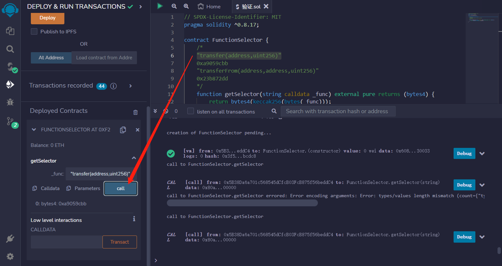
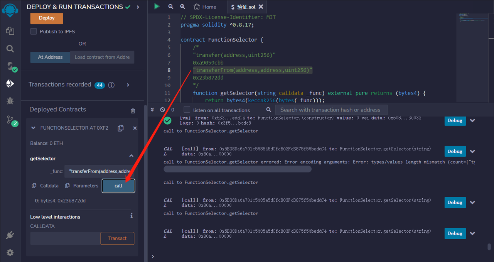

# 33.Function Selector
当调用函数时，calldata 的前4个字节指定要调用哪个函数。

这4个字节称为函数选择器。

以下面的代码为例。它使用 call 在地址 addr 上执行转账合约的转账操作。
```solidity
addr.call(abi.encodeWithSignature("transfer(address,uint256)", 0xSomeAddress, 123))
```
从 abi.encodeWithSignature(...) 返回的前4个字节是函数选择器。

也许您可以在代码中预先计算和内联函数选择器，从而节省一些gas？
下面是如何计算函数选择器的示例。

```solidity
// SPDX-License-Identifier: MIT
pragma solidity ^0.8.17;

contract FunctionSelector {
    /*
    "transfer(address,uint256)"
    0xa9059cbb
    "transferFrom(address,address,uint256)"
    0x23b872dd
    */
    function getSelector(string calldata _func) external pure returns (bytes4) {
        return bytes4(keccak256(bytes(_func)));
    }
}
```


## remix验证
1. 部署FunctionSelector 合约，它提供了一个公共函数getSelector，用于将字符串形式的函数名转换为对应的函数选择器(bytes4类型)。
2. 验证例1：

1. 例2：
