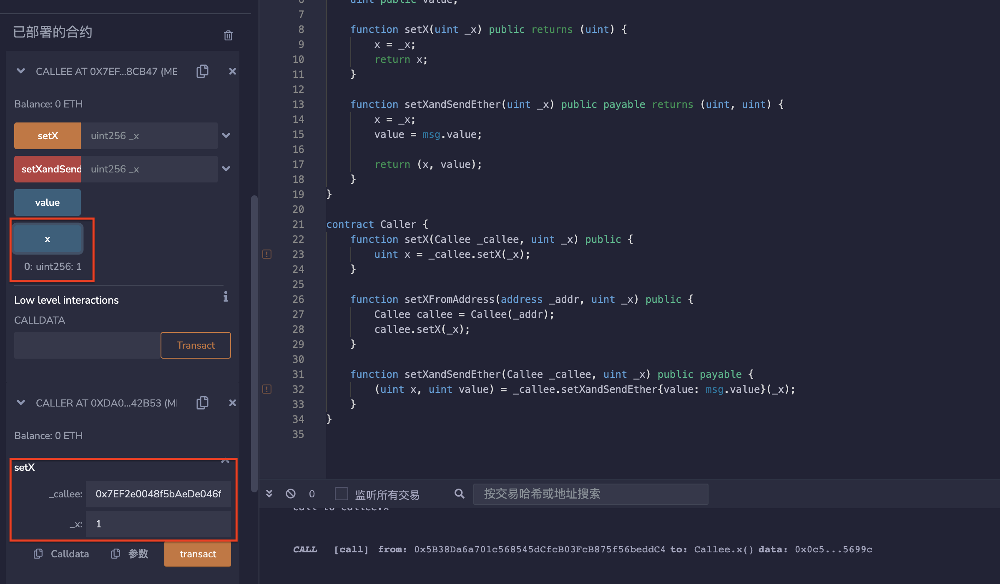

# 34.Calling Other Contract
## 合约可以用两种方式调用其他合约。
* 最简单的方法是直接调用它，如A.foo(x，y，z)。
* 另一种调用其他合约的方法是使用低级成员函数call，不建议使用此方法。
部署一个合约
被调用合约Callee
```solidity
contract Callee {
    uint public x;
    uint public value;

    function setX(uint _x) public returns (uint) {
        x = _x;
        return x;
    }

    function setXandSendEther(uint _x) public payable returns (uint, uint) {
        x = _x;
        value = msg.value;

        return (x, value);
    }
}
```
### 1. 直接调用
```solidity
function setX(Callee _callee, uint _x) public {
    uint x = _callee.setX(_x);
}

function setXFromAddress(address _addr, uint _x) public {
    Callee callee = Callee(_addr);
    callee.setX(_x);
}
```
### 2. 低成员函数call
```solidity
function setXandSendEther(Callee _callee, uint _x) public payable {
    (uint x, uint value) = _callee.setXandSendEther{value: msg.value}(_x);
}
```
## remix验证
1. 部署两个合约，调用Caller合约中的setX（）函数输入目标合约地址与X数值1，Callee合约中setX（）函数被调用，X被修改为1。

2. 调用Caller合约中的setXandSendEther（）函数输入目标合约地址与X数值2，Callee合约中setX（）函数被调用，X被修改为2。

3. 调用Caller合约中的setXFromAddress（）函数输入目标合约地址与X数值3，Callee合约中setX（）函数被调用，X被修改为3。

