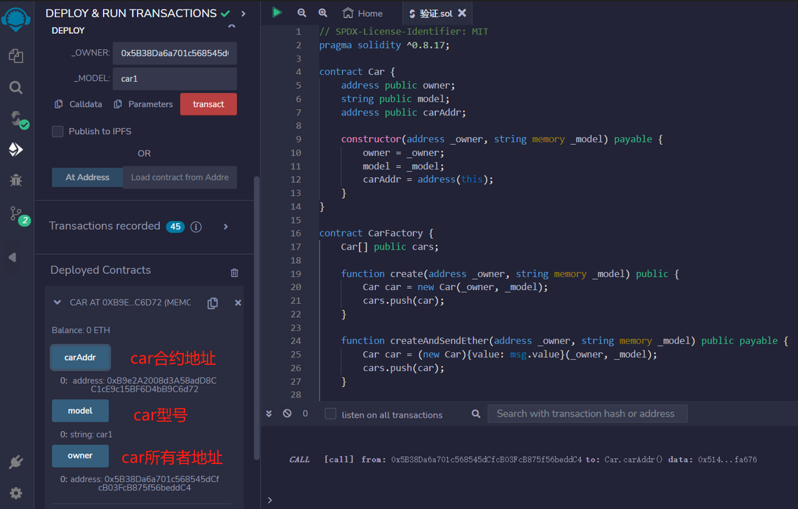
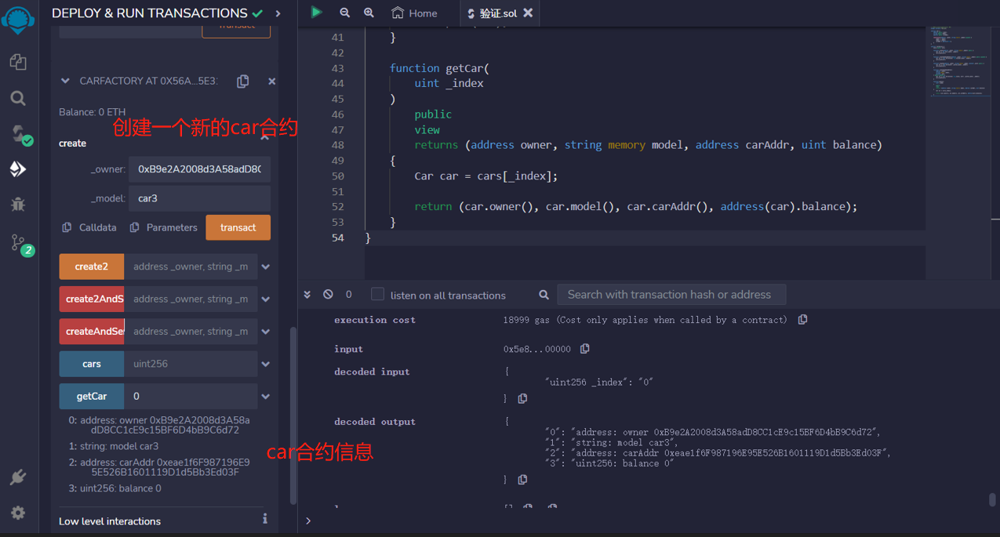

# 35.Contract that Creates other Contracts

合约可以使用new关键字创建其他合约。自 0.8.0 版本以来，new 关键字支持通过指定 salt 选项创建 create2 功能。
## 创建汽车工厂智能合约
```solidity
// SPDX-License-Identifier: MIT
pragma solidity ^0.8.17;

contract Car {
    address public owner;//car所有者地址
    string public model;//car型号
    address public carAddr;//car合约地址

    constructor(address _owner, string memory _model) payable {
        owner = _owner;
        model = _model;
        carAddr = address(this);
    }
}
```

## 创建新的汽车工厂智能合约的几种方法

1. 创建一个新的汽车合约，并将其添加到 cars 数组中，不发送以太。
```solidity
Car[] public cars;//创建cars数组
//创建一个新的汽车合约，并将其添加到 cars 数组中，不发送以太。
function create(address _owner, string memory _model) public {
    Car car = new Car(_owner, _model);
    cars.push(car);
}
```
2. 创建一个新的汽车合约，将指定数量的以太发送到该合约，并将其添加到 cars 数组中。
```solidity
function createAndSendEther(address _owner, string memory _model) public payable {
    Car car = (new Car){value: msg.value}(_owner, _model);
    cars.push(car);
}
```

3. 使用指定的 salt 值创建一个新的汽车合约，并将其添加到 cars 数组中，不发送以太。
```solidity
function create2(address _owner, string memory _model, bytes32 _salt) public {
    Car car = (new Car){salt: _salt}(_owner, _model);
    cars.push(car);
}
```

4. 使用指定的 salt 值创建一个新的汽车合约，将指定数量的以太发送到该合约，并将其添加到 cars 数组中。
```solidity
function create2AndSendEther(
    address _owner,
    string memory _model,
    bytes32 _salt
) public payable {
    Car car = (new Car){value: msg.value, salt: _salt}(_owner, _model);
        cars.push(car);
}
```

5.  返回指定索引的汽车合约的所有者地址、型号、合约地址和余额.
```solidity
function getCar(
    uint _index
)
    public
    view
    returns (address owner, string memory model, address carAddr, uint balance)
{
    Car car = cars[_index];

    return (car.owner(), car.model(), car.carAddr(), address(car).balance);
}
```


## remix验证
1. 合约的构造函数需要传入两个参数，owner 和 model，用于初始化合约的属性.传入参数部署Car合约，验证

2. 部署CarFactory合约，用于创建新的汽车合约。例如调用create()函数，创建一个新的汽车合约，调用getCar()函数返回指定索引的汽车合约的所有者地址、型号、合约地址和余额。
