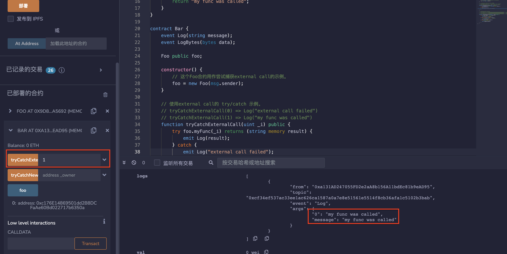

# 36.Try Catch
在solidity中，try-catch只能被用于external函数或创建合约时constructor（被视为external函数）的调用。
try/catch只能捕获来自外部函数调用和合约创建的错误。
用于try/catch示例的external合约：
```solidity
contract Foo {
    address public owner;

    constructor(address _owner) {
        require(_owner != address(0), "invalid address");
        assert(_owner != 0x0000000000000000000000000000000000000001);
        owner = _owner;
    }

    function myFunc(uint x) public pure returns (string memory) {
        require(x != 0, "require failed");
        return "my func was called";
    }
}
```

* 使用external call的try/catch示例。
```solidity
// tryCatchExternalCall(0) => Log("external call failed")
// tryCatchExternalCall(1) => Log("my func was called")
function tryCatchExternalCall(uint _i) public {
    try foo.myFunc(_i) returns (string memory result) {
        emit Log(result);
    } catch {
        emit Log("external call failed");
    }
}
```

* try/catch与合约创建的示例
```solidity
// tryCatchNewContract(0x0000000000000000000000000000000000000000) => Log("invalid address")
// tryCatchNewContract(0x0000000000000000000000000000000000000001) => LogBytes("")
// tryCatchNewContract(0x0000000000000000000000000000000000000002) => Log("Foo created")
function tryCatchNewContract(address _owner) public {
    try new Foo(_owner) returns (Foo foo) {
        // 你可以在这里使用变量foo。
        emit Log("Foo created");
    } catch Error(string memory reason) {
        // 捕捉失败的revert() 和 require()
        emit Log(reason);
    } catch (bytes memory reason) {
        // 捕捉失败的assert()
        emit LogBytes(reason);
    }
}
```
## remix验证
部署合约，调用tryCatchExternalCall（）函数输入数值0，调用失败，释放Log("external call failed")。

调用tryCatchExternalCall（）函数输入数值1，调用成功，释放Log("my func was called")。

调用tryCatchNewContract（）函数输入地址0x0000000000000000000000000000000000000000，require（）异常，释放Log("invalid address")。

调用tryCatchNewContract（）函数输入地址0x0000000000000000000000000000000000000001，assert（）异常，释放LogBytes("")。

调用tryCatchNewContract（）函数输入地址0x0000000000000000000000000000000000000002，释放Log("Foo created")。


