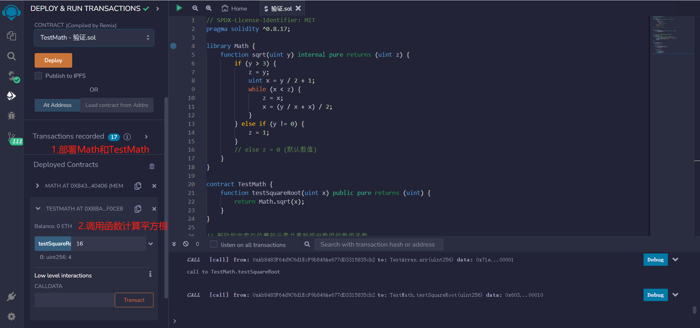
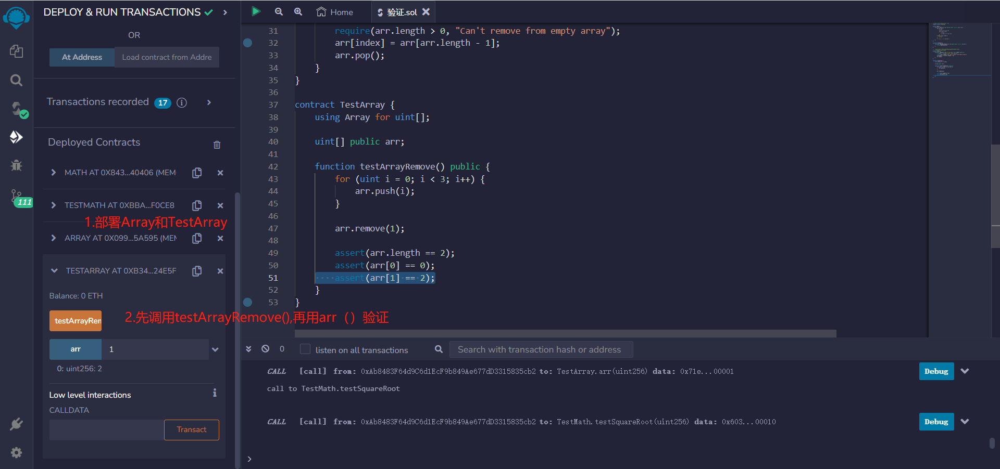

# 38.Library
library类似于合约，但不能声明任何状态变量，也不能发送ETH。
如果所有图书馆函数都是internal函数，则图书馆嵌入到合约中。
否则，在部署合约之前，必须部署图书馆并进行链接。

使用Library可以避免代码重复，提高代码的可读性和可维护性。Library还可以减少合约的大小，因为它们只需在合约中引用，而不需要在每个合约中都重新定义相同的代码。

在Solidity中，Library可以被定义为一个单独的合约，但是它不能部署为独立的合约。相反，Library的代码会被复制到使用它的合约中，从而实现代码的复用。

要使用Library，需要在合约中引入Library，并使用Library中的函数或变量。引入Library的方式是使用关键字“using”，并指定Library的名称。

例如，以下是一个简单的Library示例：
* 利用牛顿迭代法来逐步逼近平方根的值。如果传入的参数为0，则返回0；如果参数不为0且小于等于3，则返回1；否则，通过牛顿迭代法计算参数的平方根，并返回结果。
```solidity
library Math {
    function sqrt(uint y) internal pure returns (uint z) {
        if (y > 3) {
            z = y;
            uint x = y / 2 + 1;
            while (x < z) {
                z = x;
                x = (y / x + x) / 2;
            }
        } else if (y != 0) {
            z = 1;
        }
        // else z = 0 (默认数值)
    }
}
```

* 函数传入一个无符号整数x，并使用Math库中的sqrt函数计算x的平方根，然后返回结果。
```solidity
contract TestMath {
    function testSquareRoot(uint x) public pure returns (uint) {
    return Math.sqrt(x);
    }
}
```
* 删除指定索引位置的元素并重新组织数组的数组函数,以便元素之间没有间隙。
```solidity
library Array {
    function remove(uint[] storage arr, uint index) public {
        // 将最后一个元素移动到要删除的位置上。
        require(arr.length > 0, "Can't remove from empty array");
        arr[index] = arr[arr.length - 1];
        arr.pop();
    }
}
```
* 数组中添加三个元素，然后删除第二个元素，并检查数组的长度和剩余元素是否符合预期。
 ```solidity
contract TestArray {
    using Array for uint[];

    uint[] public arr;

    function testArrayRemove() public {
        for (uint i = 0; i < 3; i++) {
            arr.push(i);
        }

        arr.remove(1);

        assert(arr.length == 2);
        assert(arr[0] == 0);
        assert(arr[1] == 2);
    }
}
```

## remix验证
1. 部署 Math的库和 TestMath的合约。调用testSquareRoot（）函数计算平方根，查看结果

2. 部署Array的库和 TestArray的合约。调用testArrayRemove()函数往数组中添加三个元素，然后删除第二个元素，并检查数组的长度和剩余元素是否符合预期。
