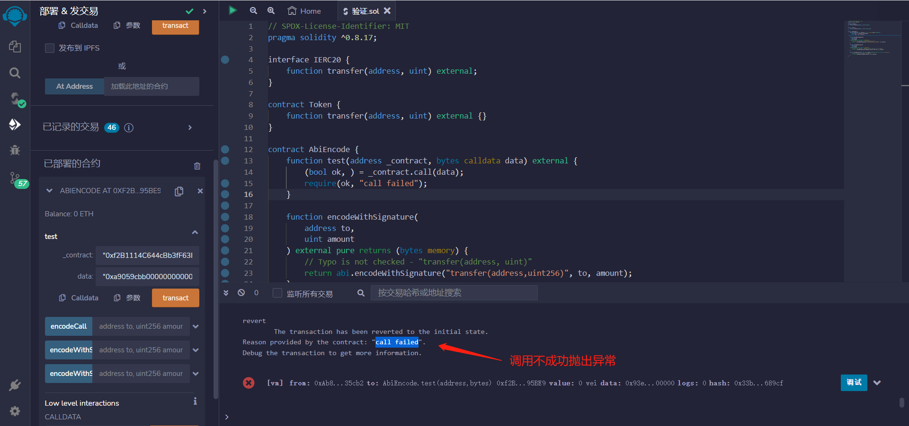

# 39.ABI Encode
ABI (Application Binary Interface，应用二进制接口)是与以太坊智能合约交互的标准。数据基于他们的类型编码；并且由于编码后不包含类型信息，解码时需要注明它们的类型。

函数参数编码为字节码

接受一个合约地址和一段字节码，
调用该合约并传递字节码，如果调用成功则不做任何操作，否则抛出异常。

```solidity
function test(address _contract, bytes calldata data) external {
    (bool ok, ) = _contract.call(data);
    require(ok, "call failed");
}
```
接受一个地址和一个整数，返回一个ABI编码后的字节数组，
该字节数组包含了一个名为"transfer"的函数签名，以及传递给该函数的地址和整数参数。

```solidity
function encodeWithSignature(
    address to,
    uint amount
) external pure returns (bytes memory) {
    // 拼写错误未被检查 - "transfer(address, uint)"
    return abi.encodeWithSignature("transfer(address,uint256)", to, amount);
}
```

该字节数组使用 IERC20.transfer.selector 作为函数选择器，将 to 地址和 amount 数量编码为参数。
这个函数的目的是编码一个 ERC20 转账操作的 ABI。

```solidity
function encodeWithSelector(
    address to,
    uint amount
) external pure returns (bytes memory) {
    // 类型错误未被检查 - (IERC20.transfer.selector, true, amount)
    return abi.encodeWithSelector(IERC20.transfer.selector, to, amount);
}
```
函数的目的是返回一个 bytes 类型的值，这个值是通过调用 abi.encodeCall 函数来生成的。
abi.encodeCall 函数将一个函数调用打包成一个字节数组，可以用于在以太坊上进行外部函数调用。

```solidity
function encodeCall(address to, uint amount) external pure returns (bytes memory) {
    // 拼写错误和类型错误将无法编译
    return abi.encodeCall(IERC20.transfer, (to, amount));
}
```


## remix验证
1. 部署AbiEncode合约，调用test函数输入一个合约地址和一段字节码，验证调用成功.

2. 调用不成功则抛出异常.

3. 验证encodeWithSignature、encodeWithSelector、encodeCall，三个函数编码.
