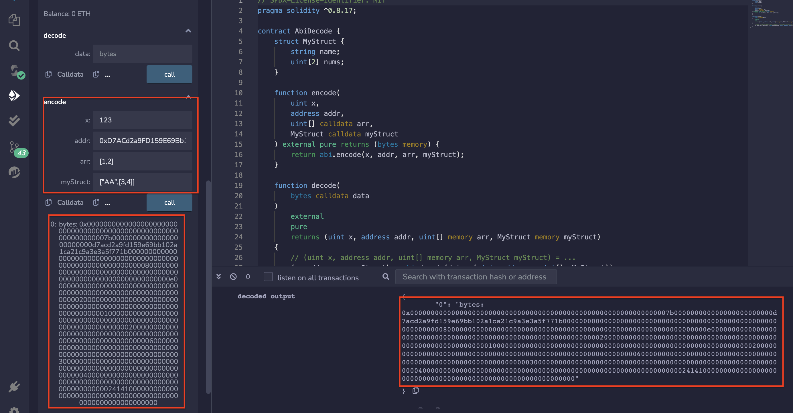
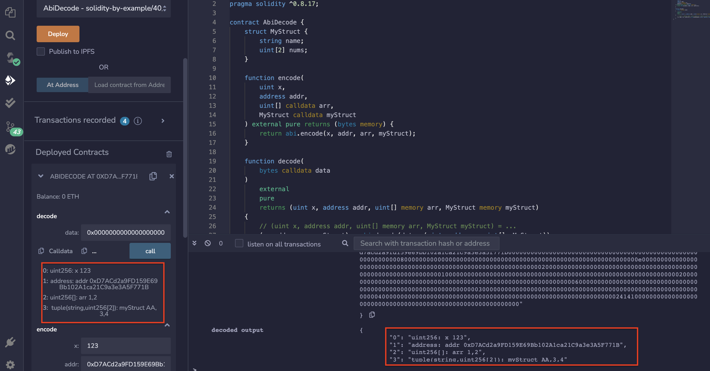

# 40.ABI Decode
ABI Decode是指将以太坊智能合约的函数调用数据解码为可读的参数和函数名称。
在以太坊中，智能合约的函数调用数据是以十六进制字符串的形式传递的。
为了执行这些函数，我们需要将这些数据解码为可读的形式，以便我们知道要执行哪个函数以及传递哪些参数

* abi.encode将数据编码为字节。
```solidity
function encode(
    uint x,
    address addr,
    uint[] calldata arr,
    MyStruct calldata myStruct
) external pure returns (bytes memory) {
    return abi.encode(x, addr, arr, myStruct);
}
```
* abi.decode将字节解码回数据。
```solidity
function decode(
    bytes calldata data
)
    external
    pure
    returns (uint x, address addr, uint[] memory arr, MyStruct memory myStruct)
{
    // (uint x, address addr, uint[] memory arr, MyStruct myStruct) = ...
    (x, addr, arr, myStruct) = abi.decode(data, (uint, address, uint[], MyStruct));
}
```
## remix验证
1. 部署合约，调用encode（）函数传入参数进行编码。

2. 调用decode（）函数对上文编码后参数进行解码。

