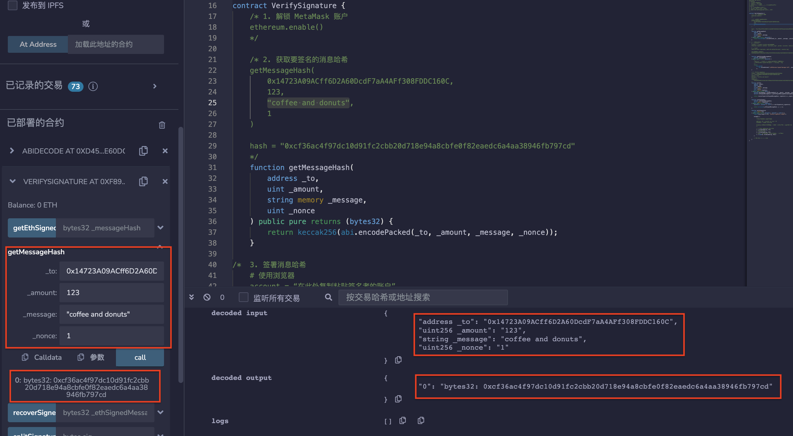
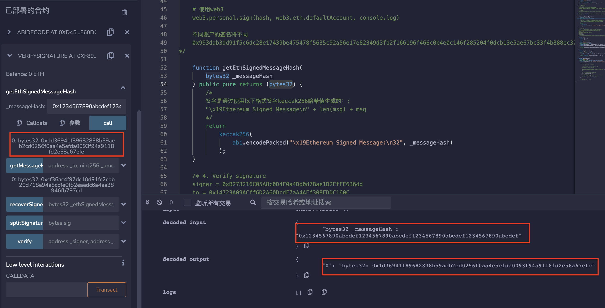
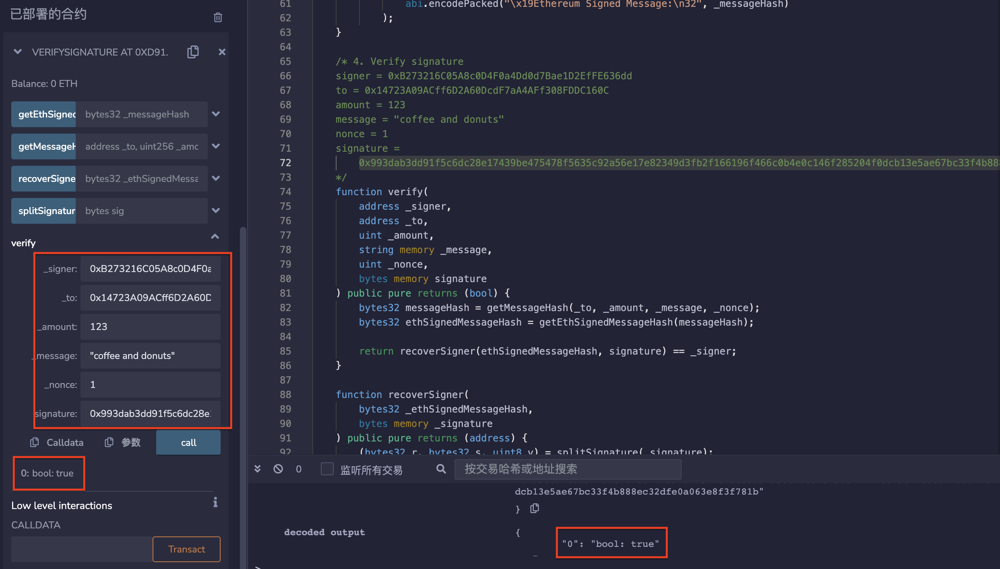
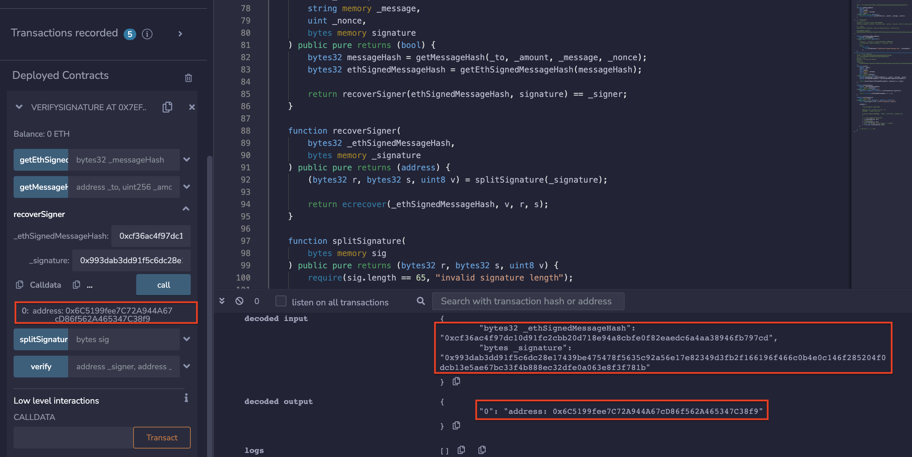
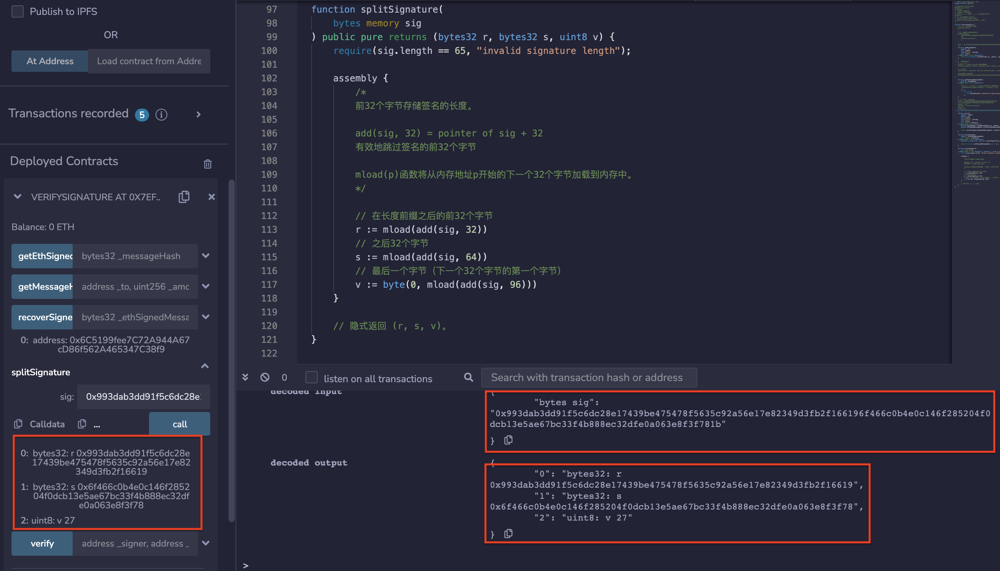

# 42.Verifying Signature

消息可以在链外进行签名，然后使用智能合约在链上进行验证。
[Example using ethers.js](https://github.com/t4sk/hello-erc20-permit/blob/main/test/verify-signature.js)

如何签名和验证
## Signing
1. 创建要签名的消息。
2. 对消息进行哈希处理。
3. 对哈希值进行签名（离线进行，保持私钥机密）。
## Verify
1. 从原始消息重新创建哈希值。
2. 从签名和哈希值中恢复签名者。
3. 将恢复的签名者与声明的签名者进行比较。

## 创建验证合约
1. 解锁 MetaMask 账户
    ethereum.enable()
2. 获取要签名的消息哈希
```solidity
    /*
    getMessageHash(
        0x14723A09ACff6D2A60DcdF7aA4AFf308FDDC160C,
        123,
        "coffee and donuts",
        1
    )

    hash = "0xcf36ac4f97dc10d91fc2cbb20d718e94a8cbfe0f82eaedc6a4aa38946fb797cd"
    */
    function getMessageHash(
        address _to,
        uint _amount,
        string memory _message,
        uint _nonce
    ) public pure returns (bytes32) {
        return keccak256(abi.encodePacked(_to, _amount, _message, _nonce));
    }
```
3. 签署消息哈希
```solidity
    # 使用浏览器
    account = “在此处复制粘贴签名者的账户”
    ethereum.request({ method: "personal_sign", params: [account, hash]}).then(console.log)

    # 使用web3
    web3.personal.sign(hash, web3.eth.defaultAccount, console.log)

    不同账户的签名将不同
    0x993dab3dd91f5c6dc28e17439be475478f5635c92a56e17e82349d3fb2f166196f466c0b4e0c146f285204f0dcb13e5ae67bc33f4b888ec32dfe0a063e8f3f781b
*/

    function getEthSignedMessageHash(
        bytes32 _messageHash
    ) public pure returns (bytes32) {
        /*
        签名是通过使用以下格式签名keccak256哈希值生成的：:
        "\x19Ethereum Signed Message\n" + len(msg) + msg
        */
        return
            keccak256(
                abi.encodePacked("\x19Ethereum Signed Message:\n32", _messageHash)
            );
    }
```
4. 验证签名
```solidity
/*
signer = 0xB273216C05A8c0D4F0a4Dd0d7Bae1D2EfFE636dd
to = 0x14723A09ACff6D2A60DcdF7aA4AFf308FDDC160C
amount = 123
message = "coffee and donuts"
nonce = 1
signature =
    0x993dab3dd91f5c6dc28e17439be475478f5635c92a56e17e82349d3fb2f166196f466c0b4e0c146f285204f0dcb13e5ae67bc33f4b888ec32dfe0a063e8f3f781b
*/
function verify(
    address _signer,
    address _to,
    uint _amount,
    string memory _message,
    uint _nonce,
    bytes memory signature
) public pure returns (bool) {
    bytes32 messageHash = getMessageHash(_to, _amount, _message, _nonce);
    bytes32 ethSignedMessageHash = getEthSignedMessageHash(messageHash);

    return recoverSigner(ethSignedMessageHash, signature) == _signer;
}
```
## remix验证
1. 部署合约，调用getMessageHash（）函数，对消息进行哈希处理。

2. 调用getEthSignedMessageHash（）函数，输入messageHash生成签名。

3. 调用verify（）函数验证签名。

4. 调用recoverSigner（）函数通过签名和哈希值中恢复签名者。

5. 调用splitSignature（）函数拆分签名。

