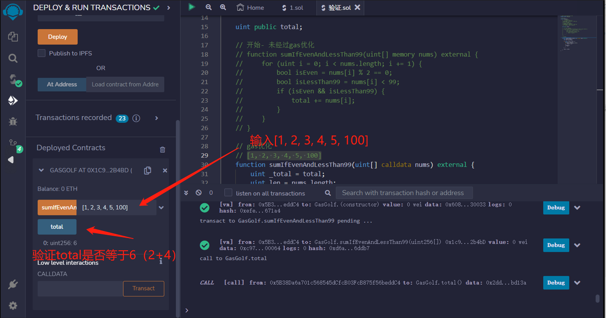

# 43.Gas Saving Techniques
一些节省gas的技巧。

1. 用calldata替换储存器
2. 将状态变量加载到储存器中
3. 用++i替换for循环i++
4. 缓存数组元素
5. 短路

```solidity
// SPDX-License-Identifier: MIT
pragma solidity ^0.8.17;

// gas golf
contract GasGolf {
    // 开始- 50908 gas
    // 使用calldata- 49163 gas
    // 将状态变量加载到储存器中- 48952 gas
    // 短路- 48634 gas
    // 循环增量- 48244 gas
    // 缓存数组长度- 48209 gas
    // 将数组元素加载到储存器中- 48047 gas
    // 不检查i的溢出/下溢- 47309 gas

    uint public total;

    // 开始- 未经过gas优化
    // function sumIfEvenAndLessThan99(uint[] memory nums) external {
    //     for (uint i = 0; i < nums.length; i += 1) {
    //         bool isEven = nums[i] % 2 == 0;
    //         bool isLessThan99 = nums[i] < 99;
    //         if (isEven && isLessThan99) {
    //             total += nums[i];
    //         }
    //     }
    // }

    // gas优化
    // [1, 2, 3, 4, 5, 100]
    //该函数使用了 unchecked 关键字，表示在运行时不检查整数溢出。
    function sumIfEvenAndLessThan99(uint[] calldata nums) external {
        uint _total = total;
        uint len = nums.length;

        for (uint i = 0; i < len; ) {
            uint num = nums[i];
            if (num % 2 == 0 && num < 99) {
                _total += num;
            }
            unchecked {
                ++i;
            }
        }

        total = _total;
    }
}
```

## remix验证
1. 部署 GasGolf 合约，调用sumIfEvenAndLessThan99函数，输入[1, 2, 3, 4, 5, 100]后查看total是否等于6（2+4），验证
