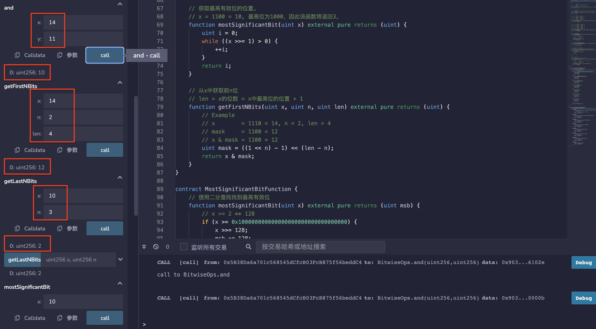
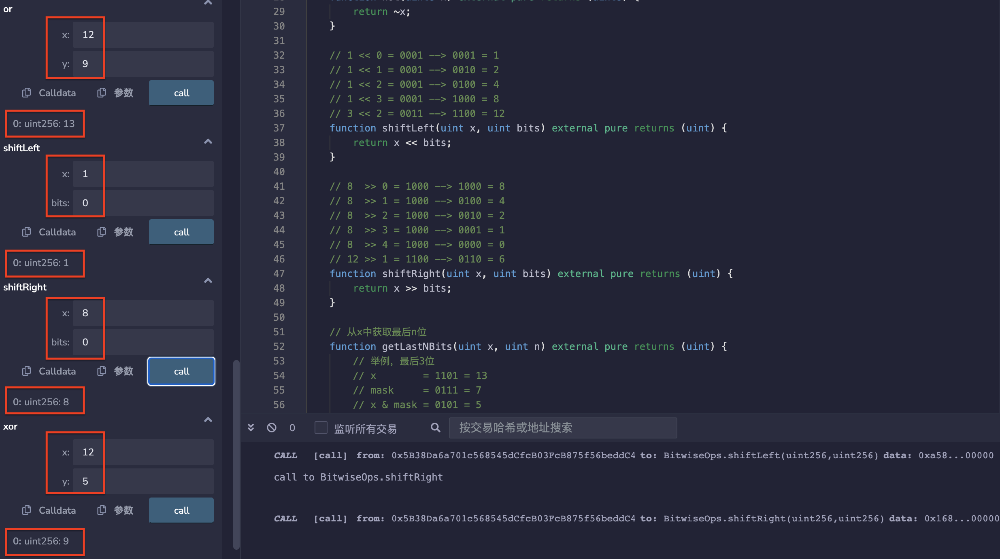
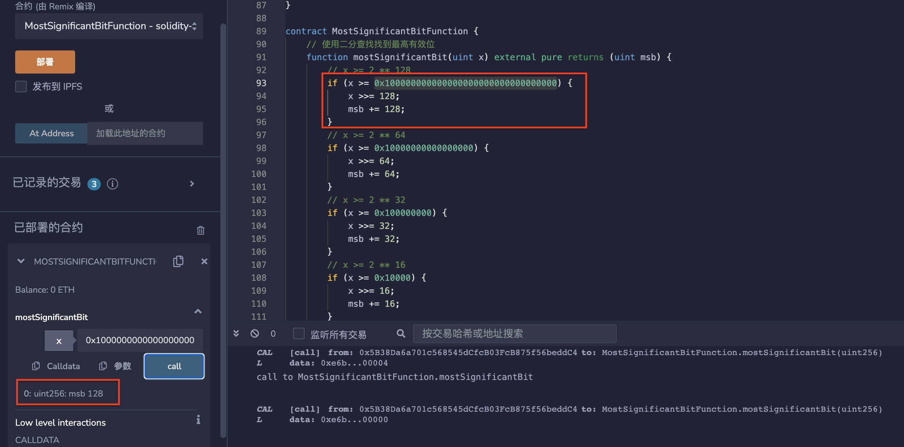
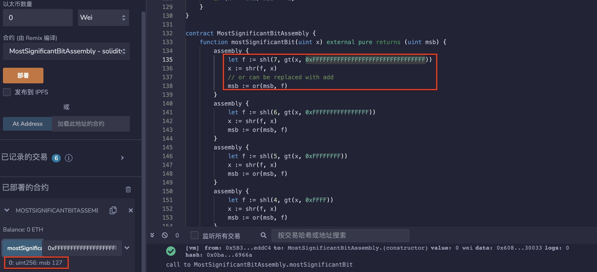

# 44.Bitwise Operators
Bitwise Operators是一组用于执行位运算的运算符。
## 位运算符

* and 按位与
```solidity
// x     = 1110 = 8 + 4 + 2 + 0 = 14
// y     = 1011 = 8 + 0 + 2 + 1 = 11
// x & y = 1010 = 8 + 0 + 2 + 0 = 10
function and(uint x, uint y) external pure returns (uint) {
    return x & y;
}
```

* or 按位或
```solidity
// x     = 1100 = 8 + 4 + 0 + 0 = 12
// y     = 1001 = 8 + 0 + 0 + 1 = 9
// x | y = 1101 = 8 + 4 + 0 + 1 = 13
function or(uint x, uint y) external pure returns (uint) {
    return x | y;
}
```

* xor 按位异或
```solidity
// x     = 1100 = 8 + 4 + 0 + 0 = 12
// y     = 0101 = 0 + 4 + 0 + 1 = 5
// x ^ y = 1001 = 8 + 0 + 0 + 1 = 9
function xor(uint x, uint y) external pure returns (uint) {
    return x ^ y;
}
```

* not 按位取反
```solidity
// x  = 00001100 =   0 +  0 +  0 +  0 + 8 + 4 + 0 + 0 = 12
// ~x = 11110011 = 128 + 64 + 32 + 16 + 0 + 0 + 2 + 1 = 243
function not(uint8 x) external pure returns (uint8) {
    return ~x;
}
```

* shiftLeft 左移
```solidity
// 1 << 0 = 0001 --> 0001 = 1
// 1 << 1 = 0001 --> 0010 = 2
// 1 << 2 = 0001 --> 0100 = 4
// 1 << 3 = 0001 --> 1000 = 8
// 3 << 2 = 0011 --> 1100 = 12
function shiftLeft(uint x, uint bits) external pure returns (uint) {
    return x << bits;
}
```

* shiftRight 右移
```solidity
// 8  >> 0 = 1000 --> 1000 = 8
// 8  >> 1 = 1000 --> 0100 = 4
// 8  >> 2 = 1000 --> 0010 = 2
// 8  >> 3 = 1000 --> 0001 = 1
// 8  >> 4 = 1000 --> 0000 = 0
// 12 >> 1 = 1100 --> 0110 = 6
function shiftRight(uint x, uint bits) external pure returns (uint) {
    return x >> bits;
}
```

* getLastNBits 获取最后n位
```solidity
function getLastNBits(uint x, uint n) external pure returns (uint) {
    // 举例，最后3位
    // x        = 1101 = 13
    // mask     = 0111 = 7
    // x & mask = 0101 = 5
    uint mask = (1 << n) - 1;
    return x & mask;
}
```

* getLastNBitsUsingMod 使用模运算获取最后n位
```solidity
function getLastNBitsUsingMod(uint x, uint n) external pure returns (uint) {
    // 1 << n = 2 ** n
    return x % (1 << n);
}
```

* mostSignificantBit 获取最高有效位的位置。
```solidity
function mostSignificantBit(uint x) external pure returns (uint) {
    uint i = 0;
    while ((x >>= 1) > 0) {
        ++i;
    }
    return i;
}
```

* getFirstNBits 从x中获取前n位
```solidity
// len = x的位数 = x中最高位的位置 + 1
function getFirstNBits(uint x, uint n, uint len) external pure returns (uint) {
    // Example
    // x        = 1110 = 14, n = 2, len = 4
    // mask     = 1100 = 12
    // x & mask = 1100 = 12
    uint mask = ((1 << n) - 1) << (len - n);
    return x & mask;
}
```

## 最高有效位
```solidity
contract MostSignificantBitFunction {
    // 使用二分查找找到最高有效位
    function mostSignificantBit(uint x) external pure returns (uint msb) {
        // x >= 2 ** 128
        if (x >= 0x100000000000000000000000000000000) {
            x >>= 128;
            msb += 128;
        }
        // x >= 2 ** 64
        if (x >= 0x10000000000000000) {
            x >>= 64;
            msb += 64;
        }
        // x >= 2 ** 32
        if (x >= 0x100000000) {
            x >>= 32;
            msb += 32;
        }
        // x >= 2 ** 16
        if (x >= 0x10000) {
            x >>= 16;
            msb += 16;
        }
        // x >= 2 ** 8
        if (x >= 0x100) {
            x >>= 8;
            msb += 8;
        }
        // x >= 2 ** 4
        if (x >= 0x10) {
            x >>= 4;
            msb += 4;
        }
        // x >= 2 ** 2
        if (x >= 0x4) {
            x >>= 2;
            msb += 2;
        }
        // x >= 2 ** 1
        if (x >= 0x2) msb += 1;
    }
}
```

## 汇编语言中的最高有效位
```solidity
contract MostSignificantBitAssembly {
    function mostSignificantBit(uint x) external pure returns (uint msb) {
        assembly {
            let f := shl(7, gt(x, 0xFFFFFFFFFFFFFFFFFFFFFFFFFFFFFFFF))
            x := shr(f, x)
            // 或者可以用 add 来替代
            msb := or(msb, f)
        }
        assembly {
            let f := shl(6, gt(x, 0xFFFFFFFFFFFFFFFF))
            x := shr(f, x)
            msb := or(msb, f)
        }
        assembly {
            let f := shl(5, gt(x, 0xFFFFFFFF))
            x := shr(f, x)
            msb := or(msb, f)
        }
        assembly {
            let f := shl(4, gt(x, 0xFFFF))
            x := shr(f, x)
            msb := or(msb, f)
        }
        assembly {
            let f := shl(3, gt(x, 0xFF))
            x := shr(f, x)
            msb := or(msb, f)
        }
        assembly {
            let f := shl(2, gt(x, 0xF))
            x := shr(f, x)
            msb := or(msb, f)
        }
        assembly {
            let f := shl(1, gt(x, 0x3))
            x := shr(f, x)
            msb := or(msb, f)
        }
        assembly {
            let f := gt(x, 0x1)
            msb := or(msb, f)
        }
    }
}
```
## remix验证
1. 对位运算符进行验证。


2. 对最高有效位进行验证。

3. 对汇编语言中的最高有效位进行验证。

