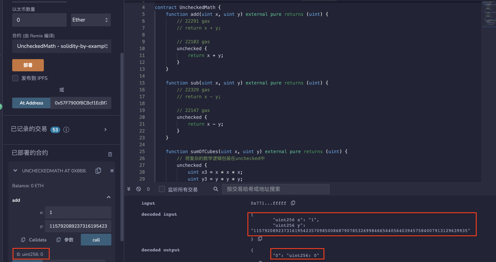
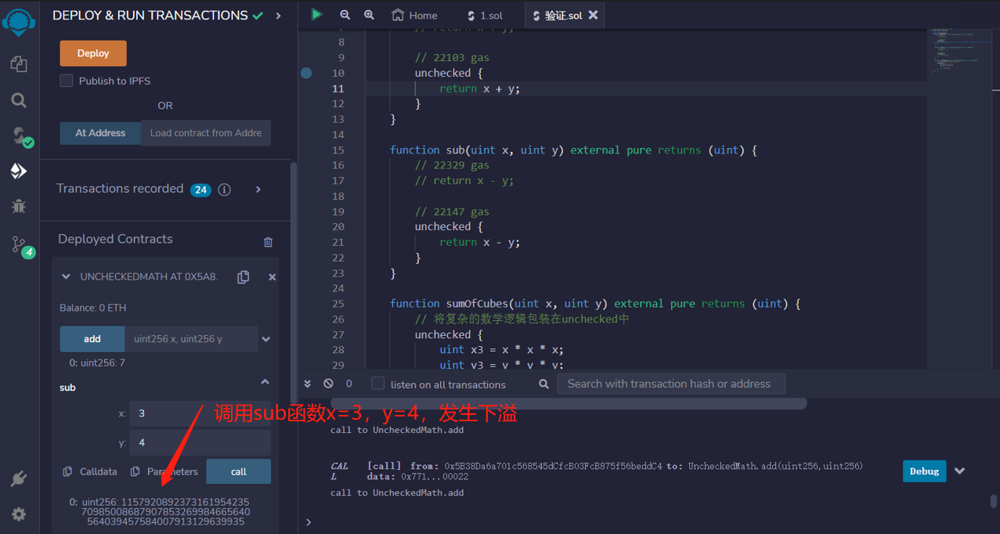
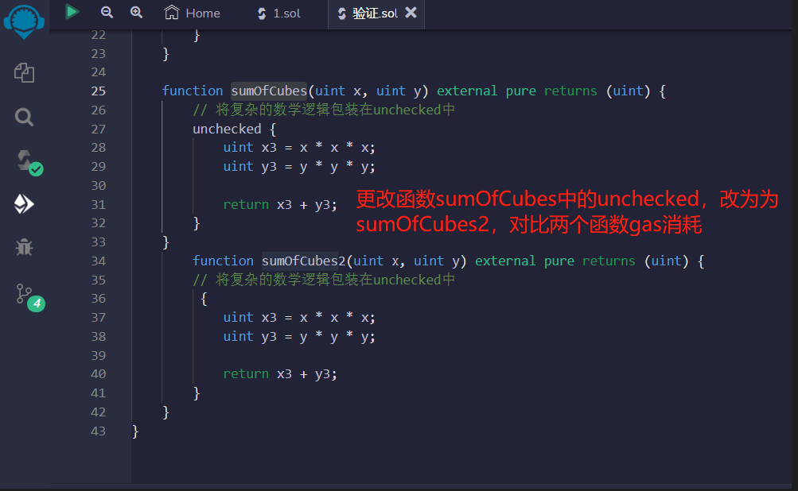
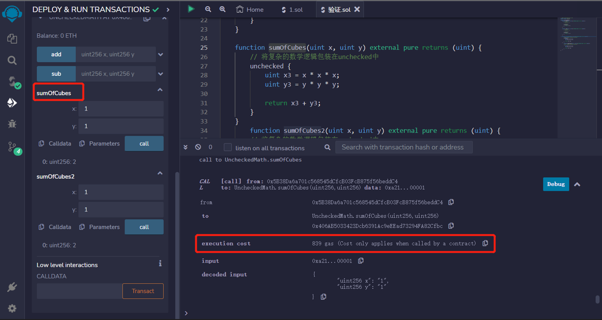
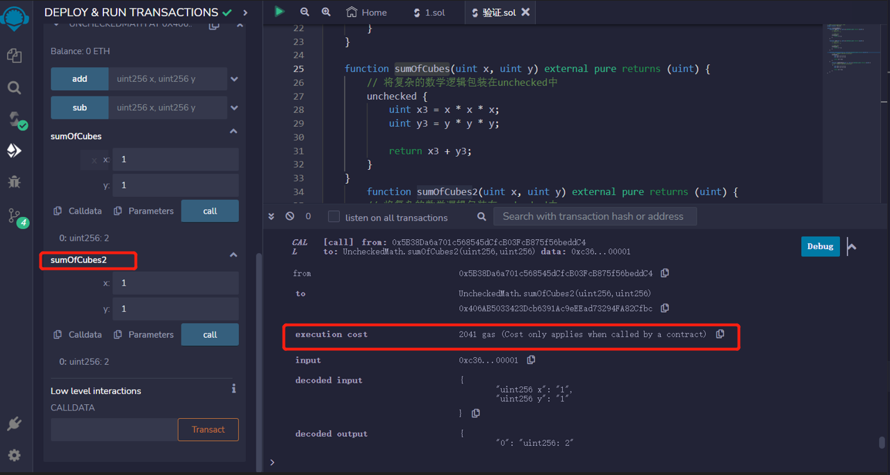

# 45.Unchecked Math
在Solidity 0.8中，数字的上溢和下溢会引发错误。这可以通过使用unchecked来禁用。
禁用上溢/下溢检查可以节省gas。

## 上溢
```solidity
function add(uint x, uint y) external pure returns (uint) {
    // 22291 gas
    // return x + y;

    // 22103 gas
    unchecked {
        return x + y;
    }
}
```

## 下溢
```solidity
function sub(uint x, uint y) external pure returns (uint) {
    // 22329 gas
    // return x - y;

    // 22147 gas
    unchecked {
        return x - y;
    }
}
```

## 复杂的数学逻辑包装在unchecked中
```solidity
function sumOfCubes(uint x, uint y) external pure returns (uint) {
    // 将复杂的数学逻辑包装在unchecked中
    unchecked {
        uint x3 = x * x * x;
        uint y3 = y * y * y;

        return x3 + y3;
    }
}
```


## remix验证
1. 部署UncheckedMath合约，调用add函数x=1，y=最大的uint256数值，发生上溢，结果为0.

2. 调用sub函数x=3，y=4，发生下溢

3. 更改函数sumOfCubes中的unchecked，改为为sumOfCubes2，对比两个函数gas消耗

* sumOfCubes

* sumOfCubes2
