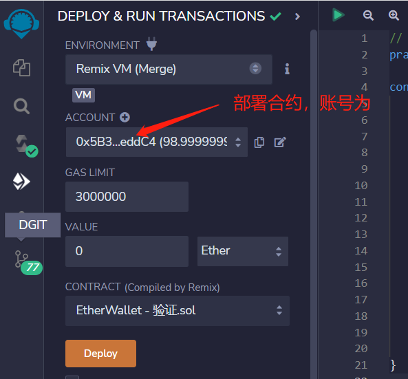
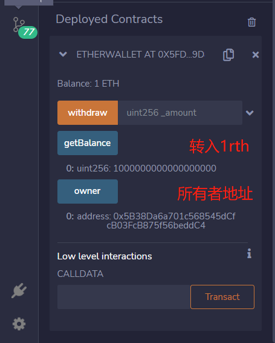
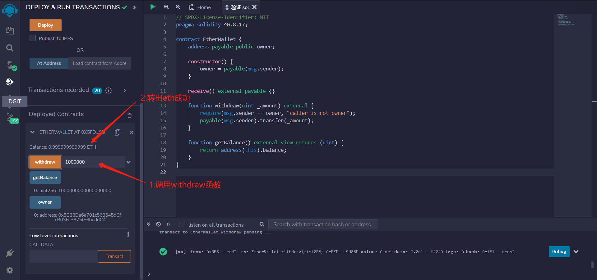
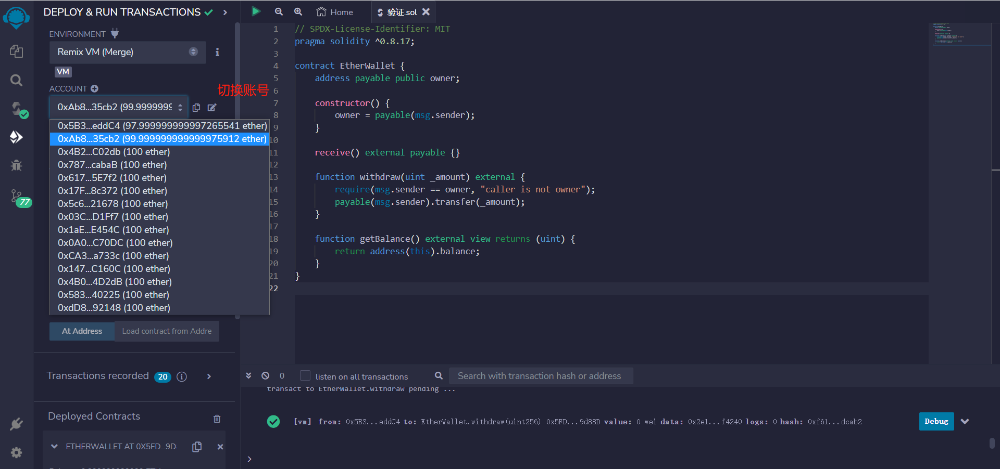
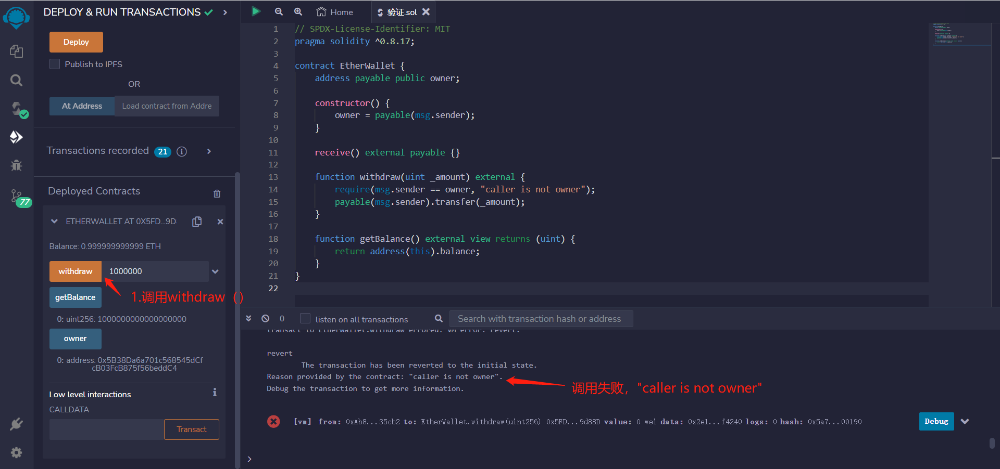

# 46.Ether Wallet
Ether Wallet是一种在线以太坊钱包，允许用户存储、发送和接收以太和其他代币。
通过Ether Wallet，用户可以轻松创建自己的智能合约，并在以太坊区块链上执行它们。

举一个基本钱包的例子EtherWallet。
* 任何人都可以发送ETH。
* 只有所有者才能提取。
```solidity
contract EtherWallet {
    //定义一个可支付地址类型的公共变量owner，表示合约所有者。
    address payable public owner;
    
    //构造函数，当合约被创建时自动执行，将合约创建者的地址赋值给owner。
    constructor() {
        owner = payable(msg.sender);
    }

    //receive函数，当以太被转入合约地址时自动执行，将转入的以太存储在合约地址中。
    receive() external payable {}

    //提款函数，允许owner从合约地址中提取指定数量的以太。
    function withdraw(uint _amount) external {
        //在提款函数中添加一个要求，只有owner才能调用该函数。
        require(msg.sender == owner, "caller is not owner");
        //将指定数量的以太转移到owner地址中。
        payable(msg.sender).transfer(_amount);
    }

    //查询余额函数，允许任何人查询当前合约地址中的以太余额。
    function getBalance() external view returns (uint) {
        return address(this).balance;
    }
}
```

## remix验证

1. 部署合约，账号为0x5B...eedC4.

2. 通过CALLDATA调用receive（）转入1ETH,查看合约金额和所有者

3. 调用withdraw（）函数，调用者为owner时，调用成功。

4. 切换账号为0xAb8...35cb2

5. 再次尝试调用withdraw（），调用失败。调用者不为owner


