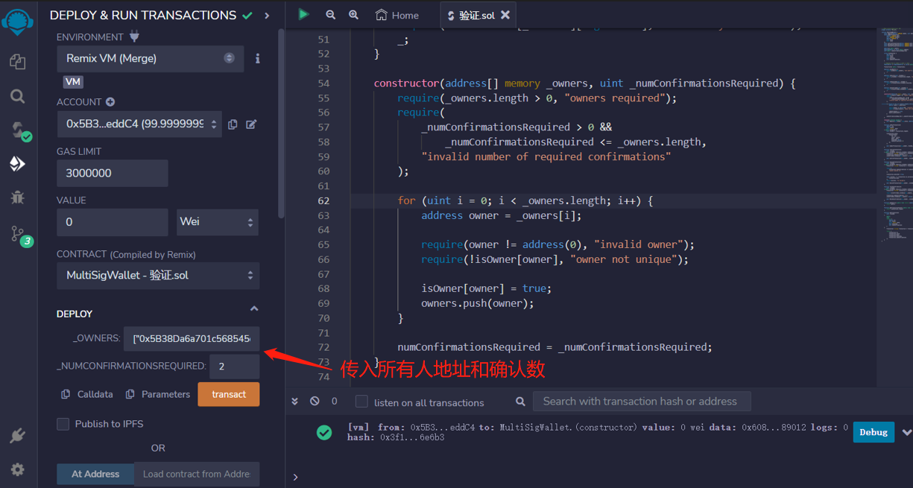
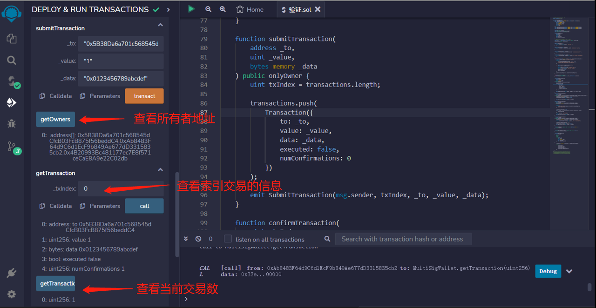

# 47.Multi-Sig Wallet
## 多签钱包

让我们创建一个多签钱包。以下是规格说明。

钱包所有者可以：

* 提交交易
* 批准和撤销待处理交易的批准
* 任何人都可以在足够多的所有者批准后执行交易。

### 事件
MultisigWallet合约有5个事件：
1. event Deposit（）：表示有人向合约地址存入了一定数量的以太。
```solidity
event Deposit(address indexed sender, uint amount, uint balance);
```

2. event SubmitTransaction（）：表示有一个交易被提交到合约中待执行。
```solidity
event SubmitTransaction(
    address indexed owner,
    uint indexed txIndex,
    address indexed to,
    uint value,
    bytes data
);
```

3. event ConfirmTransaction():表示一个交易被确认。
```solidity
event ConfirmTransaction(address indexed owner, uint indexed txIndex);
```

4. event RevokeConfirmation():表示一个确认被撤销。
```solidity
event RevokeConfirmation(address indexed owner, uint indexed txIndex);
```
5. event ExecuteTransaction():表示一个待执行的交易被执行了。
```solidity
event ExecuteTransaction(address indexed owner, uint indexed txIndex);
```

### 核心要素
```solidity
address[] public owners;
mapping(address => bool) public isOwner;
uint public numConfirmationsRequired;

struct Transaction {
    address to;
    uint value;
    bytes data;
    bool executed;
    uint numConfirmations;
}

// 从交易索引 => 拥有者 => 布尔值的映射
mapping(uint => mapping(address => bool)) public isConfirmed;

Transaction[] public transactions;
```

### 修饰器
```solidity
modifier onlyOwner() {
    require(isOwner[msg.sender], "not owner");
    _;
}

modifier txExists(uint _txIndex) {
    require(_txIndex < transactions.length, "tx does not exist");
    _;
}

modifier notExecuted(uint _txIndex) {
    require(!transactions[_txIndex].executed, "tx already executed");
    _;
}

modifier notConfirmed(uint _txIndex) {
    require(!isConfirmed[_txIndex][msg.sender], "tx already confirmed");
    _;
}
```
### 函数
MultiSigWallet合约有9个函数：
1. 构造函数：多重签名合约的构造函数，需要传入所有的合约拥有者地址数组和所需的确认数。
该函数首先会检查所传入的拥有者地址数组长度是否大于0，确认数是否大于0且小于等于拥有者数组长度。
然后通过循环遍历所有拥有者地址，检查每个地址是否有效、是否唯一，并将其添加到拥有者数组中。
最后，将所需的确认数赋值给numConfirmationsRequired变量。
```solidity
constructor(address[] memory _owners, uint _numConfirmationsRequired) {
    require(_owners.length > 0, "owners required");
    require(
        _numConfirmationsRequired > 0 &&
            _numConfirmationsRequired <= _owners.length,
        "invalid number of required confirmations"
    );

    for (uint i = 0; i < _owners.length; i++) {
        address owner = _owners[i];

        require(owner != address(0), "invalid owner");
        require(!isOwner[owner], "owner not unique");

        isOwner[owner] = true;
        owners.push(owner);
    }

    numConfirmationsRequired = _numConfirmationsRequired;
}
```

2. receive（）：当合约收到以太时会被自动调用。
在该合约中，收到以太时会触发 Deposit 事件。
```solidity
receive() external payable {
    emit Deposit(msg.sender, msg.value, address(this).balance);
}
```

3. submitTransaction（）：该函数用于提交一笔交易，需要传入目标地址、转账金额、交易数据。
只有合约的所有者才有权限调用该函数。该函数会将交易信息存储在 transactions 数组中，并触发 SubmitTransaction 事件。
```solidity
function submitTransaction(
    address _to,
    uint _value,
    bytes memory _data
) public onlyOwner {
    uint txIndex = transactions.length;

    transactions.push(
        Transaction({
            to: _to,
            value: _value,
            data: _data,
            executed: false,
            numConfirmations: 0
        })
    );

    emit SubmitTransaction(msg.sender, txIndex, _to, _value, _data);
}
```

4. confirmTransaction（）：该函数用于确认一笔交易
需要传入交易在 transactions 数组中的索引。
只有合约的所有者才有权限调用该函数。
该函数会将该交易的确认数加一，并将该交易在 isConfirmed 数组中对应的值设为 true，同时触发 ConfirmTransaction 事件。
```solidity
function confirmTransaction(
    uint _txIndex
) public onlyOwner txExists(_txIndex) notExecuted(_txIndex) notConfirmed(_txIndex) {
    Transaction storage transaction = transactions[_txIndex];
    transaction.numConfirmations += 1;
    isConfirmed[_txIndex][msg.sender] = true;

    emit ConfirmTransaction(msg.sender, _txIndex);
}
```

5. executeTransaction（）：该函数用于执行一笔交易
需要传入交易在 transactions 数组中的索引。
只有合约的所有者才有权限调用该函数。
该函数会检查该交易的确认数是否达到要求，如果达到要求则执行该交易，否则会抛出异常。
执行完毕后会将该交易的 executed 属性设为 true，并触发 ExecuteTransaction 事件。
```solidity
function executeTransaction(
    uint _txIndex
) public onlyOwner txExists(_txIndex) notExecuted(_txIndex) {
    Transaction storage transaction = transactions[_txIndex];

    require(
        transaction.numConfirmations >= numConfirmationsRequired,
        "cannot execute tx"
    );

    transaction.executed = true;

    (bool success, ) = transaction.to.call{value: transaction.value}(
        transaction.data
    );
    require(success, "tx failed");

    emit ExecuteTransaction(msg.sender, _txIndex);
}
```

6. revokeConfirmation（）：该函数用于撤销对一笔交易的确认
需要传入交易在 transactions 数组中的索引。
只有合约的所有者才有权限调用该函数。
该函数会将该交易的确认数减一，并将该交易在 isConfirmed 数组中对应的值设为 false，同时触发 RevokeConfirmation 事件。
```solidity
function revokeConfirmation(
    uint _txIndex
) public onlyOwner txExists(_txIndex) notExecuted(_txIndex) {
    Transaction storage transaction = transactions[_txIndex];

    require(isConfirmed[_txIndex][msg.sender], "tx not confirmed");

    transaction.numConfirmations -= 1;
    isConfirmed[_txIndex][msg.sender] = false;

    emit RevokeConfirmation(msg.sender, _txIndex);
}
```

7. getOwners（）：该函数用于获取合约的所有者列表，返回一个地址数组。
```solidity
function getOwners() public view returns (address[] memory) {
    return owners;
}
```

8. getTransactionCount（）：该函数用于获取当前交易的数量，返回一个整数。
```solidity
function getTransactionCount() public view returns (uint) {
    return transactions.length;
}
```

9. getTransaction():该函数用于获取指定索引的交易信息，返回一个数组
包含目标地址、转账金额、交易数据、是否执行、确认数等信息。
```solidity
function getTransaction(
    uint _txIndex
)
    public
    view
    returns (
        address to,
        uint value,
        bytes memory data,
        bool executed,
        uint numConfirmations
    )
{
    Transaction storage transaction = transactions[_txIndex];

    return (
        transaction.to,
        transaction.value,
        transaction.data,
        transaction.executed,
        transaction.numConfirmations
    );
}
```
以下是一个测试从多签钱包发送交易的合约

```solidity
// SPDX-License-Identifier: MIT
pragma solidity ^0.8.17;

contract TestContract {
    uint public i;

    function callMe(uint j) public {
        i += j;
    }

    function getData() public pure returns (bytes memory) {
        return abi.encodeWithSignature("callMe(uint256)", 123);
    }
}
```

# remix验证
1. 传入所有人地址数组和确认数，部署合约。

2. 调用submitTransaction函数，提交一笔交易

3. 调用confirmTransaction函数确认交易，输入交易交易在 transactions 数组中的索引

4. 调用getOwners函数查看所有者地址，调用getTransactionCount()函数查看当前交易数，并使用getTransaction函数索引交易信息

5. 部署TestContract测试合约，调用 getData 函数的调用按钮，可以看到返回值为十六进制编码的字符串，表示调用 "callMe(uint256)" 函数，并传入参数 123，再调用callMe 函数，可以看到 i 的值增加了 123。
