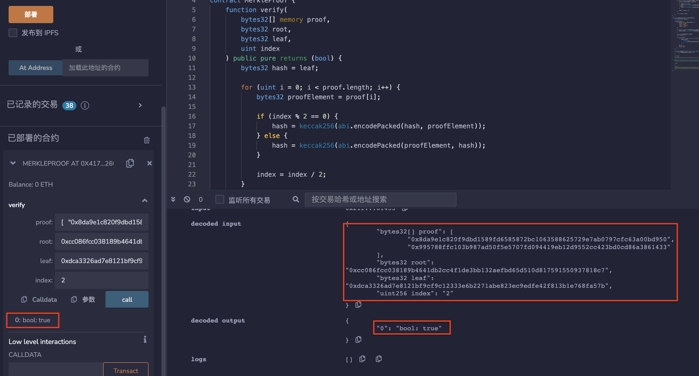

# 48.Merkle Tree
Merkle Tree允许你在不公开整个集合的情况下，加密证明一个元素包含在该集合中。
Merkle Tree允许对大型数据结构的内容进行有效和安全的验证（Merkle Proof）。

## MerkleProof合约
合约包含了一个verify函数用于验证Merkle树中的一个叶子节点是否属于该树。该合约还包含了一个TestMerkleProof合约，用于测试MerkleProof合约的功能。
* MerkleProof合约中的verify函数会根据证明路径和叶子节点计算出Merkle树的根节点，并将其与输入的根节点进行比较，如果相同则返回true，否则返回false。
```solidity
contract MerkleProof {
    function verify(
        bytes32[] memory proof,
        bytes32 root,
        bytes32 leaf,
        uint index
    ) public pure returns (bool) {
        bytes32 hash = leaf;

        for (uint i = 0; i < proof.length; i++) {
            bytes32 proofElement = proof[i];

            if (index % 2 == 0) {
                hash = keccak256(abi.encodePacked(hash, proofElement));
            } else {
                hash = keccak256(abi.encodePacked(proofElement, hash));
            }

            index = index / 2;
        }

        return hash == root;
    }
}
```
* TestMerkleProof测试合约
TestMerkleProof合约中的构造函数用于生成一个包含4个交易的Merkle树。该函数首先将每个交易进行哈希，并将哈希值存入hashes数组中。然后，它使用这些哈希值来构建Merkle树，并将树中每个节点的哈希值也存入hashes数组中。
TestMerkleProof合约中的getRoot函数用于返回Merkle树的根节点。
```solidity
contract TestMerkleProof is MerkleProof {
    bytes32[] public hashes;

    constructor() {
        string[4] memory transactions = [
            "alice -> bob",
            "bob -> dave",
            "carol -> alice",
            "dave -> bob"
        ];

        for (uint i = 0; i < transactions.length; i++) {
            hashes.push(keccak256(abi.encodePacked(transactions[i])));
        }

        uint n = transactions.length;
        uint offset = 0;

        while (n > 0) {
            for (uint i = 0; i < n - 1; i += 2) {
                hashes.push(
                    keccak256(
                        abi.encodePacked(hashes[offset + i], hashes[offset + i + 1])
                    )
                );
            }
            offset += n;
            n = n / 2;
        }
    }

    function getRoot() public view returns (bytes32) {
        return hashes[hashes.length - 1];
    }

    /* 测试verify函数的例子参数
    3rd leaf
    0xdca3326ad7e8121bf9cf9c12333e6b2271abe823ec9edfe42f813b1e768fa57b

    root
    0xcc086fcc038189b4641db2cc4f1de3bb132aefbd65d510d817591550937818c7

    index
    2

    proof
    0x8da9e1c820f9dbd1589fd6585872bc1063588625729e7ab0797cfc63a00bd950
    0x995788ffc103b987ad50f5e5707fd094419eb12d9552cc423bd0cd86a3861433
    */
}
```

## remix验证
部署合约MerkleProof，调用verify并输入上文参数验证，结果为true。

