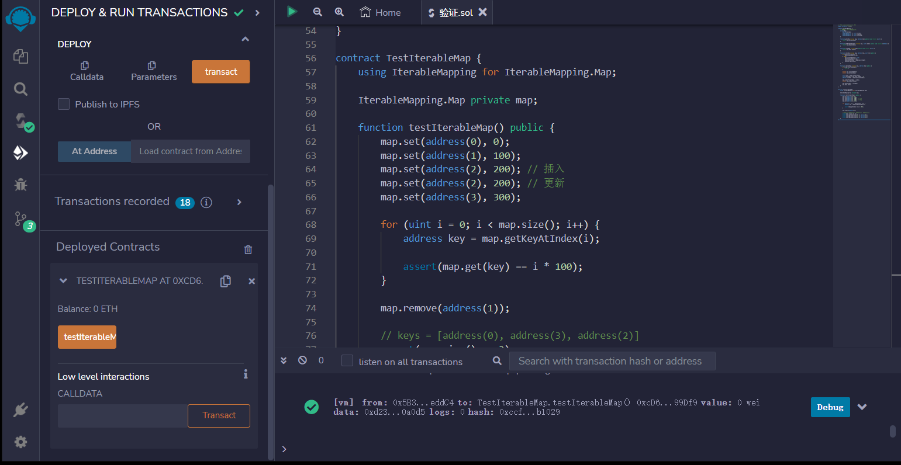

# 49.Iterable Mapping
不能通过迭代来遍历一个映射。因此，以下是创建可迭代映射的示例:
可迭代映射，从地址到uint;
```solidity
struct Map {
    address[] keys;
    mapping(address => uint) values;
    mapping(address => uint) indexOf;
    mapping(address => bool) inserted;
}
```
映射（Map）中获取一个地址键（key）对应的值（value）。
```solidity
function get(Map storage map, address key) public view returns (uint) {
    return map.values[key];
}
```
接受一个存储在区块链上的映射（Map）和一个整数索引作为参数，并返回该映射中对应索引的键（address 类型）。
```solidity
function getKeyAtIndex(Map storage map, uint index) public view returns (address) {
    return map.keys[index];
}
```
返回存储在映射中键的数量。该映射作为存储参数传递，并使用存储修饰符声明，因此该函数只能在合约中使用。
```solidity
function size(Map storage map) public view returns (uint) {
    return map.keys.length;
}
```
在存储映射中设置一个键值对。
首先检查键是否已经存在于映射中。如果是，则更新该键的值。否则，将该键插入到映射中，并将键、值和索引添加到相应的存储变量中。最后，将该键添加到映射的键列表中。
```solidity
function set(Map storage map, address key, uint val) public {
    if (map.inserted[key]) {
        map.values[key] = val;
    } else {
        map.inserted[key] = true;
        map.values[key] = val;
        map.indexOf[key] = map.keys.length;
        map.keys.push(key);
    }
}
```
首先，函数会检查该键是否存在于映射中。如果不存在，函数会直接返回，不进行任何操作。
如果键存在于映射中，函数会执行以下操作：
1. 删除插入标志：将该键的插入标志从映射中删除，表示该键已被删除。
2. 删除值：将该键对应的值从映射中删除，即将该键的值设为默认值。
3. 更新索引：获取该键在索引数组中的索引，将该索引指向最后一个键的位置，并将最后一个键的索引指向该键的位置。同时，删除该键的索引。
4. 更新键数组：将该键在键数组中的位置替换为最后一个键，并将最后一个键从键数组中删除。
```solidity
function remove(Map storage map, address key) public {
    if (!map.inserted[key]) {
        return;
    }

    delete map.inserted[key];
    delete map.values[key];

    uint index = map.indexOf[key];
    uint lastIndex = map.keys.length - 1;
    address lastKey = map.keys[lastIndex];

    map.indexOf[lastKey] = index;
    delete map.indexOf[key];

    map.keys[index] = lastKey;
    map.keys.pop();
}
```
测试可迭代映射的智能合约.其中使用了IterableMapping库来实现可迭代映射。在testIterableMap函数中，首先插入了四个键值对，其中键为地址，值为0、100、200、300。然后使用for循环遍历映射，对于每个键值对，验证其值是否正确。接着删除了键为地址1的键值对，再次验证映射的大小和键的顺序是否正确。
```solidity
contract TestIterableMap {
    
    using IterableMapping for IterableMapping.Map;

    IterableMapping.Map private map;

    function testIterableMap() public {
        map.set(address(0), 0);
        map.set(address(1), 100);
        map.set(address(2), 200); // 插入
        map.set(address(2), 200); // 更新
        map.set(address(3), 300);

        for (uint i = 0; i < map.size(); i++) {
            address key = map.getKeyAtIndex(i);

            assert(map.get(key) == i * 100);
        }

        map.remove(address(1));

        // keys = [address(0), address(3), address(2)]
        assert(map.size() == 3);
        assert(map.getKeyAtIndex(0) == address(0));
        assert(map.getKeyAtIndex(1) == address(3));
        assert(map.getKeyAtIndex(2) == address(2));
    }
}
```

## remix验证
部署合约，调用testIterableMap()函数验证
