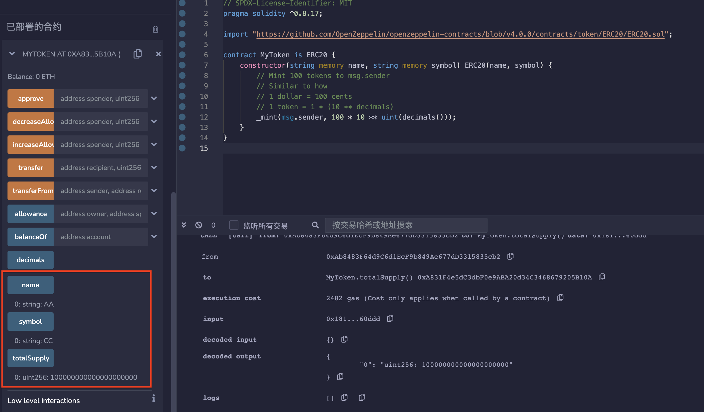

# 50.ERC20
符合ERC20标准的任何合约都是ERC20代币。
ERC20代币提供以下功能：
* 账户余额
* 转移代币（转账）
* 允许他人代表代币持有人转移代币（授权转账）
* 代币总供给
* 代币信息（可选）：名称，代号，小数位数

## ERC20的接口合约IERC20
IERC20是ERC20代币标准的接口合约，规定了ERC20代币需要实现的函数和事件。 之所以需要定义接口，是因为有了规范后，就存在所有的ERC20代币都通用的函数名称，输入参数，输出参数。 在接口函数中，只需要定义函数名称，输入参数，输出参数，并不关心函数内部如何实现。 由此，函数就分为内部和外部两个内容，一个重点是实现，另一个是对外接口，约定共同数据。
### 事件
IERC20定义了2个事件：Transfer事件和Approval事件，分别在转账和授权时被释放
```solidity
// 释放条件：当 `value` 单位的货币从账户 (`from`) 转账到另一账户 (`to`)时.
event Transfer(address indexed from, address indexed to, uint value);

// 释放条件：当 `value` 单位的货币从账户 (`owner`) 授权给另一账户 (`spender`)时.
event Approval(address indexed owner, address indexed spender, uint value);
```
### 函数
IERC20定义了6个函数，提供了转移代币的基本功能，并允许代币获得批准，以便其他链上第三方使用。
* totalSupply()返回代币总供给
```solidity
function totalSupply() external view returns (uint);
```
* balanceOf()返回账户余额
```solidity
// 返回账户`account`所持有的代币数.
function balanceOf(address account) external view returns (uint);
```
* transfer()转账
```solidity
/**
* 转账 `amount` 单位代币，从调用者账户到另一账户 `to`.
* 如果成功，返回 `true`.
* 释放 {Transfer} 事件.
*/
function transfer(address recipient, uint amount) external returns (bool);
```
* allowance()返回授权额度
```solidity
/**
* 返回`owner`账户授权给`spender`账户的额度，默认为0。
* 当{approve} 或 {transferFrom} 被调用时，`allowance`会改变.
*/
function allowance(address owner, address spender) external view returns (uint);
```
* approve()授权
```solidity
/**
* 调用者账户给`spender`账户授权 `amount`数量代币。
* 如果成功，返回 `true`.
* 释放 {Approval} 事件.
*/
function approve(address spender, uint amount) external returns (bool);
```
* transferFrom()授权转账
```solidity
/**
* 通过授权机制，从`from`账户向`to`账户转账`amount`数量代币。转账的部分会从调用者的`allowance`中扣除。
* 如果成功，返回 `true`.
* 释放 {Transfer} 事件.
*/
function transferFrom(
    address sender,
    address recipient,
    uint amount
) external returns (bool);
```

## ERC20令牌合约示例。
```solidity
// SPDX-License-Identifier: MIT
pragma solidity ^0.8.17;

import "./IERC20.sol";

contract ERC20 is IERC20 {
    uint public totalSupply;
    mapping(address => uint) public balanceOf;
    mapping(address => mapping(address => uint)) public allowance;
    string public name = "Solidity by Example";
    string public symbol = "SOLBYEX";
    uint8 public decimals = 18;

    function transfer(address recipient, uint amount) external returns (bool) {
        balanceOf[msg.sender] -= amount;
        balanceOf[recipient] += amount;
        emit Transfer(msg.sender, recipient, amount);
        return true;
    }

    function approve(address spender, uint amount) external returns (bool) {
        allowance[msg.sender][spender] = amount;
        emit Approval(msg.sender, spender, amount);
        return true;
    }

    function transferFrom(
        address sender,
        address recipient,
        uint amount
    ) external returns (bool) {
        allowance[sender][msg.sender] -= amount;
        balanceOf[sender] -= amount;
        balanceOf[recipient] += amount;
        emit Transfer(sender, recipient, amount);
        return true;
    }

    function mint(uint amount) external {
        balanceOf[msg.sender] += amount;
        totalSupply += amount;
        emit Transfer(address(0), msg.sender, amount);
    }

    function burn(uint amount) external {
        balanceOf[msg.sender] -= amount;
        totalSupply -= amount;
        emit Transfer(msg.sender, address(0), amount);
    }
}
```
## 创建自己的ERC20代币
使用Open Zeppelin创建自己的ERC20代币非常容易。
以下是一个例子：
```solidity
// SPDX-License-Identifier: MIT
pragma solidity ^0.8.17;

import "https://github.com/OpenZeppelin/openzeppelin-contracts/blob/v4.0.0/contracts/token/ERC20/ERC20.sol";

contract MyToken is ERC20 {
    constructor(string memory name, string memory symbol) ERC20(name, symbol) {
        // Mint 100 tokens to msg.sender
        // Similar to how
        // 1 dollar = 100 cents
        // 1 token = 1 * (10 ** decimals)
        _mint(msg.sender, 100 * 10 ** uint(decimals()));
    }
}
```
## 交换代币的合约
以下是一个名为TokenSwap的示例合约，用于交换一个ERC20代币与另一个代币。
该合约将通过调用以下代码来交换代币：
```solidity
transferFrom(address sender, address recipient, uint256 amount)
```
为了使transferFrom成功，发送方必须：
* 在其余额中拥有超过amount令牌
* 允许TokenSwap通过调用approve来提取amount令牌
在TokenSwap调用transferFrom之前。
```solidity
// SPDX-License-Identifier: MIT
pragma solidity ^0.8.17;

import "https://github.com/OpenZeppelin/openzeppelin-contracts/blob/v4.0.0/contracts/token/ERC20/IERC20.sol";

/*
如何交换代币

1. Alice拥有100个AliceCoin代币，这是一个ERC20代币。
2. Bob拥有100个BobCoin代币，这也是一个ERC20代币。
3. Alice和Bob想要用10个AliceCoin交换20个BobCoin。
4. Alice或Bob部署TokenSwap。
5. Alice批准TokenSwap从AliceCoin中提取10个代币。
6. Bob批准TokenSwap从BobCoin中提取20个代币。
7. Alice或Bob调用TokenSwap.swap()。
8. Alice和Bob成功交换了代币。
*/

contract TokenSwap {
    IERC20 public token1;
    address public owner1;
    uint public amount1;
    IERC20 public token2;
    address public owner2;
    uint public amount2;

    constructor(
        address _token1,
        address _owner1,
        uint _amount1,
        address _token2,
        address _owner2,
        uint _amount2
    ) {
        token1 = IERC20(_token1);
        owner1 = _owner1;
        amount1 = _amount1;
        token2 = IERC20(_token2);
        owner2 = _owner2;
        amount2 = _amount2;
    }

    function swap() public {
        require(msg.sender == owner1 || msg.sender == owner2, "Not authorized");
        require(
            token1.allowance(owner1, address(this)) >= amount1,
            "Token 1 allowance too low"
        );
        require(
            token2.allowance(owner2, address(this)) >= amount2,
            "Token 2 allowance too low"
        );

        _safeTransferFrom(token1, owner1, owner2, amount1);
        _safeTransferFrom(token2, owner2, owner1, amount2);
    }

    function _safeTransferFrom(
        IERC20 token,
        address sender,
        address recipient,
        uint amount
    ) private {
        bool sent = token.transferFrom(sender, recipient, amount);
        require(sent, "Token transfer failed");
    }
}
```
## remix验证
部署合约MyToken，在合约部署时输入代币名称和代币符号，可创建自己的ERC20代币。


