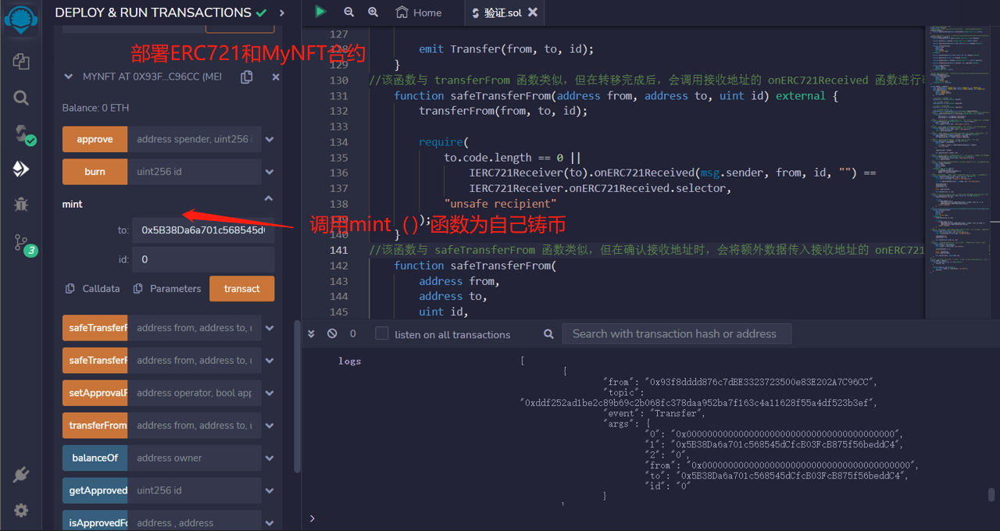
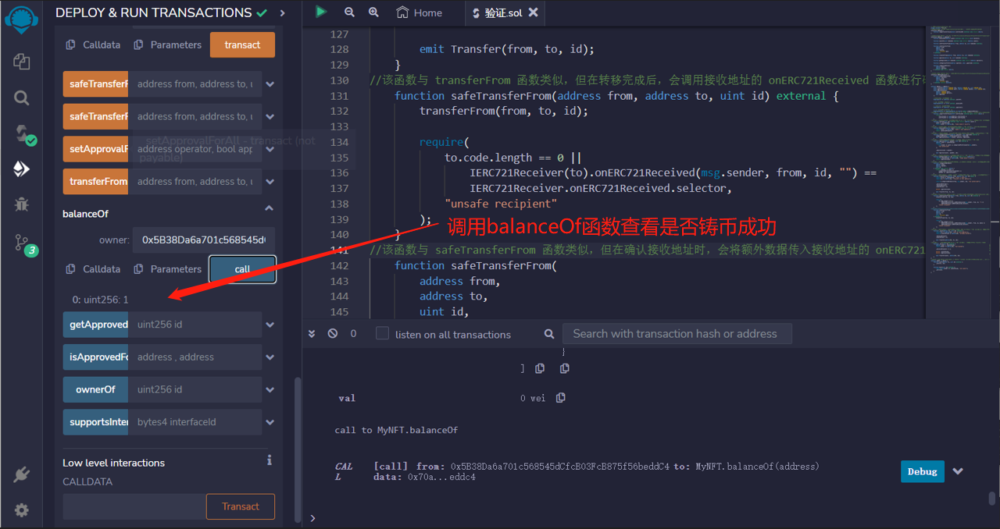
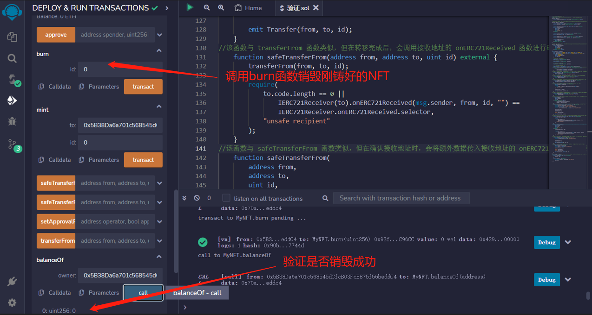

# 51.ERC721
ERC721示例

## ERC165
通过ERC165标准，智能合约可以声明它支持的接口，供其他合约检查。简单的说，ERC165就是检查一个智能合约是不是支持了ERC721，ERC1155的接口。

IERC165接口合约只声明了一个supportsInterface函数，输入要查询的interfaceId接口id，若合约实现了该接口id，则返回true：
```solidity
interface IERC165 {
    function supportsInterface(bytes4 interfaceID) external view returns (bool);
}
```

## IERC721
IERC721是ERC721标准的接口合约，规定了ERC721要实现的基本函数。它利用tokenId来表示特定的非同质化代币，授权或转账都要明确tokenId；而ERC20只需要明确转账的数额即可。
```solidity
interface IERC721 is IERC165 {
    event Transfer(address indexed from, address indexed to, uint256 indexed tokenId);
    event Approval(address indexed owner, address indexed approved, uint256 indexed tokenId);
    event ApprovalForAll(address indexed owner, address indexed operator, bool approved)
    
    //返回某地址的NFT持有量balance。
    function balanceOf(address owner) external view returns (uint balance);

    //返回某tokenId的主人owner。
    function ownerOf(uint tokenId) external view returns (address owner);

    //安全转账（如果接收方是合约地址，会要求实现ERC721Receiver接口）。参数为转出地址from，接收地址to和tokenId。
    function safeTransferFrom(address from, address to, uint tokenId) external;
    
    //安全转账的重载函数，参数里面包含了data。
    function safeTransferFrom(
        address from,
        address to,
        uint tokenId,
        bytes calldata data
    ) external;
    
    //普通转账，参数为转出地址from，接收地址to和tokenId。
    function transferFrom(address from, address to, uint tokenId) external;
    
    //授权另一个地址使用你的NFT。参数为被授权地址approve和tokenId。
    function approve(address to, uint tokenId) external;
    
    //查询tokenId被批准给了哪个地址。
    function getApproved(uint tokenId) external view returns (address operator);
    
    //将自己持有的该系列NFT批量授权给某个地址operator。
    function setApprovalForAll(address operator, bool _approved) external;
    
    //查询某地址的NFT是否批量授权给了另一个operator地址。
    function isApprovedForAll(
        address owner,
        address operator
    ) external view returns (bool);
}
```

### IERC721事件
IERC721包含3个事件，其中Transfer和Approval事件在ERC20中也有。
* Transfer事件：在转账时被释放，记录代币的发出地址from，接收地址to和tokenid。
* Approval事件：在授权时释放，记录授权地址owner，被授权地址approved和tokenid。
* ApprovalForAll事件：在批量授权时释放，记录批量授权的发出地址owner，被授权地址operator和授权与否的approved。

### IERC721函数
* balanceOf：返回某地址的NFT持有量balance。
* ownerOf：返回某tokenId的主人owner。
* transferFrom：普通转账，参数为转出地址from，接收地址to和tokenId。
* safeTransferFrom：安全转账（如果接收方是合约地址，会要求实现ERC721Receiver接口）。参数为转出地址from，接收地址to和tokenId。
* approve：授权另一个地址使用你的NFT。参数为被授权地址approve和tokenId。
* getApproved：查询tokenId被批准给了哪个地址。
* setApprovalForAll：将自己持有的该系列NFT批量授权给某个地址operator。
* isApprovedForAll：查询某地址的NFT是否批量授权给了另一个operator地址。
* safeTransferFrom：安全转账的重载函数，参数里面包含了data。

### IERC721Receiver
如果一个合约没有实现ERC721的相关函数，转入的NFT就进了黑洞，永远转不出来了。为了防止误转账，ERC721实现了safeTransferFrom()安全转账函数，目标合约必须实现了IERC721Receiver接口才能接收ERC721代币，不然会revert。IERC721Receiver接口只包含一个onERC721Received()函数。
```solidity
// IERC721Receiver接口：合约必须实现这个接口来通过安全转账接收ERC721
interface IERC721Receiver {
    function onERC721Received(
        address operator,
        address from,
        uint tokenId,
        bytes calldata data
    ) external returns (bytes4);
}
```

## ERC721
ERC721主合约
```solidity
contract ERC721 is IERC721 {
    event Transfer(address indexed from, address indexed to, uint indexed id);
    event Approval(address indexed owner, address indexed spender, uint indexed id);
    event ApprovalForAll(
        address indexed owner,
        address indexed operator,
        bool approved
    );

    //从令牌ID到所有者地址的映射
    mapping(uint => address) internal _ownerOf;

    // 将所有者地址映射到令牌
    mapping(address => uint) internal _balanceOf;

    // 从令牌ID映射到批准地址
    mapping(uint => address) internal _approvals;

    // 从所有者到操作者批准的映射
    mapping(address => mapping(address => bool)) public isApprovedForAll;
    //该函数用于检查合约是否支持某个接口，接口 ID 通过参数传入，返回一个布尔值表示是否支持该接口。
    function supportsInterface(bytes4 interfaceId) external pure returns (bool) {
        return
            interfaceId == type(IERC721).interfaceId ||
            interfaceId == type(IERC165).interfaceId;
    }
    //该函数用于查询某个代币的所有者地址，代币 ID 通过参数传入，返回一个地址类型的所有者地址。
    function ownerOf(uint id) external view returns (address owner) {
        owner = _ownerOf[id];
        require(owner != address(0), "token doesn't exist");
    }
    //该函数用于查询某个地址所拥有的代币数量，地址通过参数传入，返回一个整型表示代币数量。
    function balanceOf(address owner) external view returns (uint) {
        require(owner != address(0), "owner = zero address");
        return _balanceOf[owner];
    }
    //该函数用于设置某个地址的所有者对某个操作者的授权状态，操作者地址和授权状态分别通过参数传入。
    function setApprovalForAll(address operator, bool approved) external {
        isApprovedForAll[msg.sender][operator] = approved;
        emit ApprovalForAll(msg.sender, operator, approved);
    }
    //该函数用于授权某个地址对某个代币的转移，地址和代币 ID 分别通过参数传入。
    function approve(address spender, uint id) external {
        address owner = _ownerOf[id];
        require(
            msg.sender == owner || isApprovedForAll[owner][msg.sender],
            "not authorized"
        );

        _approvals[id] = spender;

        emit Approval(owner, spender, id);
    }
    //该函数用于查询某个代币的当前授权地址，代币 ID 通过参数传入，返回一个地址类型的授权地址。
    function getApproved(uint id) external view returns (address) {
        require(_ownerOf[id] != address(0), "token doesn't exist");
        return _approvals[id];
    }
    //该函数用于判断某个地址是否有对某个代币的转移授权或者是代币的所有者，所有者地址、操作者地址和代币 ID 分别通过参数传入，返回一个布尔值表示是否有授权或是所有者。
    function _isApprovedOrOwner(
        address owner,
        address spender,
        uint id
    ) internal view returns (bool) {
        return (spender == owner ||
            isApprovedForAll[owner][spender] ||
            spender == _approvals[id]);
    }
    //该函数用于将某个代币从一个地址转移到另一个地址，代币 ID、转移前地址和转移后地址分别通过参数传入，如果转移成功，则触发 Transfer 事件。
    function transferFrom(address from, address to, uint id) public {
        require(from == _ownerOf[id], "from != owner");
        require(to != address(0), "transfer to zero address");

        require(_isApprovedOrOwner(from, msg.sender, id), "not authorized");

        _balanceOf[from]--;
        _balanceOf[to]++;
        _ownerOf[id] = to;

        delete _approvals[id];

        emit Transfer(from, to, id);
    }
    //该函数与 transferFrom 函数类似，但在转移完成后，会调用接收地址的 onERC721Received 函数进行确认。
    function safeTransferFrom(address from, address to, uint id) external {
        transferFrom(from, to, id);

        require(
            to.code.length == 0 ||
                IERC721Receiver(to).onERC721Received(msg.sender, from, id, "") ==
                IERC721Receiver.onERC721Received.selector,
            "unsafe recipient"
        );
    }
    //该函数与 safeTransferFrom 函数类似，但在确认接收地址时，会将额外数据传入接收地址的 onERC721Received 函数中。
    function safeTransferFrom(
        address from,
        address to,
        uint id,
        bytes calldata data
    ) external {
        transferFrom(from, to, id);

        require(
            to.code.length == 0 ||
                IERC721Receiver(to).onERC721Received(msg.sender, from, id, data) ==
                IERC721Receiver.onERC721Received.selector,
            "unsafe recipient"
        );
    }
    //该函数用于将某个代币铸造到指定地址上，地址和代币 ID 分别通过参数传入，如果铸造成功，则触发 Transfer 事件。
    function _mint(address to, uint id) internal {
        require(to != address(0), "mint to zero address");
        require(_ownerOf[id] == address(0), "already minted");

        _balanceOf[to]++;
        _ownerOf[id] = to;

        emit Transfer(address(0), to, id);
    }
    //该函数用于销毁某个代币，代币 ID 通过参数传入，如果销毁成功，则触发 Transfer 事件。
    function _burn(uint id) internal {
        address owner = _ownerOf[id];
        require(owner != address(0), "not minted");

        _balanceOf[owner] -= 1;

        delete _ownerOf[id];
        delete _approvals[id];

        emit Transfer(owner, address(0), id);
    }
}
```

## MyNFT
我们来利用ERC721来写一个自己的NFT
```solidity
//该合约继承了 ERC721 合约，可以使用 ERC721 中定义的所有函数，同时还定义了 mint 和 burn 函数，用于铸造和销毁代币。
contract MyNFT is ERC721 {
    function mint(address to, uint id) external {
        _mint(to, id);
    }

    function burn(uint id) external {
        require(msg.sender == _ownerOf[id], "not owner");
        _burn(id);
    }
}
```

## remix验证
1. 部署ERC721和MyNFT合约，调用mint（）函数自己铸币

2. 调用balanceOf函数查看是否铸币成功

3. 调用burn函数销毁刚铸好的NFT，并验证
