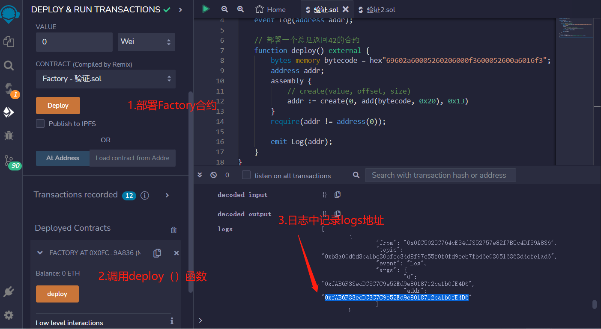
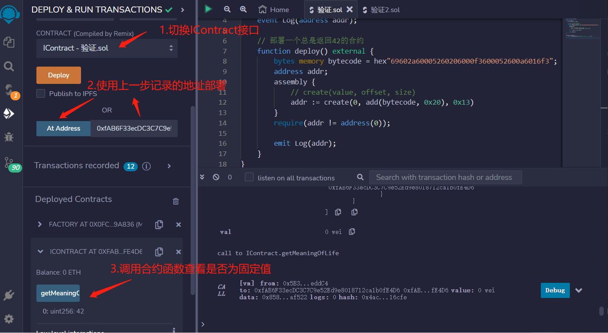

# 52.Simple Bytecode Contract
字节码编写的合约的简单示例

函数中，使用了汇编代码来创建新合约。汇编代码中的字节码为“69602a60005260206000f3600052600a6016f3”，它是一个EVM字节码，用于创建一个总是返回42的合约。
```solidity
pragma solidity ^0.8.17;

contract Factory {
    event Log(address addr);

    // 部署一个总是返回42的合约
    function deploy() external {
        bytes memory bytecode = hex"69602a60005260206000f3600052600a6016f3";
        address addr;
        assembly {
            // create(value, offset, size)
            addr := create(0, add(bytecode, 0x20), 0x13)
        }
        require(addr != address(0));

        emit Log(addr);
    }
}
//接口包含一个名为“getMeaningOfLife”的函数，用于返回数字42。
interface IContract {
    function getMeaningOfLife() external view returns (uint);
}

// https://www.evm.codes/playground
/*
Run time code - 返回 42
602a60005260206000f3

// 将42存储到内存中。
mstore(p, v) - store v at memory p to p + 32

PUSH1 0x2a
PUSH1 0
MSTORE

// 从内存返回32字节。
return(p, s) - end execution and return data from memory p to p + s

PUSH1 0x20
PUSH1 0
RETURN

Creation code - 返回 runtime code
69602a60005260206000f3600052600a6016f3

// 将run time code存储到内存中
PUSH10 0X602a60005260206000f3
PUSH1 0
MSTORE

// 从偏移量22开始的内存中返回10个字节。
PUSH1 0x0a
PUSH1 0x16
RETURN
*/

```

## remix验证
1. 部署Factory合约，调用Deploy（）函数。在Log事件中，记录合约的地址。

2. 使用记录的合约地址来调用IContract接口的新合约getMeaningOfLife函数，验证返回值为42。
