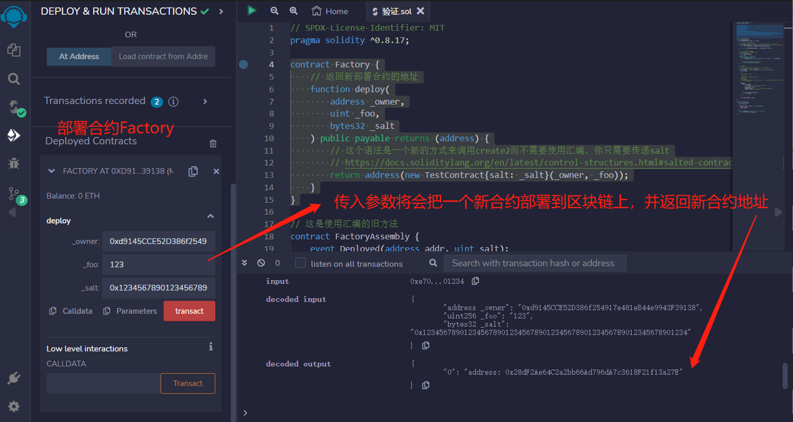
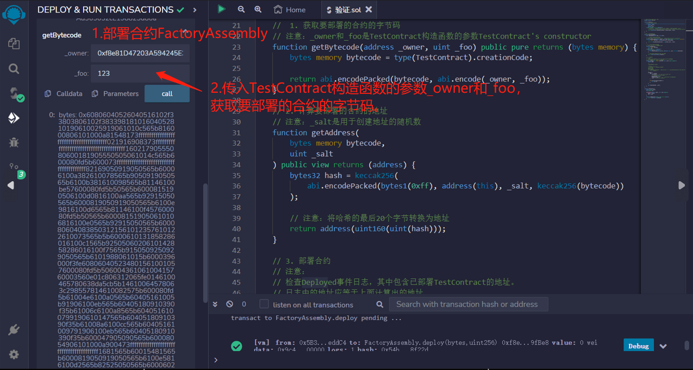
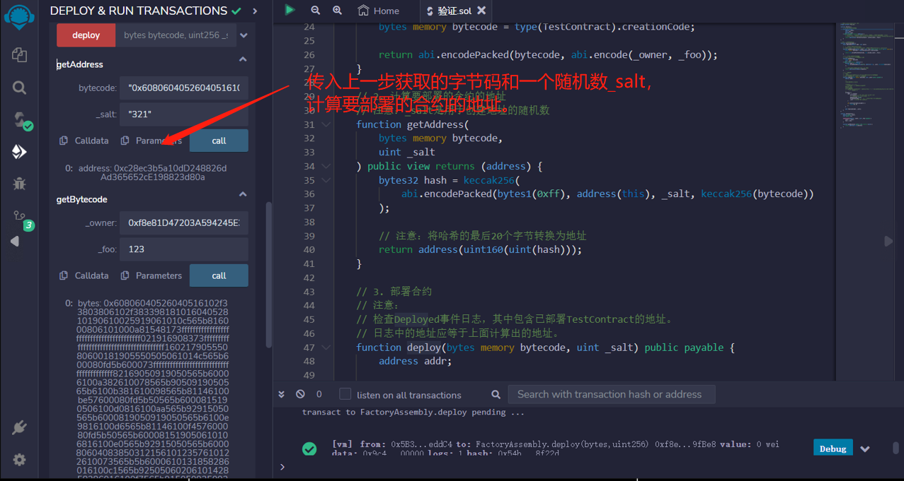
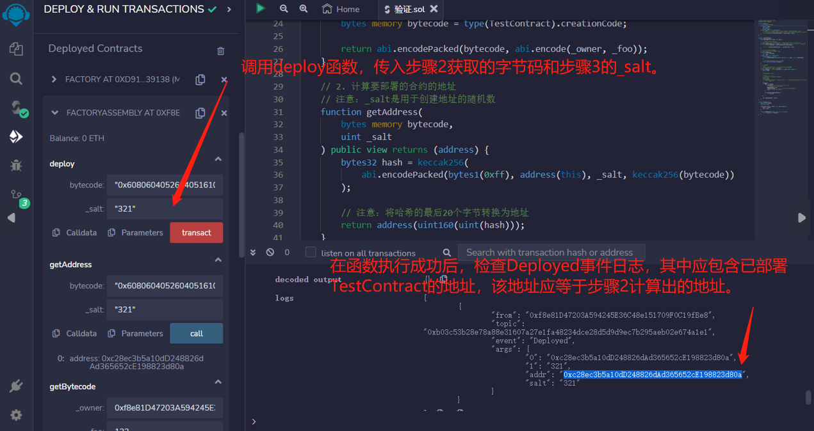
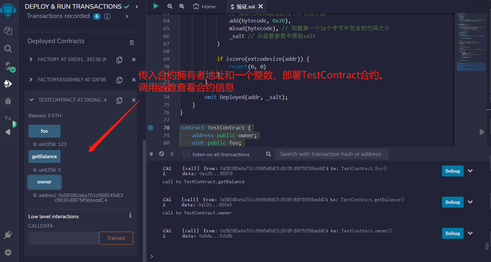

# 53.Precompute Contract Address with Create2
在合约部署之前，可以使用create2预计算合约地址。
## 新的语法方式
这个语法是一个新的方式来调用create2而不需要使用汇编，你只需要传递salt。
官方文档资料：
[Salted contract creations / create2
](https://docs.soliditylang.org/en/latest/control-structures.html#salted-contract-creations-create2)
```solidity
contract Factory {
    // 返回新部署合约的地址
    function deploy(
        address _owner,
        uint _foo,
        bytes32 _salt
    ) public payable returns (address) {
        return address(new TestContract{salt: _salt}(_owner, _foo));
    }
}
```

## 使用汇编的旧方法
1. 获取要部署的合约的字节码

注意：_owner和_foo是TestContract构造函数的参数
```solidity
function getBytecode(address _owner, uint _foo) public pure returns (bytes memory) {
    bytes memory bytecode = type(TestContract).creationCode;

    return abi.encodePacked(bytecode, abi.encode(_owner, _foo));
}
```

2. 计算要部署的合约的地址

注意：_salt是用于创建地址的随机数
```solidity
function getAddress(
    bytes memory bytecode,
    uint _salt
) public view returns (address) {
    bytes32 hash = keccak256(
        abi.encodePacked(bytes1(0xff), address(this), _salt, keccak256(bytecode))
    );

    // 注意：将哈希的最后20个字节转换为地址
    return address(uint160(uint(hash)));
}
```

3. 部署合约

注意：
检查Deployed事件日志，其中包含已部署TestContract的地址。
日志中的地址应等于上面计算出的地址。
```solidity
function deploy(bytes memory bytecode, uint _salt) public payable {
    address addr;

    /*
    注意：如何调用create2

    create2(v, p, n, s)
    使用内存p到p + n中的代码创建新合约
    并发送v wei
    并返回新地址
    其中新地址=keccak256(0xff + address(this) + s + keccak256(mem[p…(p+n)))的前20个字节
          s = 前端256位值
    */
    assembly {
        addr := create2(
            callvalue(), // wei sent with current call
            // 实际代码从跳过前32个字节后开始
            add(bytecode, 0x20),
            mload(bytecode), // 加载第一个32个字节中包含的代码大小
            _salt // 从函数参数中获取salt
        )

        if iszero(extcodesize(addr)) {
            revert(0, 0)
        }
    }

    emit Deployed(addr, _salt);
}
```

## TestContract
在合约的构造函数中，需要传入_owner和_foo两个参数进行初始化，并且可以向合约发送以太进行支付。
该合约还包含一个公共函数getBalance，用于返回合约当前的以太余额。
```solidity
contract TestContract {
    address public owner;
    uint public foo;

    constructor(address _owner, uint _foo) payable {
        owner = _owner;
        foo = _foo;
    }

    function getBalance() public view returns (uint) {
        return address(this).balance;
    }
}
```

## remix验证
1. 部署合约Factory，调用deploy函数，传入参数将会把一个新合约部署到区块链上，并返回新合约地址

2. 部署合约FactoryAssembly，调用getBytecode函数，传入TestContract构造函数的参数_owner和_foo，获取要部署的合约的字节码。

3. 调用getAddress函数，传入步骤2获取的字节码和一个随机数_salt，计算要部署的合约的地址。

4. 调用deploy函数，传入步骤2获取的字节码和步骤3的_salt。在函数执行成功后，检查Deployed事件日志，其中应包含已部署TestContract的地址，该地址应等于步骤2计算出的地址。

5. 传入合约拥有者地址和一个整数，部署TestContract合约。调用合约函数查看合约信息
