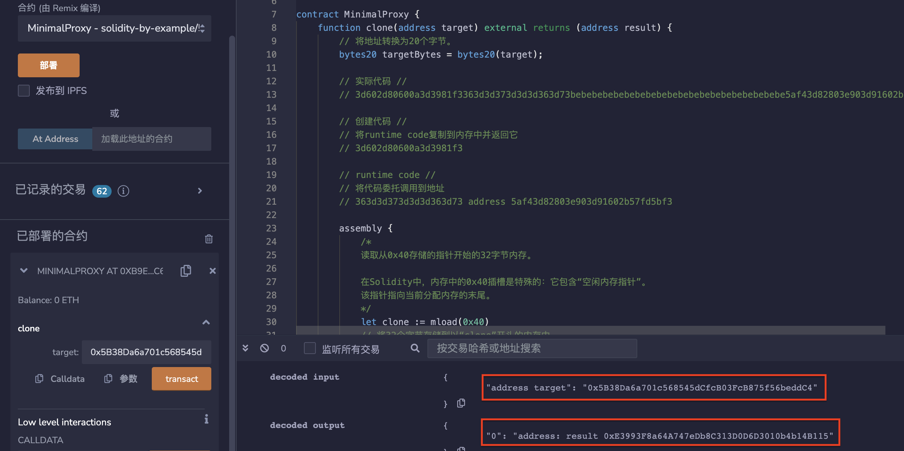

# 54.Minimal Proxy Contract
如果您有一个将被部署多次的合约，请使用最小化的代理合约来廉价地部署它们。
用于创建最小代理合约的Solidity合约。
使用了Solidity的汇编语言来构建一个新的合约，并将其代码设置为目标合约的代码
* 原始代码
https://github.com/optionality/clone-factory/blob/master/contracts/CloneFactory.sol
```solidity
// SPDX-License-Identifier: MIT
pragma solidity ^0.8.17;
contract MinimalProxy {
    //函数clone接受一个地址作为参数，该地址是要创建的合约的目标地址。
    //它将该目标地址转换为20个字节，并将其存储在新合约的代码中。
    function clone(address target) external returns (address result) {
        // 将地址转换为20个字节。
        bytes20 targetBytes = bytes20(target);

        // 实际代码 //
        // 3d602d80600a3d3981f3363d3d373d3d3d363d73bebebebebebebebebebebebebebebebebebebebe5af43d82803e903d91602b57fd5bf3

        // 创建代码 //
        // 将runtime code复制到内存中并返回它
        // 3d602d80600a3d3981f3

        // runtime code //
        // 将代码委托调用到地址
        // 363d3d373d3d3d363d73 address 5af43d82803e903d91602b57fd5bf3

        assembly {
            /*
            读取从0x40存储的指针开始的32字节内存。

            在Solidity中，内存中的0x40插槽是特殊的：它包含“空闲内存指针”。
            该指针指向当前分配内存的末尾。
            */
            let clone := mload(0x40)
            // 将32个字节存储到以“clone”开头的内存中。
            mstore(
                clone,
                0x3d602d80600a3d3981f3363d3d373d3d3d363d73000000000000000000000000
            )

            /*
              |              20 bytes                |
            0x3d602d80600a3d3981f3363d3d373d3d3d363d73000000000000000000000000
                                                      ^
                                                      pointer
            */
            // 将32字节存储到以"clone" + 20字节为起始地址的内存中。
            // 0x14 = 20
            mstore(add(clone, 0x14), targetBytes)

            /*
              |               20 bytes               |                 20 bytes              |
            0x3d602d80600a3d3981f3363d3d373d3d3d363d73bebebebebebebebebebebebebebebebebebebebe
                                                                                              ^
                                                                                              pointer
            */
            // 将32字节存储到以"clone" + 40字节为起始地址的存储器中。
            // 0x28 = 40
            mstore(
                add(clone, 0x28),
                0x5af43d82803e903d91602b57fd5bf30000000000000000000000000000000000
            )

            /*
              |               20 bytes               |                 20 bytes              |           15 bytes          |
            0x3d602d80600a3d3981f3363d3d373d3d3d363d73bebebebebebebebebebebebebebebebebebebebe5af43d82803e903d91602b57fd5bf3
            */
            // 创建新的合约
            // 发送0ETH
            // 代码从存储在“clone”中的指针开始
            // 代码大小为0x37（55字节）
            result := create(0, clone, 0x37)
        }
    }
}
```
## remix验证
部署合约MinimalProxy，调用 clone（） 函数，会将目标合约的地址转换成 20 个字节的 bytes20 类型，返回新合约的地址。

