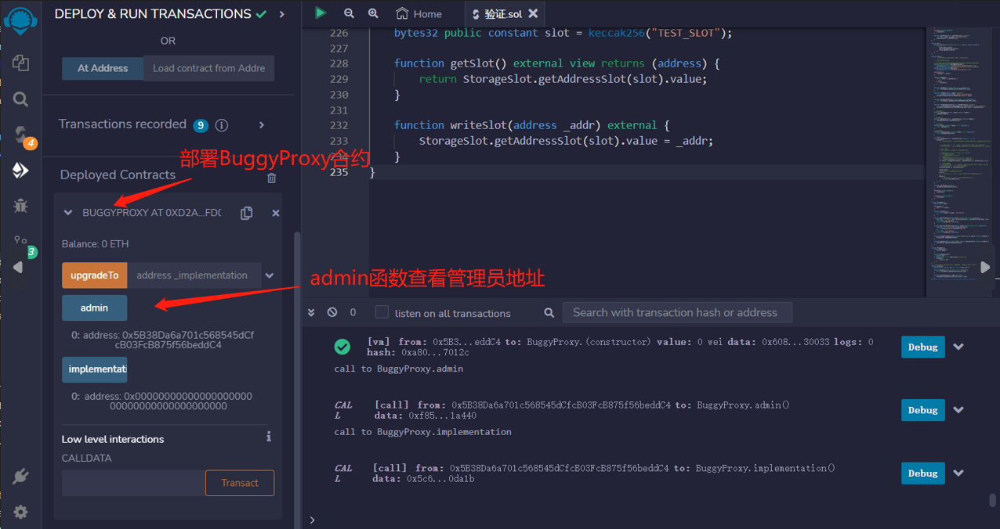
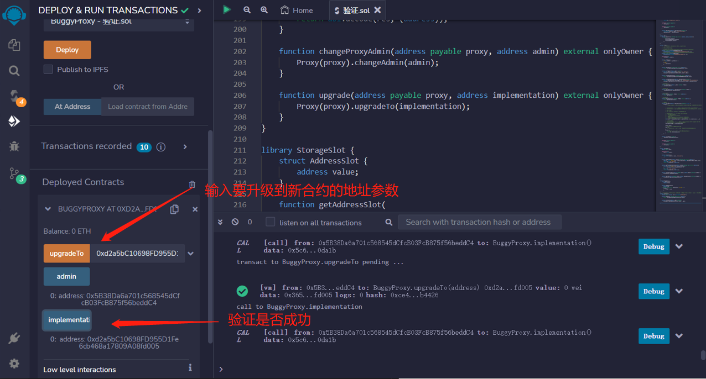
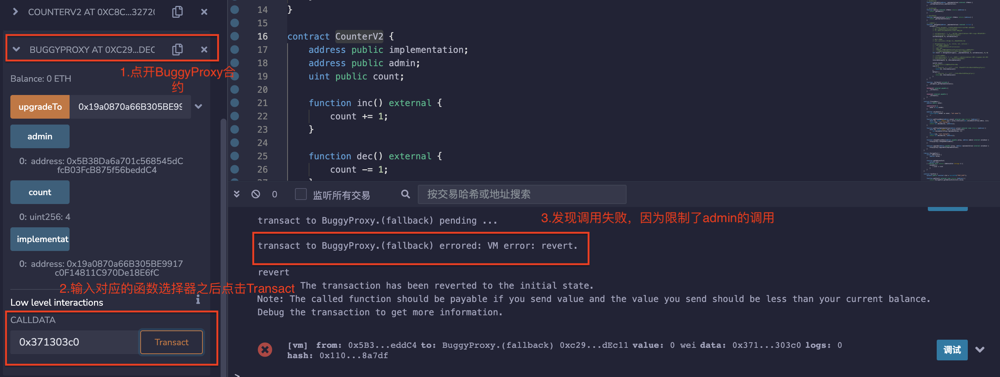
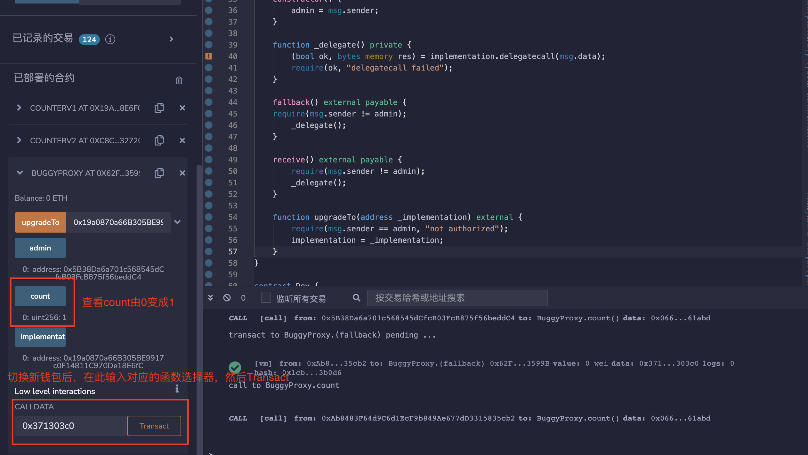
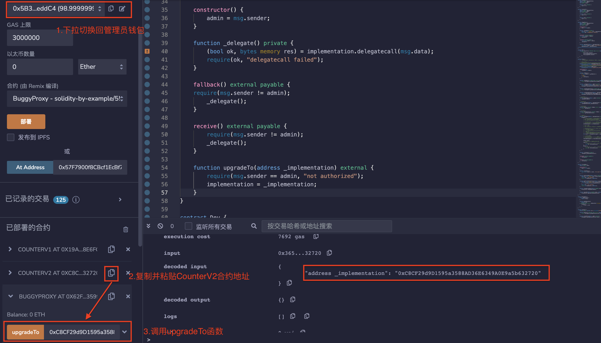
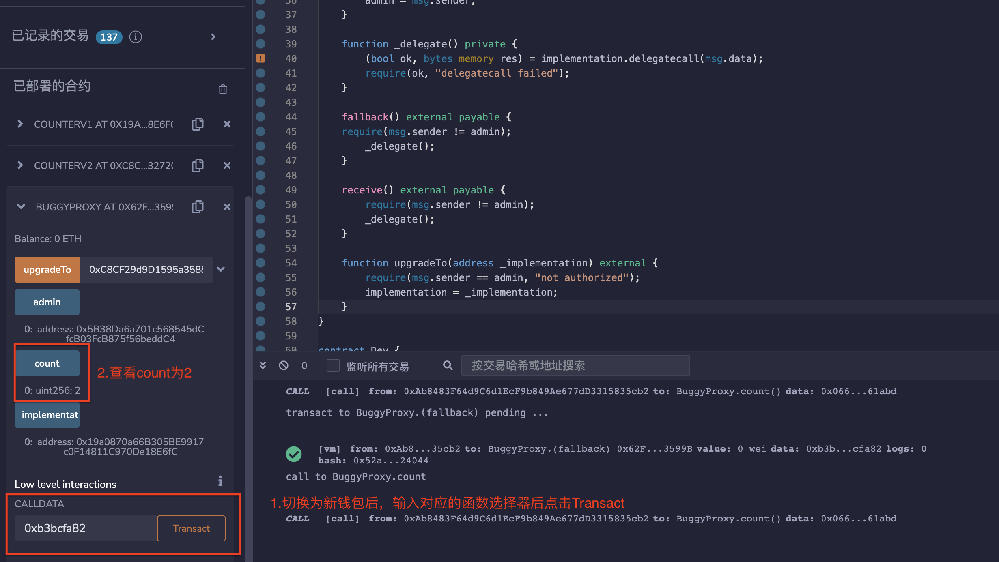
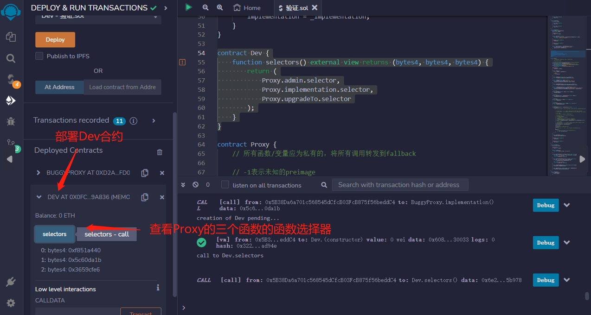
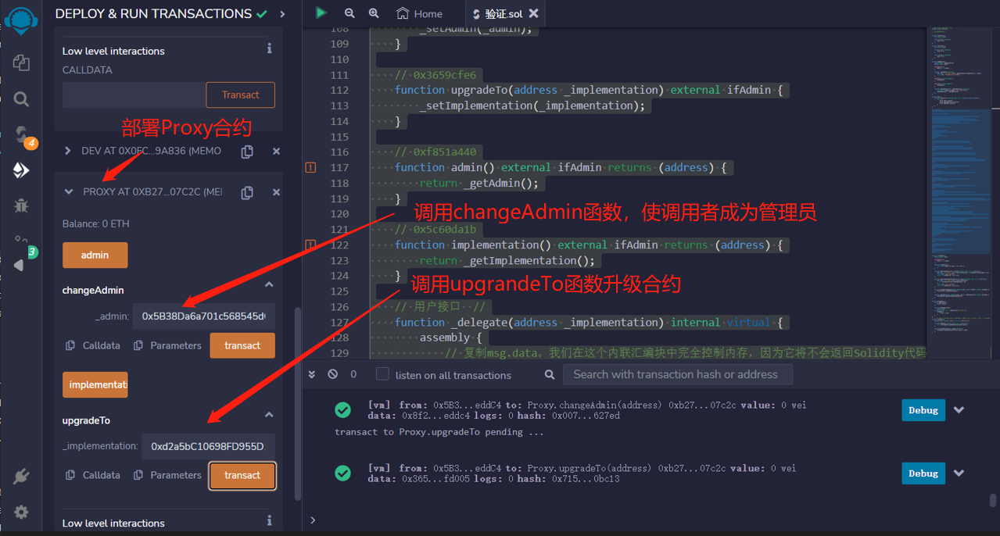

# 55.Upgradeable Proxy
这是一个可升级代理合约的示例。
教学用的合约可能有安全问题，不要用于生产环境。
本示例展示了：

* 如何使用delegatecall和在fallback被调用时返回数据。
* 如何将管理员和实现的地址存储在特定的槽中。

## 代理合约
它包含3个变量：

* implementation：逻辑合约地址。
* admin：admin地址。
* count：正整数，可以通过逻辑合约的函数改变。
它包含3个函数

* 构造函数：初始化admin地址。
* fallback()：回调函数，将调用委托给逻辑合约，不能由admin调用。
* upgrade()：升级函数，改变逻辑合约地址，只能由admin调用。

```solidity
contract BuggyProxy {
    address public implementation;
    address public admin;
    uint public count;

    constructor() {
        admin = msg.sender;
    }

    function _delegate() private {
        (bool ok, bytes memory res) = implementation.delegatecall(msg.data);
        require(ok, "delegatecall failed");
    }

    fallback() external payable {
    require(msg.sender != admin);
        _delegate();
    }

    receive() external payable {
        require(msg.sender != admin);
        _delegate();
    }

    function upgradeTo(address _implementation) external {
        require(msg.sender == admin, "not authorized");
        implementation = _implementation;
    }
}
```
## 逻辑合约
逻辑合约包含3个状态变量，与保持代理合约一致，防止插槽冲突；旧逻辑合约包含函数inc()，新的包含函数inc（）和dec（）。
```solidity
contract CounterV1 {
    address public implementation;
    address public admin;
    uint public count;

    function inc() external {
        count += 1;
    }
}

contract CounterV2 {
    address public implementation;
    address public admin;
    uint public count;

    function inc() external {
        count += 1;
    }

    function dec() external {
        count -= 1;
    }
}
```
```solidity
contract Dev {
    function selectors() external view returns (bytes4, bytes4, bytes4) {
        return (
            Proxy.admin.selector,
            Proxy.implementation.selector,
            Proxy.upgradeTo.selector
        );
    }
}
```
Proxy合约是一个透明升级代理合约，它将所有函数和变量定义为私有的，并将所有调用都转发到fallback函数。它定义了一个名为ADMIN_SLOT的常量，它是一个存储槽的键，用于存储管理员的地址。它还定义了一个名为IMPLEMENTATION_SLOT的常量，它是用于存储实现合约地址的存储槽的键。该合约具有以下功能：

通过将管理员地址存储在ADMIN_SLOT存储槽中来初始化合约。
* ifAdmin修饰器：用于确保只有管理员可以访问某些函数。
* _getAdmin私有函数：用于从ADMIN_SLOT存储槽中检索管理员地址。
* _setAdmin私有函数：用于将管理员地址存储在ADMIN_SLOT存储槽中。
* etImplementation私有函数：用于从IMPLEMENTATION_SLOT存储槽中检索实现合约地址。
* _setImplementation私有函数：用于将实现合约地址存储在IMPLEMENTATION_SLOT存储槽中。
* changeAdmin函数：用于更改管理员地址。
* upgradeTo函数：用于将实现合约地址升级到新版本。
* admin函数：用于返回管理员地址。
* implementation函数：用于返回实现合约地址。
* _delegate的内部函数：用于使用delegatecall调用实现合约中的函数。
```solidity
contract Proxy {
    // 所有函数/变量应为私有的，将所有调用转发到fallback

    // -1表示未知的原像

    // 0x360894a13ba1a3210667c828492db98dca3e2076cc3735a920a3ca505d382bbc
    bytes32 private constant IMPLEMENTATION_SLOT =
        bytes32(uint(keccak256("eip1967.proxy.implementation")) - 1);
    // 0xb53127684a568b3173ae13b9f8a6016e243e63b6e8ee1178d6a717850b5d6103
    bytes32 private constant ADMIN_SLOT =
        bytes32(uint(keccak256("eip1967.proxy.admin")) - 1);

    constructor() {
        _setAdmin(msg.sender);
    }

    modifier ifAdmin() {
        if (msg.sender == _getAdmin()) {
            _;
        } else {
            _fallback();
        }
    }

    function _getAdmin() private view returns (address) {
        return StorageSlot.getAddressSlot(ADMIN_SLOT).value;
    }

    function _setAdmin(address _admin) private {
        require(_admin != address(0), "admin = zero address");
        StorageSlot.getAddressSlot(ADMIN_SLOT).value = _admin;
    }

    function _getImplementation() private view returns (address) {
        return StorageSlot.getAddressSlot(IMPLEMENTATION_SLOT).value;
    }

    //设置合约的实现地址。
    function _setImplementation(address _implementation) private {
        require(_implementation.code.length > 0, "implementation is not contract");
        StorageSlot.getAddressSlot(IMPLEMENTATION_SLOT).value = _implementation;
    }

    // 管理员接口 //
    function changeAdmin(address _admin) external ifAdmin {
        _setAdmin(_admin);
    }

    // 0x3659cfe6
    function upgradeTo(address _implementation) external ifAdmin {
        _setImplementation(_implementation);
    }

    // 0xf851a440
    function admin() external ifAdmin returns (address) {
        return _getAdmin();
    }

    // 0x5c60da1b
    function implementation() external ifAdmin returns (address) {
        return _getImplementation();
    }

    // 用户接口  //
    function _delegate(address _implementation) internal virtual {
        assembly {
            // 复制msg.data。我们完全控制了这个内联程序集块中的内存，
            //因为它将不会返回Solidity代码。
            //我们将Solidity数据覆盖在内存位置0上。
           

            // calldatacopy(t, f, s) - 将大小为s的calldata从位置f复制到位置t的内存状态中
            // calldatasize() - call data的大小（以字节为单位）
            calldatacopy(0, 0, calldatasize())

            // 调用实现。
            // out和outsize都为0，因为我们还不知道大小。

            // delegatecall(g, a, in, insize, out, outsize) -
            // - 调用地址为a的合约
            // - 使用输入内存状态[in…(in+insize))
            // - 提供 gas
            // - 并将输出区域内存状态[out…(out+outsize))中的数据返回
            // - 在发生错误（例如gas用尽）时返回0，在成功时返回1
            let result := delegatecall(gas(), _implementation, 0, calldatasize(), 0, 0)

            // 复制返回的数据
            // returndatacopy(t, f, s) - 将大小为s的returndata从位置f复制到mem中的位置t
            // returndatasize() - 上一次returndata的大小
            returndatacopy(0, 0, returndatasize())

            switch result
            // delegatecall在发生错误时返回0。
            case 0 {
                // revert(p, s) - 结束执行，撤销状态更改，返回数据内存状态[p…(p+s))
            }
            default {
                // return(p, s) - 结束执行，返回数据内存状态[p…(p+s))
                return(0, returndatasize())
            }
        }
    }

    function _fallback() private {
        _delegate(_getImplementation());
    }

    fallback() external payable {
        _fallback();
    }

    receive() external payable {
        _fallback();
    }
}

    //代理管理员合约，用于管理代理合约的管理员和实现
contract ProxyAdmin {
    address public owner;

    constructor() {
        owner = msg.sender;
    }

    //确保只有合约所有者才能执行某些函数
    modifier onlyOwner() {
        require(msg.sender == owner, "not owner");
        _;
    }

    //通过代理合约的静态调用获取代理管理员的地址。
    function getProxyAdmin(address proxy) external view returns (address) {
        (bool ok, bytes memory res) = proxy.staticcall(abi.encodeCall(Proxy.admin, ()));
        require(ok, "call failed");
        return abi.decode(res, (address));
    }

    //通过代理合约的静态调用获取代理实现的地址。
    function getProxyImplementation(address proxy) external view returns (address) {
        (bool ok, bytes memory res) = proxy.staticcall(
            abi.encodeCall(Proxy.implementation, ())
        );
        require(ok, "call failed");
        return abi.decode(res, (address));
    }

    //用于更改代理合约的管理员。
    function changeProxyAdmin(address payable proxy, address admin) external onlyOwner {
        Proxy(proxy).changeAdmin(admin);
    }

    //用于升级代理合约的实现。
    function upgrade(address payable proxy, address implementation) external onlyOwner {
        Proxy(proxy).upgradeTo(implementation);
    }
}

library StorageSlot {
    struct AddressSlot {
        address value;
    }

    function getAddressSlot(
        bytes32 slot
    ) internal pure returns (AddressSlot storage r) {
        assembly {
            r.slot := slot
        }
    }
}
    //使用 StorageSlot.getAddressSlot 函数来获取一个地址类型的槽位，并通过 value 属性来读写该槽位的值。
contract TestSlot {
    bytes32 public constant slot = keccak256("TEST_SLOT");

    function getSlot() external view returns (address) {
        return StorageSlot.getAddressSlot(slot).value;
    }

    function writeSlot(address _addr) external {
        StorageSlot.getAddressSlot(slot).value = _addr;
    }
}
```

## remix验证
1. 部署BuggyProxy合约、CounterV1合约和CounterV2合约，调用admin函数查看管理员地址

2. 调用upgradeTo函数，复制黏贴CounterV1合约的地址参数，调用implementation验证是否成功.

3. 利用选择器0x371303c0，在代理合约中调用旧逻辑合约CounterV1的inc()函数。调用将失败，因为管理员不能调用逻辑合约。

4. 切换新钱包，利用选择器0x371303c0，在代理合约中调用旧逻辑合约CounterV1的inc()函数，count = 1，调用将成功。

5. 切换回管理员钱包，调用upgradeTo()函数，将implementation地址指向新逻辑合约CounterV2。

6. 切换新钱包，利用选择器0x371303c0，在代理合约中调用三次新逻辑合约CounterV2的inc()函数，再利用选择器0xb3bcfa82，在代理合约中调用一·次新逻辑合约CounterV2的dec()函数，最终count = 2。

7. 部署Dev合约，调用selectors()函数查看Proxy的三个函数的函数选择器.

8. 部署Proxy合约，调用changeAdmin函数，使调用者成为管理员；调用upgrandeTo函数升级合约.
