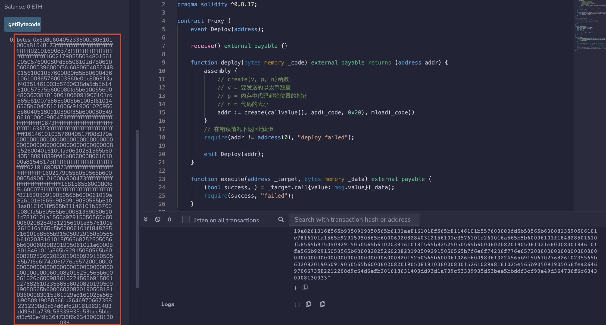
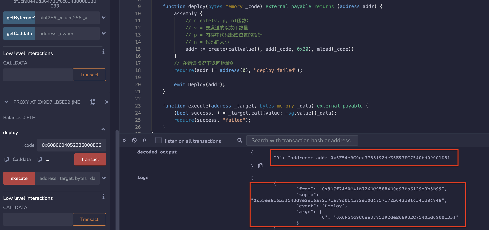
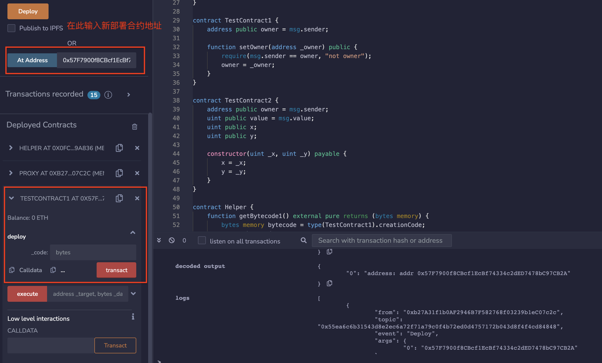
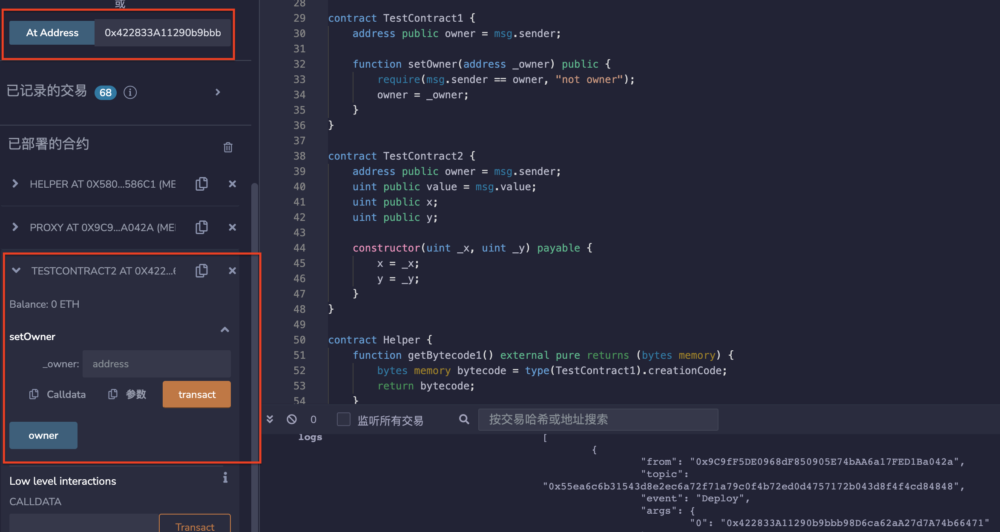

# 56.Deploy Any Contract
通过调用Proxy.deploy(bytes memory _code)部署任何合约。

对于此示例，您可以通过调用Helper.getBytecode1和Helper.getBytecode2获取合约字节码。
* 简单的代理合约，允许创建新的合约并执行已有合约的函数。
Proxy合约包含一个deploy函数，用于创建新合约。
使用Solidity的assembly语言来调用EVM的create函数来创建新合约。
一旦新合约被创建，将触发一个Deploy事件，其中包含新合约的地址。
```solidity
contract Proxy {
    event Deploy(address);

    receive() external payable {}

    /*depiloy()使用Solidity的assembly语言来调用EVM的create函数来创建新合约。
    一旦新合约被创建，将触发一个Deploy事件，其中包含新合约的地址。*/
    function deploy(bytes memory _code) external payable returns (address addr) {
        assembly {
            // create(v, p, n)函数：
            // v = 要发送的以太数量
            // p = 内存中代码起始位置的指针
            // n = 代码的大小
            addr := create(callvalue(), add(_code, 0x20), mload(_code))
        }
        // 在错误情况下返回地址0
        require(addr != address(0), "deploy failed");

        emit Deploy(addr);
    }
    //execute()检查调用是否成功
    function execute(address _target, bytes memory _data) external payable {
        (bool success, ) = _target.call{value: msg.value}(_data);
        require(success, "failed");
    }
}
```

* TestContract1和TestContract2是两个简单的示例合约，用于演示如何使用Proxy合约。
```solidity
contract TestContract1 {
    address public owner = msg.sender;

    function setOwner(address _owner) public {
        require(msg.sender == owner, "not owner");
        owner = _owner;
    }
}

contract TestContract2 {
    address public owner = msg.sender;
    uint public value = msg.value;
    uint public x;
    uint public y;

    constructor(uint _x, uint _y) payable {
        x = _x;
        y = _y;
    }
}
```

* Helper合约，用于获取字节码和调用数据。
```solidity
contract Helper {
    function getBytecode1() external pure returns (bytes memory) {
        bytes memory bytecode = type(TestContract1).creationCode;
        return bytecode;
    }

    function getBytecode2(uint _x, uint _y) external pure returns (bytes memory) {
        bytes memory bytecode = type(TestContract2).creationCode;
        return abi.encodePacked(bytecode, abi.encode(_x, _y));
    }

    function getCalldata(address _owner) external pure returns (bytes memory) {
        return abi.encodeWithSignature("setOwner(address)", _owner);
    }
}
```

## remix验证
1. 部署合约Proxy和Helper，在Helper合约中调用getBytecode1（）函数获取合约字节码

2. 复制合约字节码，调用合约Proxy中的deploy（）函数获取新部署合约地址

3. 通过合约地址在remix打开该合约，与TestContract1合约一致。

4. 以上述操作同样部署TestContract2，结果一致。

