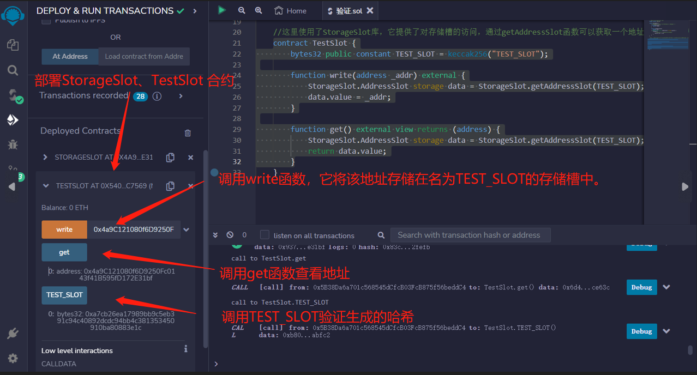

# 57.Write to Any Slot
Solidity存储类似于长度为2^256的数组。数组中的每个槽位可以存储32个字节。

声明顺序和状态变量的类型定义了它将使用哪些槽位。

但是，使用汇编语言，您可以写入任何槽位。
   
定义了一个名为StorageSlot的库，其中包含一个结构体AddressSlot，
该结构体包装了一个地址类型的值，
并提供了一个函数getAddressSlot来获取存储在槽位上的AddressSlot的指针
```solidity
library StorageSlot {
    // 将地址包装在结构体中，以便可以将其作为存储指针传递
    struct AddressSlot {
        address value;
    }

    function getAddressSlot(
        bytes32 slot
    ) internal pure returns (AddressSlot storage pointer) {
        assembly {
            // 获取存储在槽位上的AddressSlot的指针
            pointer.slot := slot
        }
    }
}
```
使用StorageSlot库来创建一个名为TEST_SLOT的存储槽位，并提供了一个函数write来将地址存储在该槽位上，以及一个函数get来获取存储在该槽位上的地址。
```solidity

contract TestSlot {
    bytes32 public constant TEST_SLOT = keccak256("TEST_SLOT");

    function write(address _addr) external {
        StorageSlot.AddressSlot storage data = StorageSlot.getAddressSlot(TEST_SLOT);
        data.value = _addr;
    }

    function get() external view returns (address) {
        StorageSlot.AddressSlot storage data = StorageSlot.getAddressSlot(TEST_SLOT);
        return data.value;
    }
}
```

## remix验证
1. 部署StorageSlot、TestSlot 合约，调用write函数，它将该地址存储在名为TEST_SLOT的存储槽中。调用get函数查看地址，调用TEST_SLOT验证生成的哈希
