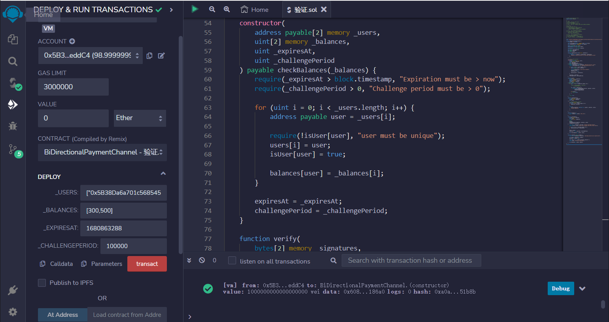

# 59.Bi-Directional Payment Channel
双向支付通道允许参与者 Alice 和 Bob 反复在链外转移以太。

支付可以双向进行，Alice 支付 Bob，Bob 支付 Alice。

打开通道
1. Alice 和 Bob 资助多重签名钱包
2. 预计算支付通道地址  
3. Alice 和 Bob 交换初始余额的签名
4. Alice 和 Bob 创建一个可以从多重签名钱包部署支付通道的交易

更新通道余额
1. 从打开通道中重复步骤 1-3
2. 从多重签名钱包创建一个交易，该交易将
   - 删除将部署旧的支付通道的交易
   - 然后创建一个可以使用新余额部署支付通道的交易

当 Alice 和 Bob 同意最终余额时关闭通道
1. 从多重签名钱包创建一个交易，该交易将
   - 向 Alice 和 Bob 发送付款
   - 然后删除将创建支付通道的交易

当 Alice 和 Bob 不同意最终余额时关闭通道
1. 从多重签名钱包部署支付通道
2. 调用 challengeExit() 开始关闭通道的过程
3. 一旦通道过期，Alice 和 Bob 可以提取资金

```solidity
// SPDX-License-Identifier: MIT
pragma solidity ^0.8.17;
import "github.com/OpenZeppelin/openzeppelin-contracts/blob/release-v4.5/contracts/utils/cryptography/ECDSA.sol";

contract BiDirectionalPaymentChannel {
    using ECDSA for bytes32;

    event ChallengeExit(address indexed sender, uint nonce);
    event Withdraw(address indexed to, uint amount);

    address payable[2] public users;
    mapping(address => bool) public isUser;

    mapping(address => uint) public balances;

    uint public challengePeriod;
    uint public expiresAt;
    uint public nonce;

    modifier checkBalances(uint[2] memory _balances) {
        require(
            address(this).balance >= _balances[0] + _balances[1],
            "balance of contract must be >= to the total balance of users"
        );
        _;
    }

    // 注意：从多重签名钱包存款
    constructor(
        address payable[2] memory _users,
        uint[2] memory _balances,
        uint _expiresAt,
        uint _challengePeriod
    ) payable checkBalances(_balances) {
        require(_expiresAt > block.timestamp, "Expiration must be > now");
        require(_challengePeriod > 0, "Challenge period must be > 0");

        for (uint i = 0; i < _users.length; i++) {
            address payable user = _users[i];

            require(!isUser[user], "user must be unique");
            users[i] = user;
            isUser[user] = true;

            balances[user] = _balances[i];
        }

        expiresAt = _expiresAt;
        challengePeriod = _challengePeriod;
    }

    function verify(
        bytes[2] memory _signatures,
        address _contract,
        address[2] memory _signers,
        uint[2] memory _balances,
        uint _nonce
    ) public pure returns (bool) {
        for (uint i = 0; i < _signatures.length; i++) {
            /*
            注意：使用此合约的地址进行签名以保护
                  其他合约免受重放攻击
            */
            bool valid = _signers[i] ==
                keccak256(abi.encodePacked(_contract, _balances, _nonce))
                    .toEthSignedMessageHash()
                    .recover(_signatures[i]);

            if (!valid) {
                return false;
            }
        }

        return true;
    }

    modifier checkSignatures(
        bytes[2] memory _signatures,
        uint[2] memory _balances,
        uint _nonce
    ) {
        // 注意：将存储数组复制到内存中
        address[2] memory signers;
        for (uint i = 0; i < users.length; i++) {
            signers[i] = users[i];
        }

        require(
            verify(_signatures, address(this), signers, _balances, _nonce),
            "Invalid signature"
        );

        _;
    }
}

    modifier onlyUser() {
        require(isUser[msg.sender], "Not user");
        _;
    }
```
用于用户退出挑战的，需要传入当前用户的余额、nonce和签名信息。
在函数中会检查签名信息是否正确、余额是否合法、nonce是否大于当前nonce、是否在挑战期内等条件。
如果条件都满足，则更新用户余额、nonce和挑战期限，并发送事件通知。
```solidity
function challengeExit(
    uint[2] memory _balances,
    uint _nonce,
    bytes[2] memory _signatures
)
    public
    onlyUser
    checkSignatures(_signatures, _balances, _nonce)
    checkBalances(_balances)
{
    require(block.timestamp < expiresAt, "Expired challenge period");
    require(_nonce > nonce, "Nonce must be greater than the current nonce");

    for (uint i = 0; i < _balances.length; i++) {
        balances[users[i]] = _balances[i];
    }

    nonce = _nonce;
    expiresAt = block.timestamp + challengePeriod;

    emit ChallengeExit(msg.sender, nonce);
}
```
用于用户取回其在合约中存储的以太。
只有在挑战期结束后才能执行此操作。
函数首先检查挑战期是否已过期，然后将用户的余额设置为零，并向用户发送相应的以太。
最后，该函数会触发Withdraw事件，以便其他人可以跟踪该操作。
```solidity
function withdraw() public onlyUser {
    require(block.timestamp >= expiresAt, "Challenge period has not expired yet");

    uint amount = balances[msg.sender];
    balances[msg.sender] = 0;

    (bool sent, ) = msg.sender.call{value: amount}("");
    require(sent, "Failed to send Ether");

    emit Withdraw(msg.sender, amount);
}
```


## remix
1. 传入参数_users：包含两个地址的可支付地址数组，表示参与通道的两个用户。
* _balances: 一个包含两个无符号整数的数组，表示每个用户的初始余额。
* _expiresAt: 一个无符号整数，表示通道的过期时间戳。（时间戳须大于现在）
* _challengePeriod: 一个无符号整数，表示在退出挑战期间内的时间差。
部署合约：
