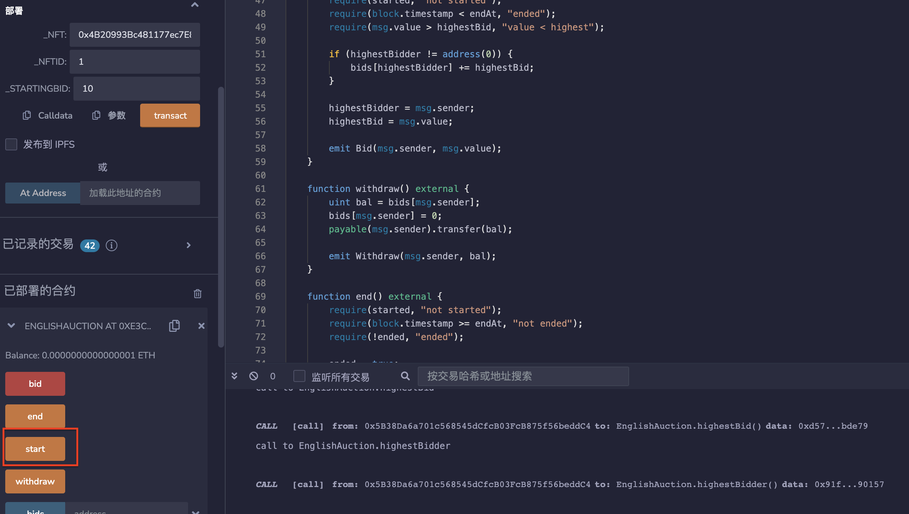
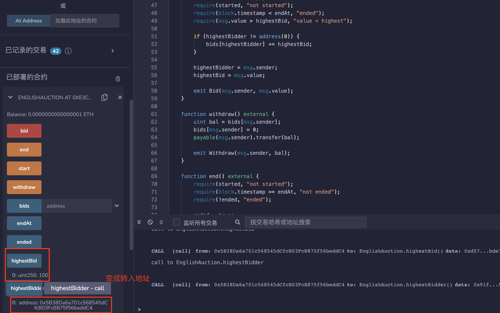

# 60.English Auction
NFT的英式拍卖
英式拍卖（English Auction）是一种公开拍卖方式，拍卖品从起始价格开始，由拍卖师通过不断提高价格来逐步升高，直到最后出价最高的竞标者将赢得拍卖品并支付出价。

## 拍卖
1. NFT的卖家部署这个合约。
2. 拍卖持续7天。
3. 参与者可以通过存入比当前最高出价更高的ETH来竞标。
4. 所有竞标者如果不是当前最高出价者，都可以撤回他们的竞标。
## 拍卖结束后
1. 最高出价者成为NFT的新拥有者。
2. 卖家获得ETH的最高出价。
   
## English Auction例子合约
* ERC721 NFT 的接口
```solidity
interface IERC721 {
    function safeTransferFrom(address from, address to, uint tokenId) external;

    function transferFrom(address, address, uint) external;
}
```

* 合约中的变量和事件
```solidity
event Start();
event Bid(address indexed sender, uint amount);
event Withdraw(address indexed bidder, uint amount);
event End(address winner, uint amount);

IERC721 public nft;//ERC721 资产的接口。
uint public nftId;//ERC721 资产的 ID。

address payable public seller;//卖家的地址。
uint public endAt;//拍卖结束的时间戳。
bool public started;//标记拍卖是否已经开始。
bool public ended;//标记拍卖是否已经结束。

address public highestBidder;//当前最高出价者的地址。
uint public highestBid;//当前最高出价。
mapping(address => uint) public bids;//每个出价者的出价。
```

* 构造函数。
传入 ERC721 资产的地址、ID 和起始出价。
```solidity
constructor(address _nft, uint _nftId, uint _startingBid) {
    nft = IERC721(_nft);
    nftId = _nftId;

    seller = payable(msg.sender);
    highestBid = _startingBid;
}
```

* 开始拍卖
只有卖家可以调用。
将 ERC721 资产转移到合约地址，并标记拍卖已开始。
```solidity
function start() external {
    require(!started, "started");
    require(msg.sender == seller, "not seller");

    nft.transferFrom(msg.sender, address(this), nftId);
    started = true;
    endAt = block.timestamp + 7 days;

    emit Start();
}
```

* 出价
只有在拍卖已开始且未结束时可以调用。
要求出价高于当前最高出价。
如果当前最高出价者不为空，则将其出价退回给其余出价者。
```solidity
function bid() external payable {
    require(started, "not started");
    require(block.timestamp < endAt, "ended");
    require(msg.value > highestBid, "value < highest");

    if (highestBidder != address(0)) {
        bids[highestBidder] += highestBid;
    }

    highestBidder = msg.sender;
    highestBid = msg.value;

    emit Bid(msg.sender, msg.value);
}
```

* 撤回出价
只有在拍卖已开始但未结束时可以调用。
将出价退回给出价者。
```solidity
function withdraw() external {
    uint bal = bids[msg.sender];
    bids[msg.sender] = 0;
    payable(msg.sender).transfer(bal);

    emit Withdraw(msg.sender, bal);
}
```

* 结束拍卖
只有在拍卖已开始且已结束时可以调用。
将 ERC721 资产转移给最高出价者，将出价支付给卖家。
如果没有出价，则将 ERC721 资产返回给卖家。
```solidity
function end() external {
    require(started, "not started");
    require(block.timestamp >= endAt, "not ended");
    require(!ended, "ended");

    ended = true;
    if (highestBidder != address(0)) {
        nft.safeTransferFrom(address(this), highestBidder, nftId);
        seller.transfer(highestBid);
    } else {
        nft.safeTransferFrom(address(this), seller, nftId);
    }

    emit End(highestBidder, highestBid);
}
```

## remix验证
部署合约EnglishAuction，并调用start（）函数开始拍卖。

调用bid（）函数竞拍，输入100wei，显示highestBid和highestBidder皆变成该地址与该数额。

