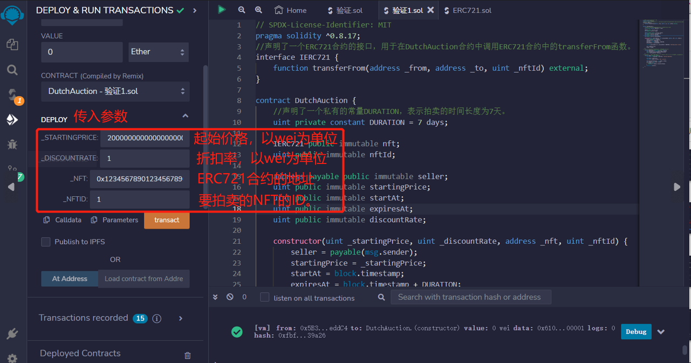
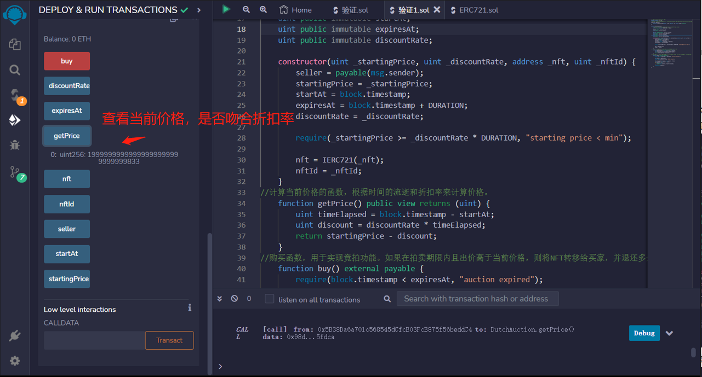

# 61.Dutch Auction
NFT的荷兰式拍卖。

### Auction
NFT的卖家部署此合约，设定NFT的起始价格。
拍卖持续7天。
NFT的价格会随着时间的推移而降低。
参与者可以通过存入大于智能合约计算的当前价格的ETH来购买。
当买家购买NFT时，拍卖结束。


声明了一个ERC721合约的接口，用于在DutchAuction合约中调用ERC721合约中的transferFrom函数。
```solidity
interface IERC721 {
    function transferFrom(address _from, address _to, uint _nftId) external;
}

contract DutchAuction {
    //声明了一个私有的常量DURATION，表示拍卖的时间长度为7天。
    uint private constant DURATION = 7 days;

    IERC721 public immutable nft;
    uint public immutable nftId;

    address payable public immutable seller;
    uint public immutable startingPrice;
    uint public immutable startAt;
    uint public immutable expiresAt;
    uint public immutable discountRate;

    constructor(uint _startingPrice, uint _discountRate, address _nft, uint _nftId) {
        seller = payable(msg.sender);
        startingPrice = _startingPrice;
        startAt = block.timestamp;
        expiresAt = block.timestamp + DURATION;
        discountRate = _discountRate;

        require(_startingPrice >= _discountRate * DURATION, "starting price < min");

        nft = IERC721(_nft);
        nftId = _nftId;
    }
}
```
计算当前价格的函数，根据时间的流逝和折扣率来计算价格。
```solidity
function getPrice() public view returns (uint) {
    uint timeElapsed = block.timestamp - startAt;
    uint discount = discountRate * timeElapsed;
    return startingPrice - discount;
}
```
购买函数，用于实现竞拍功能。如果在拍卖期限内且出价高于当前价格，则将NFT转移给买家，并退还多余的ETH给买家。最后销毁合约并将ETH发送给卖家。
```solidity
function buy() external payable {
    require(block.timestamp < expiresAt, "auction expired");

    uint price = getPrice();
    require(msg.value >= price, "ETH < price");

    nft.transferFrom(seller, msg.sender, nftId);
    uint refund = msg.value - price;
    if (refund > 0) {
        payable(msg.sender).transfer(refund);
    }
    selfdestruct(seller);
}

```

## remix验证
1. 传入参数_startingPrice：起始价格，以wei为单位。_discountRate：折扣率，以wei为单位。_nft：ERC721合约的地址。_nftId：要拍卖的NFT的ID。部署合约

2. 调用getPrice()合约，查看当前价格，是否吻合折扣率
