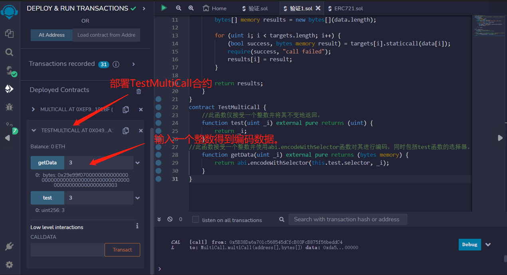
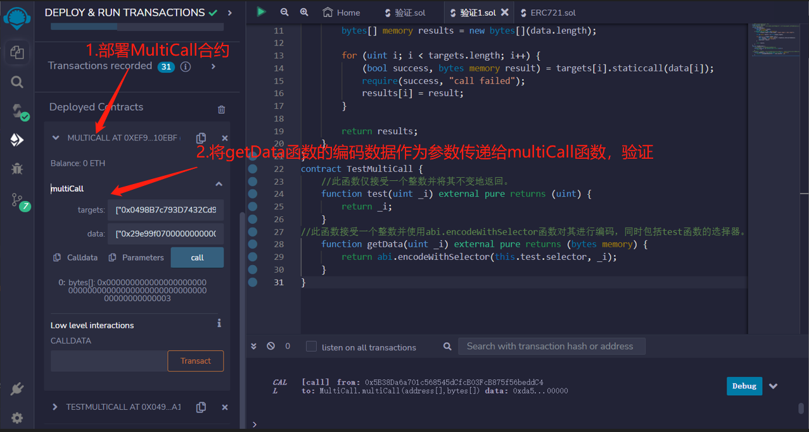

# 63.Multi Call
一个合约的例子，使用 for 循环和 staticcall 聚合多个查询的合约示例。


此函数接受两个数组 - 一个包含要调用的合约地址，另一个包含要发送到这些合约的数据。
它循环遍历每个合约和数据对，对具有给定数据的合约执行静态调用，并将结果存储在数组中。
最后，它返回结果数组。
```solidity
// SPDX-License-Identifier: MIT
pragma solidity ^0.8.17;
contract MultiCall {
    function multiCall(
        address[] calldata targets,
        bytes[] calldata data
    ) external view returns (bytes[] memory) {
        require(targets.length == data.length, "target length != data length");

        bytes[] memory results = new bytes[](data.length);

        for (uint i; i < targets.length; i++) {
            (bool success, bytes memory result) = targets[i].staticcall(data[i]);
            require(success, "call failed");
            results[i] = result;
        }

        return results;
    }
}
```

用于测试 MultiCall 的合约：

```solidity
// SPDX-License-Identifier: MIT
pragma solidity ^0.8.17;

contract TestMultiCall {
    //此函数仅接受一个整数并将其不变地返回。
    function test(uint _i) external pure returns (uint) {
        return _i;
    }
    /*此函数接受一个整数并使用abi.encodeWithSelector函数对其进行编码，同时包括test函数的选择器。
    然后，可以将此编码数据作为参数传递给multiCall函数，以便在TestMultiCall合约上调用test函数并获取结果。*/
    function getData(uint _i) external pure returns (bytes memory) {
        return abi.encodeWithSelector(this.test.selector, _i);
    }
}
```

## remix验证
1. 部署TestMultiCall合约，调用getData函数输入一个整数得到编码数据。

2. 然后，将getData函数的编码数据作为参数传递给multiCall函数，验证
